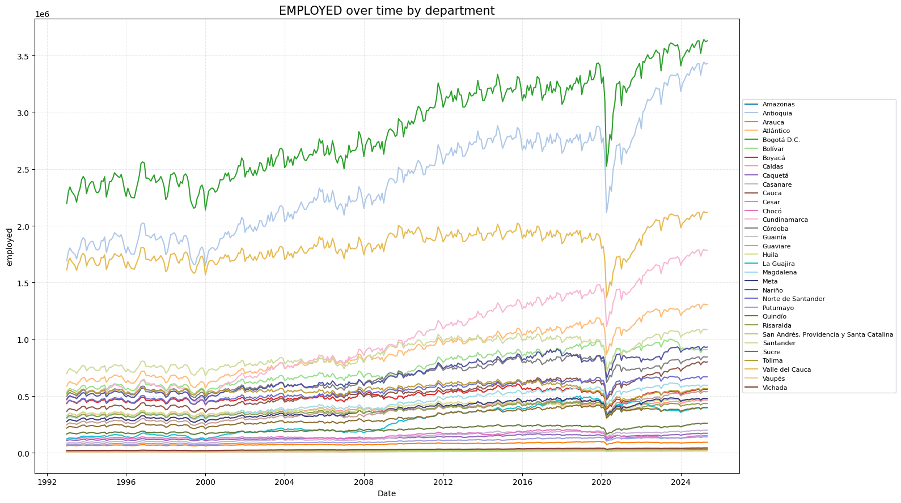

# 0. Clases Base


```python
import logging

class VerboseFilter(logging.Filter):
    """
    Logging filter that enables or disables log records based on a verbosity flag.

    Parameters
    ----------
    verbose : bool
        If True, allows log records to be processed; otherwise, suppresses them.
    """

    def __init__(self, verbose):
        super().__init__()  # Initialize parent filter
        self.verbose = verbose  # Store verbosity flag

    def filter(self, record):
        return self.verbose  # Allow record only if verbose is True


class VerboseLogger:
    """
    Logger wrapper that provides filtered logging based on a verbosity setting.

    Parameters
    ----------
    name : str
        Logger name used to retrieve or create the logger instance.
    verbose : bool, default=False
        Enables logging output when set to True.
    """

    def __init__(self, name, verbose=False):
        self.logger = logging.getLogger(name)  # Get or create logger
        self.logger.setLevel(logging.INFO)  # Set logging level to INFO
        self.logger.propagate = False  # Disable propagation to root logger

        if not self.logger.handlers:
            handler = logging.StreamHandler()  # Create console handler
            handler.setFormatter(logging.Formatter("%(message)s"))  # Set message format
            verbose_filter = VerboseFilter(verbose)  # Create verbosity filter
            handler.addFilter(verbose_filter)  # Attach filter to handler
            self.logger.addFilter(verbose_filter)  # Attach filter to logger
            self.logger.addHandler(handler)  # Attach handler to logger

    def get_logger(self):
        return self.logger  # Return configured logger instance
```


```python
import pandas as pd
import warnings
from pathlib import Path

class DataFrameProcessor:
    """
    Class for importing Excel files and processing DataFrames.

    Parameters
    ----------
    file_path : str or Path
        Path to the Excel file.
    sheet_name : str, optional
        Sheet to read. If None, loads the first sheet.
    engine : str, optional
        Engine to use (e.g., 'openpyxl', 'xlrd').
    verbose : bool, default=False
        Enables logging if True.
    """

    def __init__(self, file_path, sheet_name=None, engine=None, verbose=False):
        self.file_path = Path(file_path)  # Convert file path to Path object
        self.sheet_name = sheet_name  # Store sheet name
        self.engine = engine  # Store engine
        self.verbose = verbose  # Set verbosity flag
        self.logger = VerboseLogger(self.__class__.__name__, verbose).get_logger()
        self.df = None  # Initialize DataFrame as None

    def import_excel(self, datetime_cols=None, datetime_format=None, return_df=True):
        """
        Imports Excel file and optionally converts specified columns to datetime.

        Parameters
        ----------
        datetime_cols : list, optional
            Columns to convert to datetime.
        datetime_format : str, optional
            Date format for conversion (e.g., '%Y-%m-%d').
        return_df : bool, default=True
            If True, returns the loaded DataFrame.

        Returns
        -------
        pd.DataFrame or None
            Loaded DataFrame or None if import fails.
        """
        try:
            if not self.file_path.exists():
                raise FileNotFoundError(f"The file '{self.file_path.name}' was not found.")

            read_args = {"io": self.file_path}

            if self.sheet_name is not None:
                read_args["sheet_name"] = self.sheet_name

            if self.engine is not None:
                read_args["engine"] = self.engine

            self.df = pd.read_excel(**read_args)

            if datetime_cols:
                self.convert_columns_to_datetime(datetime_cols, datetime_format)

            if self.verbose:
                self.logger.info("File '%s' successfully imported.", self.file_path.name)

            if return_df:
                return self.df

        except FileNotFoundError as e:
            raise e
        except ValueError:
            raise ValueError(f"The sheet '{self.sheet_name}' does not exist in '{self.file_path.name}'.")
        except Exception as e:
            raise RuntimeError(f"Error importing '{self.file_path.name}': {e}")

    def convert_columns_to_datetime(self, columns, date_format=None):
        """
        Converts selected columns to datetime type.

        Parameters
        ----------
        columns : list
            Column names to convert.
        date_format : str, optional
            Expected datetime format.
        """
        if self.df is None:
            raise RuntimeError("No DataFrame loaded. Use 'import_excel()' first.")

        for col in columns:
            if col not in self.df.columns:
                warnings.warn(f"Column '{col}' does not exist in the DataFrame.")
                continue
            try:
                self.df[col] = pd.to_datetime(self.df[col], format=date_format, errors="coerce")
                if self.verbose:
                    msg = (
                        f"Column '{col}' converted using format '{date_format}'."
                        if date_format else f"Column '{col}' converted with inferred format."
                    )
                    self.logger.info(msg)
            except Exception as e:
                raise ValueError(f"Error converting column '{col}' to datetime: {e}")

    def convert_to_long_format(self, value_col, id_vars, value_name_col, return_long_format=True):
        """
        Converts DataFrame from wide to long format using melt.

        Parameters
        ----------
        value_col : str
            Name for new variable column.
        id_vars : list
            Columns to keep as identifiers.
        value_name_col : str
            Name for the values column.
        return_long_format : bool, default=True
            If True, returns the melted DataFrame.

        Returns
        -------
        pd.DataFrame or None
            Long-format DataFrame or original if return_long_format is False.
        """
        if self.df is None:
            raise RuntimeError("No DataFrame loaded. Use 'import_excel()' first.")

        missing_cols = [col for col in id_vars if col not in self.df.columns]
        if missing_cols:
            raise KeyError(f"Missing columns in DataFrame: {missing_cols}")

        if not return_long_format:
            return self.df

        try:
            df_long = pd.melt(
                self.df,
                id_vars=id_vars,
                var_name=value_col,
                value_name=value_name_col
            )
            if self.verbose:
                self.logger.info("DataFrame successfully converted to long format.")
            return df_long
        except Exception as e:
            raise RuntimeError(f"Failed to convert to long format: {e}")
```


```python
import os
import warnings

# Dictionary that maps department codes to department names
DEPARTMENT_CODE_NAME_MAP = {
    '91': 'Amazonas',
    '05': 'Antioquia',
    '81': 'Arauca',
    '08': 'Atlántico',
    '11': 'Bogotá D.C.',
    '13': 'Bolívar',
    '15': 'Boyacá',
    '17': 'Caldas',
    '18': 'Caquetá',
    '85': 'Casanare',
    '19': 'Cauca',
    '20': 'Cesar',
    '27': 'Chocó',
    '23': 'Córdoba',
    '25': 'Cundinamarca',
    '94': 'Guainía',
    '95': 'Guaviare',
    '41': 'Huila',
    '44': 'La Guajira',
    '47': 'Magdalena',
    '50': 'Meta',
    '52': 'Nariño',
    '54': 'Norte de Santander',
    '86': 'Putumayo',
    '63': 'Quindío',
    '66': 'Risaralda',
    '88': 'San Andrés, Providencia y Santa Catalina',
    '68': 'Santander',
    '70': 'Sucre',
    '73': 'Tolima',
    '76': 'Valle del Cauca',
    '97': 'Vaupés',
    '99': 'Vichada'
}

# Base data path
BASE_DATA_PATH = r"C:\Users\Admin\Documents\Python\labor market\data"

# Specific dataset paths
PATH_LABOR_MARKET = os.path.join(BASE_DATA_PATH, "Mercado Laboral")
PATH_POPULATION = os.path.join(BASE_DATA_PATH, "Población")
PATH_GOOGLE = os.path.join(BASE_DATA_PATH, "Google")
PATH_ILOSTAT = os.path.join(BASE_DATA_PATH, "ILOSTAT")
PATH_INFLATION = os.path.join(BASE_DATA_PATH, "Precios")
PATH_PRODUCTION = os.path.join(BASE_DATA_PATH, "Producción")
```

# 1. Proyecciones de Población Departamentales y Nacional


```python
import os
import pandas as pd
import warnings

class PopulationProjectionsLoader:
    """
    Loads and processes population projection Excel files from a specified folder.
    Renames standard columns and supports verbose logging.
    """

    def __init__(self, folder_path, verbose=False):
        """
        Initializes the loader with a folder path and verbosity.

        Parameters:
            folder_path (str): Path to the folder containing Excel files.
            verbose (bool): If True, enables verbose logging.
        """
        if not isinstance(folder_path, str):
            raise TypeError("folder_path must be a string.")
        if not os.path.isdir(folder_path):
            raise ValueError("Provided folder_path does not exist or is not a directory.")

        self.folder_path = folder_path  # Directory containing population files
        self.verbose = verbose  # Verbosity flag
        self.logger = VerboseLogger(__name__, verbose).get_logger()  # Logger instance

        # Standard column renaming dictionary
        self.column_map = {
            "DP": "dep_code",
            "DPNOM": "dep_name",
            "AÑO": "year",
            "ÁREA GEOGRÁFICA": "area_type",
            "Población": "population"
        }

        self.skip_rows = 11  # Number of metadata rows to skip
        self.dataframes = {}  # Dictionary to store processed DataFrames

    def load_files(self, file_names):
        """
        Loads and processes multiple Excel files into DataFrames.

        Parameters:
            file_names (list): List of Excel filenames to process (without extension).
        """
        if not isinstance(file_names, list):
            raise TypeError("file_names must be a list of strings.")
        if len(file_names) == 0:
            raise ValueError("file_names list cannot be empty.")

        for name in file_names:
            if not isinstance(name, str):
                raise TypeError("All items in file_names must be strings.")

            file_path = os.path.join(self.folder_path, f"{name}.xlsx")  # Full path to file

            if not os.path.exists(file_path):
                warnings.warn(f"⚠️ File not found: {file_path}")
                continue

            try:
                # Read Excel and skip metadata rows
                df = pd.read_excel(file_path, skiprows=self.skip_rows)

                # Rename standard columns
                df = df.rename(columns=self.column_map)

                # Validate required columns exist
                missing = [col for col in self.column_map.values() if col not in df.columns]
                if missing:
                    raise ValueError(f"Missing required columns in '{name}': {missing}")

                # Store processed DataFrame
                self.dataframes[name] = df

                # Log successful load
                if self.verbose:
                    self.logger.info("Loaded file: %s | Shape: %s", name, df.shape)

            except Exception as e:
                raise RuntimeError(f"❌ Failed to load '{name}': {e}")

    def get_dataframe(self, name):
        """
        Retrieves a processed DataFrame by file name.

        Parameters:
            name (str): Original name of the file (without extension).

        Returns:
            pd.DataFrame: The processed DataFrame.
        """
        if not isinstance(name, str):
            raise TypeError("name must be a string.")
        if name not in self.dataframes:
            raise ValueError(f"❌ No DataFrame found for '{name}'. Did you load it?")
        return self.dataframes[name]


if __name__ == "__main__":

    # Define Excel filenames (without extension)
    filenames = [
        "Proyecciones de Población 1993-2004",
        "Proyecciones de Población 2005-2019",
        "Proyecciones de Población 2020-2050"
    ]

    # Instantiate and load files
    loader = PopulationProjectionsLoader(folder_path=PATH_POPULATION, verbose=True)
    loader.load_files(filenames)

    # Retrieve processed DataFrames
    df_1993_2004 = loader.get_dataframe("Proyecciones de Población 1993-2004").dropna()
    df_2005_2019 = loader.get_dataframe("Proyecciones de Población 2005-2019").dropna()
    df_2020_2050 = loader.get_dataframe("Proyecciones de Población 2020-2050").dropna()

    # Concatenate all population projections
    df_population_all = pd.concat(
        [df_1993_2004, df_2005_2019, df_2020_2050],
        ignore_index=True
    )

    # Format dep_code with leading zeros
    df_population_all["dep_code"] = pd.to_numeric(
        df_population_all["dep_code"],
        errors="coerce"
    ).astype("Int64").astype(str).str.zfill(2)

    # Enforce integer types
    df_population_all["year"] = df_population_all["year"].astype("Int64")
    df_population_all["population"] = df_population_all["population"].astype("Int64")
    
    # Sort values by department and year
    df_population_all = df_population_all.sort_values(
        by=["dep_code", "year"]
    ).reset_index(drop=True)
    
    df_population_all_total = df_population_all[df_population_all["area_type"] == "Total"].reset_index(drop = True).drop(columns=["area_type"])
    
    df_population_annual = df_population_all_total.groupby(["year"])["population"].sum().reset_index()
```

    Loaded file: Proyecciones de Población 1993-2004 | Shape: (1188, 5)
    Loaded file: Proyecciones de Población 2005-2019 | Shape: (1485, 5)
    Loaded file: Proyecciones de Población 2020-2050 | Shape: (2082, 5)
    


```python
df_population_all_total
```


<div>
<style scoped>
    .dataframe tbody tr th:only-of-type {
        vertical-align: middle;
    }

    .dataframe tbody tr th {
        vertical-align: top;
    }

    .dataframe thead th {
        text-align: right;
    }
</style>
<table border="1" class="dataframe">
  <thead>
    <tr style="text-align: right;">
      <th></th>
      <th>dep_code</th>
      <th>dep_name</th>
      <th>year</th>
      <th>population</th>
    </tr>
  </thead>
  <tbody>
    <tr>
      <th>0</th>
      <td>05</td>
      <td>Antioquia</td>
      <td>1993</td>
      <td>4607874</td>
    </tr>
    <tr>
      <th>1</th>
      <td>05</td>
      <td>Antioquia</td>
      <td>1994</td>
      <td>4679652</td>
    </tr>
    <tr>
      <th>2</th>
      <td>05</td>
      <td>Antioquia</td>
      <td>1995</td>
      <td>4753428</td>
    </tr>
    <tr>
      <th>3</th>
      <td>05</td>
      <td>Antioquia</td>
      <td>1996</td>
      <td>4828617</td>
    </tr>
    <tr>
      <th>4</th>
      <td>05</td>
      <td>Antioquia</td>
      <td>1997</td>
      <td>4904267</td>
    </tr>
    <tr>
      <th>...</th>
      <td>...</td>
      <td>...</td>
      <td>...</td>
      <td>...</td>
    </tr>
    <tr>
      <th>1909</th>
      <td>99</td>
      <td>Vichada</td>
      <td>2046</td>
      <td>155150</td>
    </tr>
    <tr>
      <th>1910</th>
      <td>99</td>
      <td>Vichada</td>
      <td>2047</td>
      <td>155867</td>
    </tr>
    <tr>
      <th>1911</th>
      <td>99</td>
      <td>Vichada</td>
      <td>2048</td>
      <td>156528</td>
    </tr>
    <tr>
      <th>1912</th>
      <td>99</td>
      <td>Vichada</td>
      <td>2049</td>
      <td>157136</td>
    </tr>
    <tr>
      <th>1913</th>
      <td>99</td>
      <td>Vichada</td>
      <td>2050</td>
      <td>157691</td>
    </tr>
  </tbody>
</table>
<p>1914 rows × 4 columns</p>
</div>


# 2. Mercado Laboral Nacional Total (Fuente Externa)


```python
import os
import pandas as pd
import warnings

class ILOSTATMerger:
    """
    Class for merging ILOSTAT labor statistics with population projections,
    computing absolute indicators and standard labor market rates.
    """

    def __init__(self, population_df, ilostat_path, verbose=False):
        """
        Initializes the ILOSTATMerger class.

        Parameters:
            population_df (pd.DataFrame): DataFrame with annual population projections. Must include 'year' and 'population'.
            ilostat_path (str): Path to the ILOSTAT Excel file.
            verbose (bool): If True, enables verbose logging.
        """
        self.population_df = population_df  # DataFrame with population projections
        self.ilostat_path = ilostat_path  # Path to the ILOSTAT Excel file
        self.verbose = verbose  # Verbosity flag
        self.logger = VerboseLogger(__name__, verbose).get_logger()  # Logger instance
        self.result_df = None  # Output DataFrame initialized as None

    def validate_inputs(self):
        """
        Validates input population DataFrame and existence of necessary columns.
        """
        if not isinstance(self.population_df, pd.DataFrame):
            raise TypeError("population_df must be a pandas DataFrame.")

        required_columns = {"year", "population"}
        missing = required_columns - set(self.population_df.columns)
        if missing:
            raise ValueError(f"Missing required columns in population_df: {missing}")

        if self.population_df.empty:
            raise ValueError("population_df is empty.")

    def merge_and_calculate(self):
        """
        Merges population and ILOSTAT data, computes absolute indicators and labor market rates.
        """
        self.validate_inputs()  # Validate population DataFrame

        # Try to import ILOSTAT Excel file
        try:
            ilostat_df = pd.read_excel(self.ilostat_path)
        except Exception as e:
            raise RuntimeError(f"Failed to load ILOSTAT Excel file: {e}")

        # Rename 'Año' column to 'year'
        ilostat_df = ilostat_df.rename(columns={"Año": "year"})

        # Check for required proportion columns
        proportion_cols = {"PEA_Pob", "PET_Pob", "Ocupados_Pob", "Desocupados_Pob", "Inactivos_Pob"}
        missing_cols = proportion_cols - set(ilostat_df.columns)
        if missing_cols:
            raise ValueError(f"Missing required columns in ILOSTAT data: {missing_cols}")

        # Merge population and ILOSTAT data
        df = self.population_df.merge(ilostat_df, on="year", how="inner")

        if df.empty:
            warnings.warn("The merged DataFrame is empty after joining population and ILOSTAT data.")

        # Compute absolute quantities
        df["pea_ilostat"] = (df["PEA_Pob"] * df["population"]).round(3)  # Economically active population
        df["pet_ilostat"] = (df["PET_Pob"] * df["population"]).round(3)  # Total labor force
        df["employed_ilostat"] = (df["Ocupados_Pob"] * df["population"]).round(3)  # Employed
        df["unemployed_ilostat"] = (df["Desocupados_Pob"] * df["population"]).round(3)  # Unemployed
        df["inactive_ilostat"] = (df["Inactivos_Pob"] * df["population"]).round(3)  # Inactive

        # Drop raw proportion columns and keep only year, population, quantities, and rates
        keep_cols = ["year", "population", "pea_ilostat", "pet_ilostat", "employed_ilostat", "unemployed_ilostat", "inactive_ilostat"]
        df = df[keep_cols]

        self.result_df = df  # Store result

        if self.verbose:
            self.logger.info("Final DataFrame with labor quantities and rates created with shape: %s", df.shape)

        return df

if __name__ == "__main__":
    
    # Replace with the actual path to your file
    ilostat_path = os.path.join(PATH_ILOSTAT, "Estadísticas ILOSTAT.xlsx")

    # Run the merger
    merger = ILOSTATMerger(population_df=df_population_annual, ilostat_path=ilostat_path, verbose=True)
    df_ilostat_adj = merger.merge_and_calculate()
```

    Final DataFrame with labor quantities and rates created with shape: (32, 7)
    


```python
df_ilostat_adj
```


<div>
<style scoped>
    .dataframe tbody tr th:only-of-type {
        vertical-align: middle;
    }

    .dataframe tbody tr th {
        vertical-align: top;
    }

    .dataframe thead th {
        text-align: right;
    }
</style>
<table border="1" class="dataframe">
  <thead>
    <tr style="text-align: right;">
      <th></th>
      <th>year</th>
      <th>population</th>
      <th>pea_ilostat</th>
      <th>pet_ilostat</th>
      <th>employed_ilostat</th>
      <th>unemployed_ilostat</th>
      <th>inactive_ilostat</th>
    </tr>
  </thead>
  <tbody>
    <tr>
      <th>0</th>
      <td>1993</td>
      <td>35032308</td>
      <td>15325887.713</td>
      <td>22771477.814</td>
      <td>14130612.843</td>
      <td>454716.999</td>
      <td>7445590.101</td>
    </tr>
    <tr>
      <th>1</th>
      <td>1994</td>
      <td>35629174</td>
      <td>15752181.236</td>
      <td>23258347.831</td>
      <td>14452737.342</td>
      <td>448603.665</td>
      <td>7506166.596</td>
    </tr>
    <tr>
      <th>2</th>
      <td>1995</td>
      <td>36229830</td>
      <td>16181025.219</td>
      <td>23764521.757</td>
      <td>14770125.562</td>
      <td>528122.679</td>
      <td>7583496.538</td>
    </tr>
    <tr>
      <th>3</th>
      <td>1996</td>
      <td>36830574</td>
      <td>16545714.98</td>
      <td>24291566.925</td>
      <td>14591701.336</td>
      <td>742600.392</td>
      <td>7745851.945</td>
    </tr>
    <tr>
      <th>4</th>
      <td>1997</td>
      <td>37426532</td>
      <td>16958672.84</td>
      <td>24832227.081</td>
      <td>14900081.215</td>
      <td>788503.822</td>
      <td>7873554.241</td>
    </tr>
    <tr>
      <th>5</th>
      <td>1998</td>
      <td>38012359</td>
      <td>17294646.612</td>
      <td>25373228.99</td>
      <td>14700487.68</td>
      <td>1004103.465</td>
      <td>8078582.378</td>
    </tr>
    <tr>
      <th>6</th>
      <td>1999</td>
      <td>38585016</td>
      <td>17481401.368</td>
      <td>25906048.263</td>
      <td>13974758.675</td>
      <td>1420228.643</td>
      <td>8424646.895</td>
    </tr>
    <tr>
      <th>7</th>
      <td>2000</td>
      <td>39140080</td>
      <td>17871047.262</td>
      <td>26426687.264</td>
      <td>14203815.871</td>
      <td>1412104.329</td>
      <td>8555640.002</td>
    </tr>
    <tr>
      <th>8</th>
      <td>2001</td>
      <td>39674811</td>
      <td>18220332.66</td>
      <td>26939207.008</td>
      <td>15480076.523</td>
      <td>2727405.7</td>
      <td>8718874.348</td>
    </tr>
    <tr>
      <th>9</th>
      <td>2002</td>
      <td>40190679</td>
      <td>18279377.157</td>
      <td>27448160.786</td>
      <td>15632276.531</td>
      <td>2629527.809</td>
      <td>9168783.629</td>
    </tr>
    <tr>
      <th>10</th>
      <td>2003</td>
      <td>40693254</td>
      <td>18853108.181</td>
      <td>27957038.052</td>
      <td>16360458.668</td>
      <td>2462135.252</td>
      <td>9103929.871</td>
    </tr>
    <tr>
      <th>11</th>
      <td>2004</td>
      <td>41188093</td>
      <td>18990056.818</td>
      <td>28476826.947</td>
      <td>16385281.457</td>
      <td>2576171.113</td>
      <td>9486770.129</td>
    </tr>
    <tr>
      <th>12</th>
      <td>2005</td>
      <td>41671878</td>
      <td>18955263.636</td>
      <td>29010642.397</td>
      <td>16858374.403</td>
      <td>2063484.629</td>
      <td>10055378.761</td>
    </tr>
    <tr>
      <th>13</th>
      <td>2006</td>
      <td>42170126</td>
      <td>19113828.087</td>
      <td>29580642.701</td>
      <td>16994079.232</td>
      <td>2037222.569</td>
      <td>10466814.613</td>
    </tr>
    <tr>
      <th>14</th>
      <td>2007</td>
      <td>42658630</td>
      <td>19273407.832</td>
      <td>30167965.051</td>
      <td>17113984.894</td>
      <td>2107543.051</td>
      <td>10894557.219</td>
    </tr>
    <tr>
      <th>15</th>
      <td>2008</td>
      <td>43134017</td>
      <td>19736700.292</td>
      <td>30762648.917</td>
      <td>17511637.896</td>
      <td>2164254.043</td>
      <td>11025948.625</td>
    </tr>
    <tr>
      <th>16</th>
      <td>2009</td>
      <td>43608630</td>
      <td>21002419.413</td>
      <td>31368431.181</td>
      <td>18468163.858</td>
      <td>2458849.12</td>
      <td>10366011.768</td>
    </tr>
    <tr>
      <th>17</th>
      <td>2010</td>
      <td>44086292</td>
      <td>21452152.972</td>
      <td>31980430.496</td>
      <td>19059696.967</td>
      <td>2295680.542</td>
      <td>10528277.523</td>
    </tr>
    <tr>
      <th>18</th>
      <td>2011</td>
      <td>44553416</td>
      <td>22000064.956</td>
      <td>32585930.26</td>
      <td>19736646.24</td>
      <td>2168492.117</td>
      <td>10585865.304</td>
    </tr>
    <tr>
      <th>19</th>
      <td>2012</td>
      <td>45001571</td>
      <td>22588018.98</td>
      <td>33182540.517</td>
      <td>20338574.559</td>
      <td>2152062.701</td>
      <td>10594521.536</td>
    </tr>
    <tr>
      <th>20</th>
      <td>2013</td>
      <td>45434942</td>
      <td>22722762.537</td>
      <td>33776942.513</td>
      <td>20621836.713</td>
      <td>2006596.107</td>
      <td>11054179.976</td>
    </tr>
    <tr>
      <th>21</th>
      <td>2014</td>
      <td>45866010</td>
      <td>23025105.05</td>
      <td>34370445.358</td>
      <td>20998967.296</td>
      <td>1946118.294</td>
      <td>11345340.308</td>
    </tr>
    <tr>
      <th>22</th>
      <td>2015</td>
      <td>46313898</td>
      <td>23438141.869</td>
      <td>34971861.935</td>
      <td>21429008.401</td>
      <td>1928381.245</td>
      <td>11533720.066</td>
    </tr>
    <tr>
      <th>23</th>
      <td>2016</td>
      <td>46830116</td>
      <td>23664928.134</td>
      <td>35630293.195</td>
      <td>21553476.959</td>
      <td>2024167.146</td>
      <td>11965365.061</td>
    </tr>
    <tr>
      <th>24</th>
      <td>2017</td>
      <td>47419200</td>
      <td>24007534.279</td>
      <td>36367888.566</td>
      <td>21826188.323</td>
      <td>2080096.669</td>
      <td>12360354.287</td>
    </tr>
    <tr>
      <th>25</th>
      <td>2018</td>
      <td>48258494</td>
      <td>24340946.354</td>
      <td>37311566.066</td>
      <td>22062702.13</td>
      <td>2162301.406</td>
      <td>12970619.711</td>
    </tr>
    <tr>
      <th>26</th>
      <td>2019</td>
      <td>49395678</td>
      <td>24743386.108</td>
      <td>38467998.676</td>
      <td>22199882.036</td>
      <td>2416689.32</td>
      <td>13724612.568</td>
    </tr>
    <tr>
      <th>27</th>
      <td>2020</td>
      <td>50407647</td>
      <td>25040667.686</td>
      <td>39486978.927</td>
      <td>21038267.502</td>
      <td>3738200.658</td>
      <td>14446311.24</td>
    </tr>
    <tr>
      <th>28</th>
      <td>2021</td>
      <td>51117378</td>
      <td>25880067.407</td>
      <td>40230168.517</td>
      <td>22283088.04</td>
      <td>3343341.64</td>
      <td>14350101.11</td>
    </tr>
    <tr>
      <th>29</th>
      <td>2022</td>
      <td>51682692</td>
      <td>25802644.374</td>
      <td>40853471.99</td>
      <td>23081394.605</td>
      <td>2593320.58</td>
      <td>15050827.616</td>
    </tr>
    <tr>
      <th>30</th>
      <td>2023</td>
      <td>52215503</td>
      <td>26436703.922</td>
      <td>41460234.493</td>
      <td>23900166.776</td>
      <td>2412663.395</td>
      <td>15023530.571</td>
    </tr>
    <tr>
      <th>31</th>
      <td>2024</td>
      <td>52695952</td>
      <td>26725124.715</td>
      <td>42013369.881</td>
      <td>24157687.681</td>
      <td>2442846.046</td>
      <td>15288245.166</td>
    </tr>
  </tbody>
</table>
</div>


# 3. Precios (Inflación) - Total


```python
import os
import pandas as pd
import warnings

class InflationDataLoader:
    """
    Class for loading and processing inflation data from an Excel file.
    Applies date conversion, numeric transformation, and validation checks.
    """

    def __init__(self, file_path, date_col, inflation_col, verbose=False):
        """
        Initializes the loader with file path and column names.

        Parameters:
            file_path (str): Path to the Excel file.
            date_col (str): Name of the column with date values.
            inflation_col (str): Name of the column with inflation percentages.
            verbose (bool): If True, enables verbose logging.
        """
        self.file_path = file_path  # Path to the Excel file
        self.date_col = date_col  # Date column name
        self.inflation_col = inflation_col  # Inflation column name
        self.verbose = verbose  # Verbosity flag
        self.logger = VerboseLogger(__name__, verbose).get_logger()  # Logger instance
        self.df = None  # Will store the final DataFrame

    def load_and_process(self):
        """
        Loads the Excel file and processes inflation data.

        Returns:
            pd.DataFrame: Cleaned DataFrame with 'year' and 'inflation' columns added.
        """
        # Load Excel file
        try:
            df = pd.read_excel(self.file_path)
        except Exception as e:
            raise RuntimeError(f"Failed to read Excel file: {e}")

        # Check for required columns
        missing_cols = [col for col in [self.date_col, self.inflation_col] if col not in df.columns]
        if missing_cols:
            raise ValueError(f"Missing required columns in inflation file: {missing_cols}")

        # Convert date column to datetime with dayfirst
        df[self.date_col] = pd.to_datetime(df[self.date_col], dayfirst=True, errors="coerce")

        # Warn if date conversion failed
        if df[self.date_col].isna().any():
            warnings.warn(f"Some '{self.date_col}' values could not be parsed and were set as NaT.")

        # Extract year and month as integers
        df["year"] = df[self.date_col].dt.year.astype("Int64")
        df["month"] = df[self.date_col].dt.month.astype("Int64")

        # Rewrite date column in ISO format
        df[self.date_col] = df[self.date_col].dt.strftime("%Y-%m-%d")

        # Convert inflation column to numeric proportion
        df["inflation"] = (pd.to_numeric(df[self.inflation_col], errors="coerce") / 100).round(3)

        # Warn if inflation conversion failed
        if df["inflation"].isna().any():
            warnings.warn(f"Some '{self.inflation_col}' values could not be converted to numeric.")

        # Store result internally
        self.df = df

        # Log successful load
        if self.verbose:
            self.logger.info("Inflation data loaded and processed with shape: %s", df.shape)

        return df

if __name__ == "__main__":

    loader = InflationDataLoader(
        file_path=os.path.join(PATH_INFLATION, "Inflación.xlsx"),
        date_col="Fecha",
        inflation_col="Inflación Total",
        verbose=True
    )
    df_inflation = loader.load_and_process()
```

    Inflation data loaded and processed with shape: (840, 5)
    


```python
df_inflation
```


<div>
<style scoped>
    .dataframe tbody tr th:only-of-type {
        vertical-align: middle;
    }

    .dataframe tbody tr th {
        vertical-align: top;
    }

    .dataframe thead th {
        text-align: right;
    }
</style>
<table border="1" class="dataframe">
  <thead>
    <tr style="text-align: right;">
      <th></th>
      <th>Fecha</th>
      <th>Inflación Total</th>
      <th>year</th>
      <th>month</th>
      <th>inflation</th>
    </tr>
  </thead>
  <tbody>
    <tr>
      <th>0</th>
      <td>1955-07-31</td>
      <td>-0.87</td>
      <td>1955</td>
      <td>7</td>
      <td>-0.009</td>
    </tr>
    <tr>
      <th>1</th>
      <td>1955-08-31</td>
      <td>-0.01</td>
      <td>1955</td>
      <td>8</td>
      <td>-0.000</td>
    </tr>
    <tr>
      <th>2</th>
      <td>1955-09-30</td>
      <td>0.84</td>
      <td>1955</td>
      <td>9</td>
      <td>0.008</td>
    </tr>
    <tr>
      <th>3</th>
      <td>1955-10-31</td>
      <td>0.77</td>
      <td>1955</td>
      <td>10</td>
      <td>0.008</td>
    </tr>
    <tr>
      <th>4</th>
      <td>1955-11-30</td>
      <td>1.44</td>
      <td>1955</td>
      <td>11</td>
      <td>0.014</td>
    </tr>
    <tr>
      <th>...</th>
      <td>...</td>
      <td>...</td>
      <td>...</td>
      <td>...</td>
      <td>...</td>
    </tr>
    <tr>
      <th>835</th>
      <td>2025-02-28</td>
      <td>5.28</td>
      <td>2025</td>
      <td>2</td>
      <td>0.053</td>
    </tr>
    <tr>
      <th>836</th>
      <td>2025-03-31</td>
      <td>5.09</td>
      <td>2025</td>
      <td>3</td>
      <td>0.051</td>
    </tr>
    <tr>
      <th>837</th>
      <td>2025-04-30</td>
      <td>5.16</td>
      <td>2025</td>
      <td>4</td>
      <td>0.052</td>
    </tr>
    <tr>
      <th>838</th>
      <td>2025-05-31</td>
      <td>5.05</td>
      <td>2025</td>
      <td>5</td>
      <td>0.050</td>
    </tr>
    <tr>
      <th>839</th>
      <td>2025-06-30</td>
      <td>4.82</td>
      <td>2025</td>
      <td>6</td>
      <td>0.048</td>
    </tr>
  </tbody>
</table>
<p>840 rows × 5 columns</p>
</div>


# 4. Desagregar Mercado Laboral (ILOSTAT) - Total Nacional


```python
import pandas as pd
import warnings
from tempdisagg import TempDisaggModel

class ILOSTATDisaggregator:
    """
    Disaggregates multiple annual labor indicators using a shared auxiliary variable (inflation).
    """

    def __init__(self, df, target_cols, verbose=False):
        """
        Parameters:
            df (pd.DataFrame): Must contain 'Index', 'Grain', 'X' and target columns to disaggregate.
            target_cols (list): Columns to disaggregate (each will be used as 'y').
            verbose (bool): If True, enables verbose logging.
        """
        self.df = df.copy()
        self.target_cols = target_cols
        self.verbose = verbose
        self.logger = VerboseLogger(__name__, verbose).get_logger()

    def disaggregate_all(self):
        """
        Iterates over target columns, applying TempDisaggModel to each.

        Returns:
            pd.DataFrame: DataFrame with columns 'Index', 'Grain', and one column per disaggregated target (suffix '_disagg').
        """
        base = self.df[["Index", "Grain"]].drop_duplicates().copy()

        for col in self.target_cols:
            if self.verbose:
                self.logger.info("Disaggregating: %s", col)

            try:
                # Preparar input para el modelo
                df_model = self.df[["Index", "Grain", "X", col]].dropna(subset=[col]).copy()
                df_model = df_model.rename(columns={col: "y"})

                # Ajustar modelo
                model = TempDisaggModel(method="denton", conversion="average")
                model.fit(df_model)

                # Predecir y almacenar
                y_hat = model.adjust_output(full=False)
                base[f"{col}_disagg"] = y_hat.round(8)

            except Exception as e:
                warnings.warn(f"Disaggregation failed for {col}: {str(e)}")

        return base


if __name__ == "__main__":

    df_ilostat_ext = df_ilostat_adj.merge(
         df_inflation[["year", "month", "inflation"]], on="year"
     ).rename(columns={"year": "Index", "month": "Grain", "inflation": "X"})

    cols_to_disagg = [
        "population", "pea_ilostat", "pet_ilostat",
        "employed_ilostat", "unemployed_ilostat", "inactive_ilostat"
    ]

    disaggregator = ILOSTATDisaggregator(
        df=df_ilostat_ext,
        target_cols=cols_to_disagg,
        verbose=True
    )

    df_ilostat_disagg = disaggregator.disaggregate_all()
```

    Disaggregating: population
    Disaggregating: pea_ilostat
    Disaggregating: pet_ilostat
    Disaggregating: employed_ilostat
    Disaggregating: unemployed_ilostat
    Disaggregating: inactive_ilostat
    


```python
df_ilostat_disagg 
```


<div>
<style scoped>
    .dataframe tbody tr th:only-of-type {
        vertical-align: middle;
    }

    .dataframe tbody tr th {
        vertical-align: top;
    }

    .dataframe thead th {
        text-align: right;
    }
</style>
<table border="1" class="dataframe">
  <thead>
    <tr style="text-align: right;">
      <th></th>
      <th>Index</th>
      <th>Grain</th>
      <th>population_disagg</th>
      <th>pea_ilostat_disagg</th>
      <th>pet_ilostat_disagg</th>
      <th>employed_ilostat_disagg</th>
      <th>unemployed_ilostat_disagg</th>
      <th>inactive_ilostat_disagg</th>
    </tr>
  </thead>
  <tbody>
    <tr>
      <th>0</th>
      <td>1993</td>
      <td>1</td>
      <td>3.367633e+07</td>
      <td>1.464905e+07</td>
      <td>2.183868e+07</td>
      <td>1.372741e+07</td>
      <td>2.667232e+05</td>
      <td>7.189629e+06</td>
    </tr>
    <tr>
      <th>1</th>
      <td>1993</td>
      <td>2</td>
      <td>3.489165e+07</td>
      <td>1.519464e+07</td>
      <td>2.263733e+07</td>
      <td>1.417748e+07</td>
      <td>3.289924e+05</td>
      <td>7.442690e+06</td>
    </tr>
    <tr>
      <th>2</th>
      <td>1993</td>
      <td>3</td>
      <td>3.542078e+07</td>
      <td>1.544161e+07</td>
      <td>2.299087e+07</td>
      <td>1.435265e+07</td>
      <td>3.804248e+05</td>
      <td>7.549264e+06</td>
    </tr>
    <tr>
      <th>3</th>
      <td>1993</td>
      <td>4</td>
      <td>3.500432e+07</td>
      <td>1.527727e+07</td>
      <td>2.273119e+07</td>
      <td>1.414679e+07</td>
      <td>4.194397e+05</td>
      <td>7.453923e+06</td>
    </tr>
    <tr>
      <th>4</th>
      <td>1993</td>
      <td>5</td>
      <td>3.467982e+07</td>
      <td>1.515240e+07</td>
      <td>2.253078e+07</td>
      <td>1.398446e+07</td>
      <td>4.523593e+05</td>
      <td>7.378384e+06</td>
    </tr>
    <tr>
      <th>...</th>
      <td>...</td>
      <td>...</td>
      <td>...</td>
      <td>...</td>
      <td>...</td>
      <td>...</td>
      <td>...</td>
      <td>...</td>
    </tr>
    <tr>
      <th>379</th>
      <td>2024</td>
      <td>8</td>
      <td>5.308427e+07</td>
      <td>2.688462e+07</td>
      <td>4.229374e+07</td>
      <td>2.430377e+07</td>
      <td>2.450852e+06</td>
      <td>1.540912e+07</td>
    </tr>
    <tr>
      <th>380</th>
      <td>2024</td>
      <td>9</td>
      <td>5.300748e+07</td>
      <td>2.684859e+07</td>
      <td>4.225226e+07</td>
      <td>2.426864e+07</td>
      <td>2.452015e+06</td>
      <td>1.540367e+07</td>
    </tr>
    <tr>
      <th>381</th>
      <td>2024</td>
      <td>10</td>
      <td>5.272293e+07</td>
      <td>2.672296e+07</td>
      <td>4.207405e+07</td>
      <td>2.414942e+07</td>
      <td>2.451504e+06</td>
      <td>1.535108e+07</td>
    </tr>
    <tr>
      <th>382</th>
      <td>2024</td>
      <td>11</td>
      <td>5.261969e+07</td>
      <td>2.667678e+07</td>
      <td>4.201128e+07</td>
      <td>2.410532e+07</td>
      <td>2.451691e+06</td>
      <td>1.533450e+07</td>
    </tr>
    <tr>
      <th>383</th>
      <td>2024</td>
      <td>12</td>
      <td>5.269777e+07</td>
      <td>2.671003e+07</td>
      <td>4.206395e+07</td>
      <td>2.413634e+07</td>
      <td>2.452574e+06</td>
      <td>1.535392e+07</td>
    </tr>
  </tbody>
</table>
<p>384 rows × 8 columns</p>
</div>


# 5. Mercado Laboral GEIH (Dane) - Total Nacional


```python
import pandas as pd
import warnings

class GEIHBlockParser:
    """
    Parser for GEIH Excel files with regional blocks delimited by 'Concepto' and
    'Fuerza de trabajo potencial'. Each block corresponds to a region, whose name is
    located two rows above the 'Concepto' header.
    """

    def __init__(self, path, sheet_name, usecols=None, start_date="2007-03-01", verbose=False):
        """
        Initialize the GEIHBlockParser.

        Parameters
        ----------
        path : str
            Path to the Excel file (.xls or .xlsx).
        sheet_name : str
            Name of the sheet to read.
        usecols : list or None, optional
            List of columns to read. If None, reads all columns.
        start_date : str, default="2007-03-01"
            Starting date for generating monthly headers.
        verbose : bool, default=False
            If True, enables logging using VerboseLogger.
        """
        self.path = path  # Path to input Excel file
        self.sheet_name = sheet_name  # Name of the sheet to load
        self.usecols = usecols  # List of columns to read
        self.start_date = pd.to_datetime(start_date)  # Parse start date
        self.verbose = verbose  # Enable or disable logging
        self.logger = VerboseLogger("GEIHBlockParser", verbose=self.verbose).get_logger()  # Logger instance

        self.df = None  # Placeholder for loaded DataFrame
        self.blocks = []  # List to store parsed blocks
        self.result = None  # Final cleaned DataFrame

        # Load the Excel sheet on initialization
        self._load_excel()

    def _load_excel(self):
        """Load and validate the Excel file."""
        try:
            # Load the Excel file with optional column selection
            self.df = pd.read_excel(self.path, sheet_name=self.sheet_name, usecols=self.usecols)
        except Exception as e:
            raise ValueError(f"Failed to load Excel file: {e}")

        # Validate that the DataFrame was loaded correctly
        if not isinstance(self.df, pd.DataFrame) or self.df.empty:
            raise ValueError("The Excel sheet is empty or not properly loaded.")

        if self.verbose:
            self.logger.info("Excel file loaded with shape: %s", self.df.shape)

    def parse(self):
        """
        Parse and return a long-format DataFrame with columns:
        'Region', 'Concepto', 'Fecha', 'Año', 'Valor'.

        Returns
        -------
        pd.DataFrame
            Cleaned and concatenated long-format dataset.
        """
        rows = self.df.reset_index(drop=True)  # Reset index for row iteration
        i = 0  # Row pointer

        while i < len(rows):
            # Look for a row starting with 'Concepto'
            if str(rows.iloc[i, 0]).strip().lower() == "concepto":
                # Ensure there are enough rows above for region extraction
                if i < 2:
                    warnings.warn(f"Skipping block at row {i}: insufficient rows above for region name.")
                    i += 1
                    continue

                # Extract region name located two rows above
                region = str(rows.iloc[i - 2, 0]).strip()

                # Extract raw headers and generate monthly date list
                raw_headers = list(rows.iloc[i + 1, 1:])
                fechas = self._generate_dates(len(raw_headers))

                # Determine start and end of block
                data_start = i + 2
                data_end = data_start
                while data_end < len(rows):
                    value = str(rows.iloc[data_end, 0]).strip().lower()
                    if value == "fuerza de trabajo potencial":
                        data_end += 1
                        break
                    data_end += 1

                # Slice and reshape the block
                df_block = rows.iloc[data_start:data_end].copy()
                df_block.columns = ["Concepto"] + fechas
                df_block = df_block.melt(id_vars="Concepto", var_name="Fecha", value_name="Valor")
                df_block["Region"] = region  # Add region identifier
                self.blocks.append(df_block)  # Store parsed block

                # Move pointer to next block
                i = data_end
            else:
                i += 1  # Continue scanning

        # Check that blocks were parsed
        if not self.blocks:
            raise RuntimeError("No valid blocks found in the Excel sheet.")

        # Concatenate and postprocess the result
        self.result = pd.concat(self.blocks, ignore_index=True)
        self._postprocess_result()

        if self.verbose:
            self.logger.info("Parsing completed. Final shape: %s", self.result.shape)

        return self.result

    def _postprocess_result(self):
        """Clean and finalize the parsed result."""
        # Drop rows with missing 'Concepto'
        self.result = self.result[self.result["Concepto"].notnull()].reset_index(drop=True)

        # Convert 'Valor' to numeric with coercion and rounding
        self.result["Valor"] = pd.to_numeric(self.result["Valor"], errors="coerce").round(4)

        # Format date column as string YYYY-MM-DD
        self.result["Fecha"] = pd.to_datetime(self.result["Fecha"]).dt.strftime("%Y-%m-%d")

        # Extract year and create new column
        self.result["Año"] = pd.to_datetime(self.result["Fecha"]).dt.year.astype(int)

        # Reorder columns for consistency
        self.result = self.result[["Region", "Concepto", "Fecha", "Año", "Valor"]]

    def _generate_dates(self, n):
        """
        Generate a list of n monthly dates starting from self.start_date.

        Parameters
        ----------
        n : int
            Number of months to generate.

        Returns
        -------
        list of datetime
            List of monthly datetime objects.
        """
        return [self.start_date + pd.DateOffset(months=k) for k in range(n)]

if __name__ == "__main__":
    import os

    # Initialize the parser with specified parameters
    parser = GEIHBlockParser(
        path=os.path.join(PATH_LABOR_MARKET, "Anexo GEIH Mayo 2025.xlsx"),
        sheet_name="Total nacional",
        usecols=None,
        start_date="2001-01-01",
        verbose=True
    )

    # Parse the Excel file to obtain long-format DataFrame
    df_monthly_lm = parser.parse()

    # Clean column names
    df_monthly_lm.columns = [col.strip() for col in df_monthly_lm.columns]

    # Filter for national-level data only
    df_monthly_national = df_monthly_lm[df_monthly_lm["Region"].str.strip() == "Total Nacional"].copy()

    # Normalize whitespace in 'Concepto'
    df_monthly_national["Concepto"] = df_monthly_national["Concepto"].astype(str).str.strip()

    # Define renaming dictionary
    concept_rename_map = {
        "Población total": "population_geih",
        "Fuerza de trabajo": "pea_geih",
        "Población en edad de trabajar (PET)": "pet_geih",
        "Población ocupada": "employed_geih",
        "Población desocupada": "unemployed_geih",
        "Población fuera de la fuerza de trabajo": "inactive_geih"
    }

    # Keep only relevant concepts
    df_monthly_national = df_monthly_national[
        df_monthly_national["Concepto"].isin(concept_rename_map.keys())
    ].copy()

    # Validate missing concepts if any
    found_concepts = set(df_monthly_national["Concepto"].unique())
    missing_concepts = set(concept_rename_map.keys()) - found_concepts
    if missing_concepts and parser.verbose:
        parser.logger.warning("Missing concepts in source data: %s", missing_concepts)

    # Rename concepts
    df_monthly_national["Concepto"] = df_monthly_national["Concepto"].map(concept_rename_map)

    # Convert 'Fecha' to datetime
    df_monthly_national["Fecha"] = pd.to_datetime(df_monthly_national["Fecha"])

    # Extract month
    df_monthly_national["Mes"] = df_monthly_national["Fecha"].dt.month

    # Pivot to wide format
    df_monthly_wide = df_monthly_national.pivot(
        index=["Fecha", "Año", "Mes"],
        columns="Concepto",
        values="Valor"
    ).reset_index()

    # Flatten MultiIndex
    df_monthly_wide.columns.name = None

    # Final reshape with renaming
    df_national = df_monthly_wide.drop(columns=["Fecha"]).rename(columns={"Año": "Index", "Mes": "Grain"})
```

    Excel file loaded with shape: (64, 294)
    Parsing completed. Final shape: (9376, 5)
    


```python
df_national
```


<div>
<style scoped>
    .dataframe tbody tr th:only-of-type {
        vertical-align: middle;
    }

    .dataframe tbody tr th {
        vertical-align: top;
    }

    .dataframe thead th {
        text-align: right;
    }
</style>
<table border="1" class="dataframe">
  <thead>
    <tr style="text-align: right;">
      <th></th>
      <th>Index</th>
      <th>Grain</th>
      <th>employed_geih</th>
      <th>inactive_geih</th>
      <th>pea_geih</th>
      <th>pet_geih</th>
      <th>population_geih</th>
      <th>unemployed_geih</th>
    </tr>
  </thead>
  <tbody>
    <tr>
      <th>0</th>
      <td>2001</td>
      <td>1</td>
      <td>15107.8320</td>
      <td>8120.4000</td>
      <td>18119.7560</td>
      <td>26240.156</td>
      <td>38378.406</td>
      <td>3011.9250</td>
    </tr>
    <tr>
      <th>1</th>
      <td>2001</td>
      <td>2</td>
      <td>14960.2580</td>
      <td>8159.9690</td>
      <td>18119.1960</td>
      <td>26279.165</td>
      <td>38419.624</td>
      <td>3158.9380</td>
    </tr>
    <tr>
      <th>2</th>
      <td>2001</td>
      <td>3</td>
      <td>15150.4070</td>
      <td>8318.5500</td>
      <td>17995.9080</td>
      <td>26314.458</td>
      <td>38456.836</td>
      <td>2845.5010</td>
    </tr>
    <tr>
      <th>3</th>
      <td>2001</td>
      <td>4</td>
      <td>14693.8050</td>
      <td>9164.6690</td>
      <td>17188.7680</td>
      <td>26353.437</td>
      <td>38498.053</td>
      <td>2494.9630</td>
    </tr>
    <tr>
      <th>4</th>
      <td>2001</td>
      <td>5</td>
      <td>14838.8560</td>
      <td>9129.8650</td>
      <td>17261.6760</td>
      <td>26391.541</td>
      <td>38538.005</td>
      <td>2422.8200</td>
    </tr>
    <tr>
      <th>...</th>
      <td>...</td>
      <td>...</td>
      <td>...</td>
      <td>...</td>
      <td>...</td>
      <td>...</td>
      <td>...</td>
      <td>...</td>
    </tr>
    <tr>
      <th>288</th>
      <td>2025</td>
      <td>1</td>
      <td>22902.8347</td>
      <td>14506.1160</td>
      <td>25918.7500</td>
      <td>40424.866</td>
      <td>51831.449</td>
      <td>3015.9152</td>
    </tr>
    <tr>
      <th>289</th>
      <td>2025</td>
      <td>2</td>
      <td>23469.4770</td>
      <td>14297.9848</td>
      <td>26173.3002</td>
      <td>40471.285</td>
      <td>51874.862</td>
      <td>2703.8232</td>
    </tr>
    <tr>
      <th>290</th>
      <td>2025</td>
      <td>3</td>
      <td>23702.3933</td>
      <td>14289.3300</td>
      <td>26224.2100</td>
      <td>40513.540</td>
      <td>51914.421</td>
      <td>2521.8167</td>
    </tr>
    <tr>
      <th>291</th>
      <td>2025</td>
      <td>4</td>
      <td>23576.0785</td>
      <td>14714.1065</td>
      <td>25846.0055</td>
      <td>40560.112</td>
      <td>51957.935</td>
      <td>2269.9270</td>
    </tr>
    <tr>
      <th>292</th>
      <td>2025</td>
      <td>5</td>
      <td>23626.8321</td>
      <td>14631.6491</td>
      <td>25973.9459</td>
      <td>40605.595</td>
      <td>52000.467</td>
      <td>2347.1138</td>
    </tr>
  </tbody>
</table>
<p>293 rows × 8 columns</p>
</div>


# 6. Retropolarización de GEIH con Ilostat (desagregado con inflación)


```python
import pandas as pd
import numpy as np
import warnings
from tempdisagg import Retropolarizer

class LaborMarketRetropolarizer:
    """
    Retropolarizes national labor market indicators by aligning high-frequency series
    (GEIH) with low-frequency references (ILOSTAT or model-based disaggregations),
    applying smoothing and seasonal reconstruction to ensure internal consistency.
    """

    def __init__(self, df_merged, verbose=False):
        if not isinstance(df_merged, pd.DataFrame):
            raise TypeError("Input must be a pandas DataFrame.")

        expected_columns = [
            "Index", "Grain",
            "population_geih", "population_disagg",
            "pet_geih", "pet_ilostat_disagg",
            "pea_geih", "pea_ilostat_disagg",
            "employed_geih", "employed_ilostat_disagg",
            "unemployed_geih", "unemployed_ilostat_disagg",
            "inactive_geih", "inactive_ilostat_disagg"
        ]
        missing = [c for c in expected_columns if c not in df_merged.columns]
        if missing:
            raise ValueError(f"Missing required columns: {missing}")
        if df_merged.shape[0] < 50:
            warnings.warn("Input DataFrame has fewer than 50 rows.")

        self.df = df_merged.copy()
        self.verbose = verbose

    def _retropolarize_series(self, geih_col, ilostat_col, smooth=False, output_col=None):
        retro = Retropolarizer(df=self.df, new_col=geih_col, old_col=ilostat_col)
        base = retro.retropolarize(method="linear_regression")
        base = base.infer_objects(copy=False)

        if smooth:
            smoothed = base.rolling(window=60, center=True, min_periods=1).mean()
            smoothed_col = f"{geih_col.split('_')[0]}_smoothed"
            self.df[smoothed_col] = smoothed
            retro = Retropolarizer(df=self.df, new_col=geih_col, old_col=smoothed_col)
            base = retro.retropolarize(method="linear_regression")
            base = base.infer_objects(copy=False)

        self.df[output_col] = pd.to_numeric(base, errors="coerce").round(4)
        if self.verbose:
            print(f"✅ Finished: {output_col}")

    def _apply_seasonality(self, col):
        post2001 = self.df["Index"] >= 2001
        pre2001 = self.df["Index"] < 2001

        smoothed = self.df.loc[post2001, col].rolling(window=12, center=True, min_periods=1).mean()
        seasonal_factor = self.df.loc[post2001, col] / smoothed
        monthly = self.df.loc[post2001, "Grain"]
        factors = seasonal_factor.groupby(monthly).mean()

        self.df.loc[pre2001, col] = (
            pd.to_numeric(self.df.loc[pre2001, col], errors="coerce") *
            self.df.loc[pre2001, "Grain"].map(factors)
        )
        self.df[col] = pd.to_numeric(self.df[col], errors="coerce").round(4)

        if self.verbose:
            print(f"📈 Applied seasonality pattern to: {col}")

    def run(self):
        self._retropolarize_series("population_geih", "population_disagg", smooth=True, output_col="population_final")
        self._retropolarize_series("pet_geih", "pet_ilostat_disagg", smooth=True, output_col="pet_final")
        self._retropolarize_series("pea_geih", "pea_ilostat_disagg", output_col="pea_final")
        self._retropolarize_series("employed_geih", "employed_ilostat_disagg", output_col="employed_final")
        self._retropolarize_series("unemployed_geih", "unemployed_ilostat_disagg", output_col="unemployed_final")
        self._retropolarize_series("inactive_geih", "inactive_ilostat_disagg", output_col="inactive_final")


        for col in ["employed_final", "unemployed_final", "inactive_final"]:
            self._apply_seasonality(col)

        self.df["unemployed_final"] = (self.df["pea_final"] - self.df["employed_final"]).round(4)
        
    def get_dataframe(self):
        return self.df.copy()
```


```python
import pandas as pd
import numpy as np
import warnings
from tempdisagg import Retropolarizer

class LaborMarketRetropolarizer:
    """
    Retropolarizes national labor market indicators by aligning high-frequency series
    (GEIH) with low-frequency references (ILOSTAT or model-based disaggregations),
    applying smoothing and seasonal reconstruction to ensure internal consistency.
    """

    def __init__(self, df_merged, verbose=False):
        if not isinstance(df_merged, pd.DataFrame):
            raise TypeError("Input must be a pandas DataFrame.")

        expected_columns = [
            "Index", "Grain",
            "population_geih", "population_disagg",
            "pet_geih", "pet_ilostat_disagg",
            "pea_geih", "pea_ilostat_disagg",
            "employed_geih", "employed_ilostat_disagg",
            "unemployed_geih", "unemployed_ilostat_disagg",
            "inactive_geih", "inactive_ilostat_disagg"
        ]
        missing = [c for c in expected_columns if c not in df_merged.columns]
        if missing:
            raise ValueError(f"Missing required columns: {missing}")
        if df_merged.shape[0] < 50:
            warnings.warn("Input DataFrame has fewer than 50 rows.")

        self.df = df_merged.copy()
        self.verbose = verbose
        self.logger = VerboseLogger("LaborMarketRetropolarizer", verbose).get_logger()

    def _retropolarize_series(self, geih_col, ilostat_col, smooth=False, output_col=None):
        # Run retropolarization with optional smoothing
        retro = Retropolarizer(df=self.df, new_col=geih_col, old_col=ilostat_col)
        base = retro.retropolarize(method="linear_regression")
        base = base.infer_objects(copy=False)

        if smooth:
            # Apply rolling smoothing before second retropolarization
            smoothed = base.rolling(window=60, center=True, min_periods=1).mean()
            smoothed_col = f"{geih_col.split('_')[0]}_smoothed"
            self.df[smoothed_col] = smoothed
            retro = Retropolarizer(df=self.df, new_col=geih_col, old_col=smoothed_col)
            base = retro.retropolarize(method="linear_regression")
            base = base.infer_objects(copy=False)

        self.df[output_col] = pd.to_numeric(base, errors="coerce").round(4)
        if self.verbose:
            self.logger.info("✅ Finished: %s", output_col)

    def _apply_seasonality(self, col):
        # Identify post and pre 2001 data
        post2001 = self.df["Index"] >= 2001
        pre2001 = self.df["Index"] < 2001

        # Estimate seasonal factors from post-2001
        smoothed = self.df.loc[post2001, col].rolling(window=12, center=True, min_periods=1).mean()
        seasonal_factor = self.df.loc[post2001, col] / smoothed
        monthly = self.df.loc[post2001, "Grain"]
        factors = seasonal_factor.groupby(monthly).mean()

        # Apply to pre-2001
        self.df.loc[pre2001, col] = (
            pd.to_numeric(self.df.loc[pre2001, col], errors="coerce") *
            self.df.loc[pre2001, "Grain"].map(factors)
        )
        self.df[col] = pd.to_numeric(self.df[col], errors="coerce").round(4)

        if self.verbose:
            self.logger.info("📈 Applied seasonality pattern to: %s", col)

    def run(self):
        # Run all retropolarizations
        self._retropolarize_series("population_geih", "population_disagg", smooth=True, output_col="population_final")
        self._retropolarize_series("pet_geih", "pet_ilostat_disagg", smooth=True, output_col="pet_final")
        self._retropolarize_series("pea_geih", "pea_ilostat_disagg", output_col="pea_final")
        self._retropolarize_series("employed_geih", "employed_ilostat_disagg", output_col="employed_final")
        self._retropolarize_series("unemployed_geih", "unemployed_ilostat_disagg", output_col="unemployed_final")
        self._retropolarize_series("inactive_geih", "inactive_ilostat_disagg", output_col="inactive_final")

        # Apply seasonality to selected columns
        for col in ["employed_final", "unemployed_final", "inactive_final"]:
            self._apply_seasonality(col)

        # Recompute unemployment from identity
        self.df["unemployed_final"] = (self.df["pea_final"] - self.df["employed_final"]).round(4)

        # --------------------------------------------------------------------
        # Final step: retropolarize inactivity_rate and inactive_final < 2001
        # --------------------------------------------------------------------
        self.df["year"] = self.df["Index"]
        self.df["date"] = pd.to_datetime(self.df["Index"].astype(str) + "-" + self.df["Grain"].astype(str) + "-01")

        # Compute participation and inactivity rates
        self.df["participation_rate"] = self.df["pea_final"] / self.df["pet_final"]
        self.df["inactivity_rate"] = 1 - self.df["participation_rate"]

        # Mark inactivity_rate as NaN before cutoff
        cutoff = 2001
        mask_pre = self.df["year"] < cutoff
        self.df.loc[mask_pre, "inactivity_rate"] = np.nan

        # Retropolarize inactivity_rate using participation_rate as old_col
        retro = Retropolarizer(df=self.df, new_col="inactivity_rate", old_col="participation_rate")
        retro_series = retro.retropolarize(method="linear_regression")

        # Clip and update
        retro_series = retro_series.clip(lower=0, upper=1)
        self.df["inactivity_rate"] = retro_series
        self.df["inactive_final"] = (self.df["inactivity_rate"] * self.df["pet_final"]).round(4)

        if self.verbose:
            self.logger.info("🌀 Reconstructed inactivity_rate and inactive_final before year 2001.")

    def clean_output(self):
        # Select and scale final columns
        final_cols = [
            "Index", "Grain",
            "population_final", "pet_final", "pea_final",
            "employed_final", "unemployed_final", "inactive_final"
        ]
        df_clean = self.df[final_cols].copy()
        scale_cols = final_cols[2:]
        df_clean[scale_cols] = df_clean[scale_cols].multiply(1000).round(1)

        # Construct 'date' column
        df_clean["date"] = pd.to_datetime(
            df_clean["Index"].astype(str) + "-" + df_clean["Grain"].astype(str) + "-01"
        )

        # Rename columns to final names
        rename_dict = {
            "Index": "year",
            "Grain": "month",
            "population_final": "population_nat",
            "pet_final": "pet_nat",
            "pea_final": "pea_nat",
            "employed_final": "employed_nat",
            "unemployed_final": "unemployed_nat",
            "inactive_final": "inactive_nat",
            "date": "date"
        }
        df_monthly = df_clean.rename(columns=rename_dict)

        # Aggregate to annual average
        df_annual = (
            df_monthly
            .groupby("year")[
                [
                    "population_nat", "pet_nat", "pea_nat",
                    "employed_nat", "unemployed_nat", "inactive_nat"
                ]
            ]
            .mean()
            .round(4)
            .reset_index()
        )

        return df_monthly, df_annual

    def get_dataframe(self):
        return self.df.copy()


if __name__ == "__main__":
    # Merge disaggregated (ILOSTAT) and GEIH national data
    df_lm_to_retro = df_ilostat_disagg.merge(
        df_national,
        on=["Index", "Grain"],
        how="outer"
    )

    # Run processor
    processor = LaborMarketRetropolarizer(df_merged=df_lm_to_retro, verbose=True)
    processor.run()

    # Clean and retrieve output
    df_lm_national_final_monthly, df_lm_national_final_annual = processor.clean_output()

    print("✅ Monthly and annual national labor market series generated.")
    df_lm_national_final_monthly.loc[:, ["pea_nat", "employed_nat", "unemployed_nat", "inactive_nat"]].plot()

```

    ✅ Finished: population_final
    ✅ Finished: pet_final
    ✅ Finished: pea_final
    ✅ Finished: employed_final
    ✅ Finished: unemployed_final
    ✅ Finished: inactive_final
    📈 Applied seasonality pattern to: employed_final
    📈 Applied seasonality pattern to: unemployed_final
    📈 Applied seasonality pattern to: inactive_final
    🌀 Reconstructed inactivity_rate and inactive_final before year 2001.
    

    ✅ Monthly and annual national labor market series generated.
    


    

    


# 7. Mercado Laboral Departamental (23 Principales Ciudades) - GEIH Anual


```python
import pandas as pd
import warnings
import logging


class DepartamentoGEIHExtractor:
    """
    Class to process GEIH Excel files with blocked departmental structure.
    Extracts, transforms, and organizes data into long format.
    """

    def __init__(self, path_excel, sheet_name, verbose=False):
        """
        Initialize the extractor.

        Parameters
        ----------
        path_excel : str
            Path to the Excel file (.xls or .xlsx).
        sheet_name : str
            Name of the sheet containing departmental data.
        verbose : bool, optional
            If True, enables verbose logging. Default is False.
        """
        if not isinstance(path_excel, str):
            raise TypeError("path_excel must be a string.")
        if not isinstance(sheet_name, str):
            raise TypeError("sheet_name must be a string.")

        self.path_excel = path_excel
        self.sheet_name = sheet_name
        self.verbose = verbose
        self.logger = VerboseLogger(__name__, verbose=self.verbose).get_logger()
        self.df_raw = None
        self.df_long = None

    def load_data(self):
        """Load Excel file without custom headers."""
        try:
            self.df_raw = pd.read_excel(self.path_excel, sheet_name=self.sheet_name, header=None)
        except Exception as e:
            raise RuntimeError(f"Failed to load Excel file: {e}")

        if self.verbose:
            self.logger.info("Raw data loaded with shape: %s", self.df_raw.shape)

    def parse_blocks(self):
        """
        Extract, clean and convert departmental blocks to long format.
        Stores the final result in self.df_long.
        """
        if self.df_raw is None:
            raise RuntimeError("You must run load_data() before parse_blocks().")

        dfs = []
        row_count = len(self.df_raw)

        for idx in range(1, row_count - 15):
            cell = str(self.df_raw.iloc[idx, 0]).strip().lower()
            if cell == "concepto":
                dept_name = str(self.df_raw.iloc[idx - 1, 0]).strip()
                header = self.df_raw.iloc[idx].values[1:]
                data_block = self.df_raw.iloc[idx + 1:idx + 15]

                if data_block.shape[1] < 2:
                    warnings.warn(f"Block at row {idx} for {dept_name} has insufficient columns.")
                    continue

                conceptos = data_block.iloc[:, 0].values
                valores = data_block.iloc[:, 1:].values

                df_temp = pd.DataFrame(valores, columns=header)
                df_temp.insert(0, "Concepto", conceptos)
                df_temp["Departamento"] = dept_name

                df_long = df_temp.melt(
                    id_vars=["Departamento", "Concepto"],
                    var_name="Año",
                    value_name="Valor"
                )

                dfs.append(df_long)

        if not dfs:
            raise RuntimeError("No valid departmental blocks were found.")

        df_final = pd.concat(dfs, ignore_index=True)
        df_final = df_final[df_final["Concepto"].notnull()].reset_index(drop=True)

        # Convert 'Año' to numeric
        df_final["Año"] = pd.to_numeric(df_final["Año"], errors="coerce")

        if df_final["Año"].isnull().any():
            warnings.warn("Some 'Año' values could not be converted and will be dropped.")

        df_final = df_final.dropna(subset=["Año"])
        df_final["Año"] = df_final["Año"].astype(int)
        df_final["Mes"] = 12
        df_final["Día"] = 1

        # Convert 'Valor' to float
        df_final["Valor"] = pd.to_numeric(df_final["Valor"], errors="coerce").round(8)

        # Create date string and convert to datetime
        df_final["Fecha"] = pd.to_datetime(
            df_final["Año"].astype(str) + "-" +
            df_final["Mes"].astype(str).str.zfill(2) + "-" +
            df_final["Día"].astype(str).str.zfill(2),
            errors="coerce"
        )
        
        df_final["Fecha"] = df_final["Fecha"].dt.strftime("%Y-%m-%d")
        
        df_final = df_final[["Fecha", "Año", "Departamento", "Concepto", "Valor"]]

        self.df_long = df_final

        if self.verbose:
            self.logger.info("Parsed data shape: %s", self.df_long.shape)

    def get_data(self):
        """
        Return the final processed DataFrame in long format.

        Returns
        -------
        pd.DataFrame
            DataFrame with columns: Departamento, Concepto, Año, Mes, Día, Valor, Fecha
        """
        if self.df_long is None:
            raise RuntimeError("You must run parse_blocks() before get_data().")

        return self.df_long.copy()
    
    
import pandas as pd
import warnings


class RegionalAnnualAggregator:
    """
    Aggregates regional quarterly GEIH data to annual values, formats the output
    with standardized dates, and filters to match available concepts.

    Parameters
    ----------
    df_trimestral : pd.DataFrame
        Quarterly input dataframe with columns: 'Region', 'Concepto', 'Año', 'Valor'.
    df_conceptos_ref : pd.DataFrame
        Reference dataframe containing valid 'Concepto' values to retain.
    verbose : bool, default=False
        If True, enables logging via VerboseLogger.
    """

    def __init__(self, df_trimestral, df_conceptos_ref, verbose=False):
        self.df_trimestral = df_trimestral
        self.df_conceptos_ref = df_conceptos_ref
        self.verbose = verbose
        self.logger = VerboseLogger("RegionalAnnualAggregator", verbose=verbose).get_logger()
        self.df_anual = None

        self._validate_inputs()

    def _validate_inputs(self):
        # Check data types
        if not isinstance(self.df_trimestral, pd.DataFrame):
            raise TypeError("df_trimestral must be a pandas DataFrame.")
        if not isinstance(self.df_conceptos_ref, pd.DataFrame):
            raise TypeError("df_conceptos_ref must be a pandas DataFrame.")

        # Check required columns in df_trimestral
        required_cols = {"Region", "Concepto", "Año", "Valor"}
        if not required_cols.issubset(self.df_trimestral.columns):
            raise ValueError(f"df_trimestral must contain columns: {required_cols}")
        if "Concepto" not in self.df_conceptos_ref.columns:
            raise ValueError("df_conceptos_ref must contain the column 'Concepto'.")

    def transform(self):
        """
        Transforms the quarterly data into annual format, with cleaned and formatted output.

        Returns
        -------
        pd.DataFrame
            Annual regional dataframe with columns: 'Fecha', 'Año', 'Departamento', 'Concepto', 'Valor'.
        """
        # Compute annual mean by Region, Concepto, Año
        self.df_anual = self.df_trimestral.groupby(
            ["Region", "Concepto", "Año"]
        )["Valor"].mean().reset_index()

        # Filter only valid concepts
        valid_conceptos = self.df_conceptos_ref["Concepto"].dropna().unique()
        self.df_anual = self.df_anual[
            self.df_anual["Concepto"].isin(valid_conceptos)
        ].copy()

        # Add fixed month and day
        self.df_anual["Año"] = self.df_anual["Año"].astype(int)
        self.df_anual["Mes"] = 12
        self.df_anual["Día"] = 1

        # Convert 'Valor' to float and round
        self.df_anual["Valor"] = pd.to_numeric(self.df_anual["Valor"], errors="coerce").round(8)

        # Construct date column and convert to string
        self.df_anual["Fecha"] = pd.to_datetime(
            self.df_anual["Año"].astype(str) + "-" +
            self.df_anual["Mes"].astype(str).str.zfill(2) + "-" +
            self.df_anual["Día"].astype(str).str.zfill(2),
            errors="coerce"
        )
        self.df_anual["Fecha"] = self.df_anual["Fecha"].dt.strftime("%Y-%m-%d")

        # Rename 'Region' to 'Departamento'
        self.df_anual = self.df_anual.rename(columns={"Region": "Departamento"})

        # Select output columns
        self.df_anual = self.df_anual[["Fecha", "Año", "Departamento", "Concepto", "Valor"]]

        return self.df_anual
    
class GEIHAnnualPipeline:
    """
    Full pipeline for processing GEIH department and city-level data, aggregating
    quarterly city data to annual, merging with department data, and filtering
    key labor indicators.
    """

    def __init__(
        self,
        path_departamentos,
        sheet_departamentos,
        path_ciudades,
        sheet_ciudades,
        start_date_ciudades,
        conceptos_validos,
        codigos_departamento,
        verbose=False
    ):
        self.path_departamentos = path_departamentos
        self.sheet_departamentos = sheet_departamentos
        self.path_ciudades = path_ciudades
        self.sheet_ciudades = sheet_ciudades
        self.start_date_ciudades = start_date_ciudades
        self.conceptos_validos = conceptos_validos
        self.codigos_departamento = codigos_departamento
        self.verbose = verbose

        self.logger = VerboseLogger("GEIHAnnualPipeline", verbose).get_logger()

        self.df_departamentos = None
        self.df_ciudades_trimestral = None
        self.df_ciudades_anual = None
        self.df_merged = None

    def run(self):
        """
        Run the complete processing pipeline and return the merged result.

        Returns
        -------
        pd.DataFrame
            Cleaned and merged dataframe with columns:
            'Fecha', 'Año', 'Ciudad', 'Concepto', 'Valor', 'Codigo_Departamento'
        """
        # Parse departmental data
        extractor = DepartamentoGEIHExtractor(
            path_excel=self.path_departamentos,
            sheet_name=self.sheet_departamentos,
            verbose=self.verbose
        )
        extractor.load_data()
        extractor.parse_blocks()
        self.df_departamentos = extractor.get_data()

        # Parse city-level quarterly data
        parser = GEIHBlockParser(
            path=self.path_ciudades,
            sheet_name=self.sheet_ciudades,
            start_date=self.start_date_ciudades,
            verbose=self.verbose
        )
        self.df_ciudades_trimestral = parser.parse()

        # Aggregate city-level quarterly data to annual
        aggregator = RegionalAnnualAggregator(
            df_trimestral=self.df_ciudades_trimestral,
            df_conceptos_ref=self.df_departamentos,
            verbose=self.verbose
        )
        self.df_ciudades_anual = aggregator.transform()

        # Extract only Cundinamarca from departmental data
        df_cundinamarca = self.df_departamentos[
            self.df_departamentos["Departamento"] == "Cundinamarca"
        ].copy()

        # Concatenate with aggregated city data
        self.df_merged = pd.concat([df_cundinamarca, self.df_ciudades_anual])

        # Filter for years after 2020
        self.df_merged = self.df_merged[self.df_merged["Año"] > 2020].reset_index(drop=True)

        # Rename 'Departamento' to 'Ciudad'
        self.df_merged = self.df_merged.rename(columns={"Departamento": "Ciudad"})

        # Filter by specific concepts
        self.df_merged = self.df_merged[self.df_merged["Concepto"].isin(self.conceptos_validos)]

        # Add department codes
        self.df_merged["Código Departamento"] = self.df_merged["Ciudad"].map(self.codigos_departamento)
        
        
        # Diccionario de reemplazo
        concept_renames = {
            "Población total": "population",
            "Población en edad de trabajar (PET)": "pet",
            "Población ocupada": "employed",
            "Población desocupada": "unemployed",
            "Población fuera de la fuerza de trabajo": "inactive",
            "Fuerza de trabajo  ": "pea"
        }
        # Reemplazar en la columna "Concepto"
        self.df_merged["Concepto"] = self.df_merged["Concepto"].replace(concept_renames)

        return self.df_merged
```


```python
if __name__ == "__main__":
    # --- CONFIGURACIÓN GENERAL ---
    PATH_DEPARTAMENTOS = os.path.join(PATH_LABOR_MARKET, "Anexo GEIH Departamentos 2024.xls")
    SHEET_DEPARTAMENTOS = "Departamentos anual"

    PATH_CIUDADES = os.path.join(PATH_LABOR_MARKET, "Anexo GEIH Mayo 2025.xlsx")
    SHEET_CIUDADES = "Año_móvil_32_ciudades"

    START_DATE_CIUDADES = "2021-12-01"

    CONCEPTOS_VALIDOS = [
        "Población total",
        "Población en edad de trabajar (PET)",
        "Población ocupada",
        "Población desocupada",
        "Población fuera de la fuerza de trabajo",
        "Fuerza de trabajo  "
    ]
    
    RENAMING_DICT = {
            "Población total": "population",
            "Población en edad de trabajar (PET)": "pet",
            "Población ocupada": "employed",
            "Población desocupada": "unemployed",
            "Población fuera de la fuerza de trabajo": "inactive",
            "Fuerza de trabajo  ": "pea"
        }

    DEPARTAMENTO_CODIGO = {
        "Arauca": 81,
        "Armenia": 63,
        "Barranquilla A.M.": 8,
        "Bogotá D.C.": 11,
        "Bucaramanga A.M.": 68,
        "Cali A.M.": 76,
        "Cartagena": 13,
        "Cúcuta A.M.": 54,
        "Cundinamarca": 25,
        "Florencia": 18,
        "Ibagué": 73,
        "Inírida": 94,
        "Leticia": 91,
        "Manizales A.M.": 17,
        "Medellín A.M.": 5,
        "Mitú": 97,
        "Mocoa": 86,
        "Montería": 23,
        "Neiva": 41,
        "Pasto": 52,
        "Pereira A.M.": 66,
        "Popayán": 19,
        "Puerto Carreño": 99,
        "Quibdó": 27,
        "Riohacha": 44,
        "San Andrés": 88,
        "San José del Guaviare": 95,
        "Santa Marta": 47,
        "Sincelejo": 70,
        "Tunja": 15,
        "Valledupar": 20,
        "Villavicencio": 50,
        "Yopal": 85
    }

    DEPARTAMENTOS_CODS_PC = {
    'Antioquia': '05',
    'Atlántico': '08',
    'Bolívar': '13',
    'Boyacá': '15',
    'Caldas': '17',
    'Caquetá': '18',
    'Cauca': '19',
    'Cesar': '20',
    'Chocó': '27',
    'Córdoba': '23',
    'Cundinamarca': '25',
    'Huila': '41',
    'La Guajira': '44',
    'Magdalena': '47',
    'Meta': '50',
    'Nariño': '52',
    'Norte de Santander': '54',
    'Quindío': '63',
    'Risaralda': '66',
    'Santander': '68',
    'Sucre': '70',
    'Tolima': '73',
    'Valle del Cauca': '76'
}

    
    # Ejecutar pipeline
    pipeline = GEIHAnnualPipeline(
        path_departamentos=PATH_DEPARTAMENTOS,
        sheet_departamentos=SHEET_DEPARTAMENTOS,
        path_ciudades=PATH_CIUDADES,
        sheet_ciudades=SHEET_CIUDADES,
        start_date_ciudades=START_DATE_CIUDADES,
        conceptos_validos=CONCEPTOS_VALIDOS,
        codigos_departamento=DEPARTAMENTO_CODIGO,
        verbose=True
    )

    df_ciudades = pipeline.run()

    df_ciudades["Valor"] = (df_ciudades["Valor"]*1000).round(2)
    
    extractor = DepartamentoGEIHExtractor(
            path_excel=PATH_DEPARTAMENTOS,
            sheet_name=SHEET_DEPARTAMENTOS,
            verbose=True
        )
    extractor.load_data()
    extractor.parse_blocks()
    df_departamentos = extractor.get_data()
    
    FINAL_CONCEPTS_DEPS = ["population", "pet", "employed", "unemployed", "inactive"]
    
    df_departamentos["Concepto"] = df_departamentos["Concepto"].replace(RENAMING_DICT)
    
    df_departamentos["Código Departamento"] = (df_departamentos["Departamento"].map(DEPARTAMENTOS_CODS_PC)).astype(int)
    
    df_departamentos["Valor"] = (df_departamentos["Valor"]*1000).round(2)
```

    Raw data loaded with shape: (433, 19)
    Parsed data shape: (4968, 5)
    Excel file loaded with shape: (623, 43)
    Parsing completed. Final shape: (17472, 5)
    Raw data loaded with shape: (433, 19)
    Parsed data shape: (4968, 5)
    


```python
df_departamentos
```


<div>
<style scoped>
    .dataframe tbody tr th:only-of-type {
        vertical-align: middle;
    }

    .dataframe tbody tr th {
        vertical-align: top;
    }

    .dataframe thead th {
        text-align: right;
    }
</style>
<table border="1" class="dataframe">
  <thead>
    <tr style="text-align: right;">
      <th></th>
      <th>Fecha</th>
      <th>Año</th>
      <th>Departamento</th>
      <th>Concepto</th>
      <th>Valor</th>
      <th>Código Departamento</th>
    </tr>
  </thead>
  <tbody>
    <tr>
      <th>0</th>
      <td>2007-12-01</td>
      <td>2007</td>
      <td>Antioquia</td>
      <td>% población en edad de trabajar</td>
      <td>72239.82</td>
      <td>5</td>
    </tr>
    <tr>
      <th>1</th>
      <td>2007-12-01</td>
      <td>2007</td>
      <td>Antioquia</td>
      <td>Tasa Global de Participación (TGP)</td>
      <td>61603.42</td>
      <td>5</td>
    </tr>
    <tr>
      <th>2</th>
      <td>2007-12-01</td>
      <td>2007</td>
      <td>Antioquia</td>
      <td>Tasa de Ocupación (TO)</td>
      <td>54555.22</td>
      <td>5</td>
    </tr>
    <tr>
      <th>3</th>
      <td>2007-12-01</td>
      <td>2007</td>
      <td>Antioquia</td>
      <td>Tasa de Desocupación (TD)</td>
      <td>11441.25</td>
      <td>5</td>
    </tr>
    <tr>
      <th>4</th>
      <td>2007-12-01</td>
      <td>2007</td>
      <td>Antioquia</td>
      <td>Tasa de Subocupación (TS)</td>
      <td>8339.97</td>
      <td>5</td>
    </tr>
    <tr>
      <th>...</th>
      <td>...</td>
      <td>...</td>
      <td>...</td>
      <td>...</td>
      <td>...</td>
      <td>...</td>
    </tr>
    <tr>
      <th>4963</th>
      <td>2024-12-01</td>
      <td>2024</td>
      <td>Valle del Cauca</td>
      <td>pea</td>
      <td>2299659.00</td>
      <td>76</td>
    </tr>
    <tr>
      <th>4964</th>
      <td>2024-12-01</td>
      <td>2024</td>
      <td>Valle del Cauca</td>
      <td>employed</td>
      <td>2022034.00</td>
      <td>76</td>
    </tr>
    <tr>
      <th>4965</th>
      <td>2024-12-01</td>
      <td>2024</td>
      <td>Valle del Cauca</td>
      <td>unemployed</td>
      <td>277625.00</td>
      <td>76</td>
    </tr>
    <tr>
      <th>4966</th>
      <td>2024-12-01</td>
      <td>2024</td>
      <td>Valle del Cauca</td>
      <td>inactive</td>
      <td>1342350.00</td>
      <td>76</td>
    </tr>
    <tr>
      <th>4967</th>
      <td>2024-12-01</td>
      <td>2024</td>
      <td>Valle del Cauca</td>
      <td>Población subocupada</td>
      <td>197094.00</td>
      <td>76</td>
    </tr>
  </tbody>
</table>
<p>4968 rows × 6 columns</p>
</div>


```python
# Filter only labor market concepts from departmental data
labor_market_vars = ["population", "pet", "pea", "employed", "unemployed", "inactive"]
df_filtered = df_departamentos[df_departamentos["Concepto"].isin(labor_market_vars)].copy()

# Rename columns for clarity
df_filtered = df_filtered.rename(columns={
    "Año": "year",
    "Código Departamento": "dep_code",
    "Departamento": "department",
    "Concepto": "variable",
    "Valor": "value"
})


# Pivot to wide format
df_departments_wide = df_filtered.pivot_table(
    index=["year", "dep_code", "department"],
    columns="variable",
    values="value"
).reset_index()

# Add suffix "_dep" to departmental labor market columns
suffix_targets = ["population", "pet", "pea", "employed", "unemployed", "inactive"]
columns_with_suffix = {col: f"{col}_dep" for col in suffix_targets if col in df_departments_wide.columns}
df_departments_wide = df_departments_wide.rename(columns=columns_with_suffix)
```


```python
df_departments_wide 
```


<div>
<style scoped>
    .dataframe tbody tr th:only-of-type {
        vertical-align: middle;
    }

    .dataframe tbody tr th {
        vertical-align: top;
    }

    .dataframe thead th {
        text-align: right;
    }
</style>
<table border="1" class="dataframe">
  <thead>
    <tr style="text-align: right;">
      <th>variable</th>
      <th>year</th>
      <th>dep_code</th>
      <th>department</th>
      <th>employed_dep</th>
      <th>inactive_dep</th>
      <th>pea_dep</th>
      <th>pet_dep</th>
      <th>population_dep</th>
      <th>unemployed_dep</th>
    </tr>
  </thead>
  <tbody>
    <tr>
      <th>0</th>
      <td>2007</td>
      <td>5</td>
      <td>Antioquia</td>
      <td>2204133.31</td>
      <td>1551294.07</td>
      <td>2488893.93</td>
      <td>4040188.0</td>
      <td>5592744.0</td>
      <td>284760.62</td>
    </tr>
    <tr>
      <th>1</th>
      <td>2007</td>
      <td>8</td>
      <td>Atlántico</td>
      <td>816135.58</td>
      <td>605171.00</td>
      <td>925493.00</td>
      <td>1530664.0</td>
      <td>2173868.0</td>
      <td>109357.42</td>
    </tr>
    <tr>
      <th>2</th>
      <td>2007</td>
      <td>13</td>
      <td>Bolívar</td>
      <td>680041.65</td>
      <td>492469.36</td>
      <td>770741.64</td>
      <td>1263211.0</td>
      <td>1845329.0</td>
      <td>90699.99</td>
    </tr>
    <tr>
      <th>3</th>
      <td>2007</td>
      <td>15</td>
      <td>Boyacá</td>
      <td>485225.47</td>
      <td>301746.99</td>
      <td>536833.01</td>
      <td>838580.0</td>
      <td>1149632.0</td>
      <td>51607.55</td>
    </tr>
    <tr>
      <th>4</th>
      <td>2007</td>
      <td>17</td>
      <td>Caldas</td>
      <td>380680.75</td>
      <td>315428.63</td>
      <td>431673.37</td>
      <td>747102.0</td>
      <td>990531.0</td>
      <td>50992.62</td>
    </tr>
    <tr>
      <th>...</th>
      <td>...</td>
      <td>...</td>
      <td>...</td>
      <td>...</td>
      <td>...</td>
      <td>...</td>
      <td>...</td>
      <td>...</td>
      <td>...</td>
    </tr>
    <tr>
      <th>409</th>
      <td>2024</td>
      <td>66</td>
      <td>Risaralda</td>
      <td>437066.00</td>
      <td>324398.00</td>
      <td>483818.00</td>
      <td>808216.0</td>
      <td>998153.0</td>
      <td>46752.00</td>
    </tr>
    <tr>
      <th>410</th>
      <td>2024</td>
      <td>68</td>
      <td>Santander</td>
      <td>1040097.00</td>
      <td>692562.00</td>
      <td>1168993.00</td>
      <td>1861554.0</td>
      <td>2356535.0</td>
      <td>128896.00</td>
    </tr>
    <tr>
      <th>411</th>
      <td>2024</td>
      <td>70</td>
      <td>Sucre</td>
      <td>379729.00</td>
      <td>309505.00</td>
      <td>429517.00</td>
      <td>739022.0</td>
      <td>990656.0</td>
      <td>49788.00</td>
    </tr>
    <tr>
      <th>412</th>
      <td>2024</td>
      <td>73</td>
      <td>Tolima</td>
      <td>538702.00</td>
      <td>460225.00</td>
      <td>612178.00</td>
      <td>1072403.0</td>
      <td>1353230.0</td>
      <td>73476.00</td>
    </tr>
    <tr>
      <th>413</th>
      <td>2024</td>
      <td>76</td>
      <td>Valle del Cauca</td>
      <td>2022034.00</td>
      <td>1342350.00</td>
      <td>2299659.00</td>
      <td>3642008.0</td>
      <td>4656038.0</td>
      <td>277625.00</td>
    </tr>
  </tbody>
</table>
<p>414 rows × 9 columns</p>
</div>


# 8. Índice Sintético de Temas asociados a la Economía y Mercado Laboral


```python
import pandas as pd
import numpy as np
import matplotlib.pyplot as plt
from scipy.stats import spearmanr
from sklearn.linear_model import Ridge, Lasso
from sklearn.preprocessing import StandardScaler
from sklearn.model_selection import GridSearchCV
import warnings


class SyntheticIndexBuilder:
    """
    Initializes the SyntheticIndexBuilder with data, configuration, and model type.

    Parameters
    ----------
    df : pd.DataFrame
        The input dataframe containing trend and target columns.
    trend_columns : list of str
        Names of columns to use as independent variables (predictors).
    target_columns : list of str
        Names of columns to model as dependent variables.
    method : str
        Regression method to use: 'ridge' or 'lasso'.
    smoothing_window : int
        Rolling window size (in periods) for smoothing trend variables.
    correlation_window : int
        Window size (in periods) for computing rolling Spearman correlations.
    verbose : bool
        Whether to log detailed information during execution.
    """


    def __init__(self, df, trend_columns, target_columns,
                 method="ridge", smoothing_window=6, correlation_window=12, verbose=False):
        if not isinstance(df, pd.DataFrame):
            raise TypeError("Input df must be a pandas DataFrame.")
        if not isinstance(trend_columns, list) or not all(isinstance(c, str) for c in trend_columns):
            raise TypeError("trend_columns must be a list of strings.")
        if not isinstance(target_columns, list) or not all(isinstance(c, str) for c in target_columns):
            raise TypeError("target_columns must be a list of strings.")
        if method not in ["ridge", "lasso"]:
            raise ValueError("method must be either 'ridge' or 'lasso'.")
        if not isinstance(smoothing_window, int) or smoothing_window < 1:
            raise ValueError("smoothing_window must be a positive integer.")
        if not isinstance(correlation_window, int) or correlation_window < 2:
            raise ValueError("correlation_window must be an integer greater than 1.")

        self.df = df.copy()
        self.trend_columns = trend_columns
        self.target_columns = target_columns
        self.method = method
        self.smoothing_window = smoothing_window
        self.correlation_window = correlation_window
        self.verbose = verbose
        self.logger = VerboseLogger(self.__class__.__name__, verbose).get_logger()

        self.synthetic_indices = {}
        self.regression_weights = {}
        self.relative_weights = {}
        self.rolling_correlations = {}

    def _rolling_spearman(self, series1, series2):
        """
        Computes the rolling Spearman correlation between two time series.

        Parameters
        ----------
        series1 : pd.Series
            First input time series.
        series2 : pd.Series
            Second input time series.

        Returns
        -------
        pd.Series
            Series of rolling Spearman correlations aligned to the end of each window.
        """

        # Compute rolling Spearman correlation using configured window
        window = self.correlation_window
        corrs = []
        index = []
        for i in range(len(series1) - window + 1):
            s1 = series1.iloc[i:i + window]
            s2 = series2.iloc[i:i + window]
            corr, _ = spearmanr(s1, s2)
            corrs.append(corr)
            index.append(series1.index[i + window - 1])
        return pd.Series(corrs, index=index)

    def _round_floats(self, d):
        """
        Rounds all float values in a dictionary to 8 decimal places.

        Parameters
        ----------
        d : dict
            Dictionary with float values.

        Returns
        -------
        dict
            Dictionary with rounded float values.
        """

        # Round all float values in a dictionary to 8 decimals
        return {k: round(float(v), 8) for k, v in d.items()}

    def _plot_rolling_correlation(self, target, series):
        """
        Plots the rolling correlation between a synthetic index and a target variable.

        Parameters
        ----------
        target : str
            Name of the target variable.
        series : pd.Series
            Series of rolling correlation values.
        """

        # Plot the rolling correlation for a target variable
        plt.figure(figsize=(12, 6))
        plt.plot(series, label=f"Indice_sint_{target}")
        plt.axhline(0, color="gray", linestyle="--")
        plt.title(f"Correlación móvil del índice sintético con {target}")
        plt.legend()
        plt.grid(True)
        plt.tight_layout()
        plt.show()

    def fit(self):
        """
        Fits the synthetic index model for each target using the selected regression method.
        Performs smoothing, scaling, hyperparameter tuning (via GridSearchCV), model fitting,
        index prediction, and rolling correlation calculation.

        Raises
        ------
        ValueError
            If required columns are missing or parameters are invalid.
        RuntimeError
            If model fitting fails due to convergence or input issues.
        """

        # Validate required columns
        missing_cols = set(self.trend_columns + self.target_columns) - set(self.df.columns)
        if missing_cols:
            raise ValueError(f"The following columns are missing in the DataFrame: {missing_cols}")

        # Convert index if needed
        if "Fecha" in self.df.columns:
            self.df["Fecha"] = pd.to_datetime(self.df["Fecha"])
            self.df.set_index("Fecha", inplace=True)

        # Smooth trend variables
        self.df[self.trend_columns] = self.df[self.trend_columns].rolling(
            window=self.smoothing_window, center=True, min_periods=1
        ).mean()

        # Drop NA
        df_clean = self.df.dropna(subset=self.trend_columns + self.target_columns).copy()
        df_clean.index = pd.to_datetime(df_clean.index)

        for target in self.target_columns:
            # Prepare X and y
            X = df_clean[self.trend_columns]
            y = df_clean[target]

            # Standardize X
            scaler = StandardScaler()
            X_scaled = scaler.fit_transform(X)

            # Set up model and hyperparameter grid
            if self.method == "ridge":
                estimator = Ridge(max_iter=10000)
                param_grid = {"alpha": np.logspace(-4, 4, 25)}
            else:
                estimator = Lasso(max_iter=10000)
                param_grid = {"alpha": np.logspace(-4, 1, 25)}

            # Grid search
            search = GridSearchCV(estimator=estimator, param_grid=param_grid, cv=5)
            try:
                search.fit(X_scaled, y)
            except Exception as e:
                raise RuntimeError(f"Model fitting failed for target '{target}': {e}")

            best_model = search.best_estimator_

            # Predict synthetic index
            index_name = f"Indice_sint_{target}"
            df_clean[index_name] = best_model.predict(X_scaled)
            self.synthetic_indices[target] = df_clean[index_name]

            # Store coefficients and relative weights
            coefs = dict(zip(self.trend_columns, best_model.coef_))
            self.regression_weights[target] = self._round_floats(coefs)

            abs_vals = np.abs(best_model.coef_)
            if abs_vals.sum() == 0:
                warnings.warn(f"All coefficients are zero for target '{target}'.")
                rel_weights = {k: 0.0 for k in self.trend_columns}
            else:
                rel_weights = dict(zip(self.trend_columns, abs_vals / abs_vals.sum()))
            self.relative_weights[target] = self._round_floats(rel_weights)

            # Rolling correlation
            corr_series = self._rolling_spearman(df_clean[index_name], y)
            corr_series.index = df_clean.index[self.correlation_window - 1:]
            quarterly_corr = corr_series.resample("ME").mean()
            avg_corr = quarterly_corr.mean()
            self.rolling_correlations[target] = quarterly_corr

            if self.verbose:
                self.logger.info("📈 Avg correlation between synthetic index and %s: %.3f", target, avg_corr)
                self.logger.info("📊 Coefficients (signed):")
                for var, coef in self.regression_weights[target].items():
                    self.logger.info("   - %s: %.8f", var, coef)
                self.logger.info("🔢 Relative importance (percent of total):")
                for var, pct in self.relative_weights[target].items():
                    self.logger.info("   - %s: %.8f", var, pct)
                self.logger.info("=" * 60)

    def plot_correlation(self, target=None):
        """
        Plots the rolling correlation(s) between synthetic indices and their respective targets.

        Parameters
        ----------
        target : str, optional
            If specified, plots only the correlation for that target. If None, plots all.
        Raises
        ------
        ValueError
            If the specified target has no computed rolling correlation.
        """

        if target is not None:
            if target not in self.rolling_correlations:
                raise ValueError(f"Target '{target}' not found. Did you call fit() first?")
            self._plot_rolling_correlation(target, self.rolling_correlations[target])
        else:
            for tgt, series in self.rolling_correlations.items():
                self._plot_rolling_correlation(tgt, series)
                
                
    def build_index_from_weights(self):
        """
        Reconstructs synthetic indices using saved relative weights (no regression).
        This method allows rebuilding the indices outside the regression context.

        Returns
        -------
        pd.DataFrame
            DataFrame containing synthetic indices alongside the smoothed trend data.

        Raises
        ------
        RuntimeError
            If `fit()` has not been run or no weights are available.
        """

        if not self.relative_weights:
            raise RuntimeError("Relative weights are not available. Please run fit() first.")

        # Smooth trends
        smoothed = self.df[self.trend_columns].rolling(
            window=self.smoothing_window, center=True, min_periods=1
        ).mean()

        # Clean data
        df_clean = self.df.copy()
        df_clean[self.trend_columns] = smoothed
        df_clean.dropna(subset=self.trend_columns, inplace=True)
        df_clean.index = pd.to_datetime(df_clean.index)

        for target in self.target_columns:
            if target not in self.relative_weights:
                warnings.warn(f"No weights found for target '{target}'. Skipping.")
                continue

            # Extract relative weights
            weights = self.relative_weights[target]

            # Compute synthetic index
            values = np.zeros(len(df_clean))
            for var in self.trend_columns:
                if var in weights:
                    values += df_clean[var].values * weights[var]

            index_name = f"Indice_sint_{target}"
            df_clean[index_name] = values
            self.synthetic_indices[target] = df_clean[index_name]

            if self.verbose:
                self.logger.info("✅ Reconstructed index for %s using fixed weights.", target)
            
        return df_clean


    def get_relative_weights(self):
        """
        Returns the relative importance weights (as proportions) for each trend variable per target.

        Returns
        -------
        dict
            Dictionary of {target_variable: {trend_variable: relative_weight}}.
        """

        return self.relative_weights

    def get_regression_weights(self):
        """
        Returns the raw regression coefficients from the model for each target.

        Returns
        -------
        dict
            Dictionary of {target_variable: {trend_variable: coefficient}}.
        """

        return self.regression_weights

    def get_synthetic_indices(self):
        """
        Returns the synthetic index time series for each target variable.

        Returns
        -------
        dict
            Dictionary of {target_variable: pd.Series of synthetic index}.
        """

        return self.synthetic_indices

    def get_rolling_correlations(self):
        """
        Returns the rolling Spearman correlation series for each target.

        Returns
        -------
        dict
            Dictionary of {target_variable: pd.Series of rolling correlations}.
        """

        return self.rolling_correlations
    
    def evaluate_mean_absolute_correlation(self):
        """
        Computes the mean absolute rolling Spearman correlation
        between each synthetic index and its target variable.

        Returns
        -------
        dict
            Dictionary mapping each target variable to its mean absolute correlation.
        """
        if not self.rolling_correlations:
            raise RuntimeError("Rolling correlations not available. Run fit() first.")

        abs_corr = {}
        for target, series in self.rolling_correlations.items():
            abs_corr[target] = float(np.mean(np.abs(series.dropna())))
        return abs_corr

class RegionalSyntheticIndexBuilder:
    """
    Class for constructing regional synthetic indices using weighted national trends
    and pre-defined percentage contributions by department.

    Parameters
    ----------
    df_nacional : pd.DataFrame
        DataFrame containing national trend and target variables (with a 'Fecha' column).
    df_porcentajes : pd.DataFrame
        DataFrame with weights per department for trend variables.
    trend_columns : list
        List of column names representing trend variables to use as predictors.
    target_columns : list
        List of column names representing target labor market variables.
    smoothing_window : int
        Rolling mean window size for trend variables.
    correlation_window : int
        Rolling window size for Spearman correlation.
    method : str
        Regression method to use for SyntheticIndexBuilder: 'ridge' or 'lasso'.
    verbose : bool
        If True, enables logging via VerboseLogger.
    """

    def __init__(self, df_nacional, df_porcentajes, trend_columns, target_columns,
                 smoothing_output=3, smoothing_window=3, correlation_window=3,
                 method="lasso", verbose=False):
        if not isinstance(df_nacional, pd.DataFrame):
            raise TypeError("df_nacional must be a pandas DataFrame.")
        if not isinstance(df_porcentajes, pd.DataFrame):
            raise TypeError("df_porcentajes must be a pandas DataFrame.")
        if not isinstance(trend_columns, list) or not all(isinstance(c, str) for c in trend_columns):
            raise TypeError("trend_columns must be a list of strings.")
        if not isinstance(target_columns, list) or not all(isinstance(c, str) for c in target_columns):
            raise TypeError("target_columns must be a list of strings.")
        if method not in ["ridge", "lasso"]:
            raise ValueError("method must be 'ridge' or 'lasso'.")
        if not isinstance(smoothing_window, int) or smoothing_window < 1:
            raise ValueError("smoothing_window must be a positive integer.")
        if not isinstance(correlation_window, int) or correlation_window < 2:
            raise ValueError("correlation_window must be an integer greater than 1.")

        self.df_nacional = df_nacional.copy()
        self.df_porcentajes = df_porcentajes.copy()
        self.trend_columns = trend_columns
        self.target_columns = target_columns
        self.smoothing_window = smoothing_window
        self.correlation_window = correlation_window
        self.smoothing_window_output = smoothing_output
        self.method = method
        self.verbose = verbose
        self.logger = VerboseLogger(self.__class__.__name__, verbose).get_logger()
        self.df_regional_indices = None

    def _normalize_row(self, row):
        # Normalize the row so that its values sum to 1
        total = row.sum()
        if total == 0:
            return pd.Series([0.0] * len(row), index=row.index)
        return row / total

    def _weight_national_data_by_percentages(self, row):
        # Retrieve department metadata
        dept_code = row["Código Departamento"]
        dept_name = row["Nombre Departamento"]
        porcentajes = row[self.trend_columns]

        # Normalize the trend weights
        weights = self._normalize_row(porcentajes)

        # Multiply each trend column by its weight
        df_regional = self.df_nacional[["Fecha"] + self.trend_columns + self.target_columns].copy()
        for col in self.trend_columns:
            df_regional[col] = df_regional[col] * weights[col]

        # Add department identifiers
        df_regional["Código Departamento"] = dept_code
        df_regional["Nombre Departamento"] = dept_name
        return df_regional

    def build_regional_indices(self):
        """
        Construct synthetic indices for each department using weighted trends.

        Returns
        -------
        pd.DataFrame
            Wide-format DataFrame with regional synthetic indices by department and date.
        """
        resultados = []

        for _, row in self.df_porcentajes.iterrows():
            df_modificado = self._weight_national_data_by_percentages(row)

            builder = SyntheticIndexBuilder(
                df=df_modificado,
                trend_columns=self.trend_columns,
                target_columns=self.target_columns,
                method=self.method,
                smoothing_window=self.smoothing_window,
                correlation_window=self.correlation_window,
                verbose=self.verbose
            )

            builder.fit()
            resultados_regional = builder.build_index_from_weights()

            # Add department identifiers
            resultados_regional = resultados_regional.reset_index()
            resultados_regional["Código Departamento"] = row["Código Departamento"]
            resultados_regional["Nombre Departamento"] = row["Nombre Departamento"]

            # Select only relevant columns
            columnas_sinteticas = [f"Indice_sint_{t}" for t in self.target_columns]
            columnas_finales = ["Fecha", "Código Departamento", "Nombre Departamento"] + columnas_sinteticas
            resultados.append(resultados_regional[columnas_finales])

            if self.verbose:
                self.logger.info("✅ Regional index generated for %s", row["Nombre Departamento"])

        self.df_regional_indices = pd.concat(resultados, ignore_index=True)
        return self.df_regional_indices

    def to_long_format(self):
        """
        Convert the regional index DataFrame to long format.

        Returns
        -------
        pd.DataFrame
            Long-format DataFrame with one row per date, department and target variable.
        """
        if self.df_regional_indices is None:
            raise RuntimeError("You must run build_regional_indices() before converting to long format.")

        df_long = self.df_regional_indices.melt(
            id_vars=["Fecha", "Código Departamento", "Nombre Departamento"],
            var_name="Indicador",
            value_name="Valor Índice Sintético"
        )
        df_long["Indicador"] = df_long["Indicador"].str.replace("Indice_sint_", "", regex=False)
        df_long["Fecha"] = df_long["Fecha"].dt.strftime("%Y-%m-%d")
        df_long["Año"] = pd.to_datetime(df_long["Fecha"]).dt.year.astype(int)
        return df_long.rename(columns = {"Indicador": "Concepto"})

    def smooth_indices(self):
        """
        Apply post-construction smoothing to synthetic indices for each department and target.

        Returns
        -------
        pd.DataFrame
            Smoothed version of self.df_regional_indices
        """
        if self.df_regional_indices is None:
            raise RuntimeError("You must run build_regional_indices() before smoothing.")

        df_smoothed = self.df_regional_indices.copy()
        for target in self.target_columns:
            col = f"Indice_sint_{target}"
            df_smoothed[col] = (
                df_smoothed.sort_values("Fecha")
                .groupby("Nombre Departamento")[col]
                .transform(lambda x: x.rolling(window=self.smoothing_window_output, min_periods=1).mean())
            )

        self.df_regional_indices = df_smoothed
        return self.df_regional_indices

    def plot_indices(self, combined=True):
        """
        Plot the synthetic indices for each target variable, grouped by department.

        Parameters
        ----------
        combined : bool, default=True
            If True, plots all target indices in subplots within a single figure.
            If False, plots each target index in a separate figure.

        Raises
        ------
        RuntimeError
            If regional indices have not been generated.
        """
        import matplotlib.pyplot as plt
        import itertools

        # Validate input data
        if self.df_regional_indices is None:
            raise RuntimeError("You must run build_regional_indices() before plotting.")

        # Get department names and define style cycle
        department_names = self.df_regional_indices["Nombre Departamento"].unique()
        color_cycle = plt.cm.tab20.colors
        line_styles = ['-', '--', '-.', ':']
        style_cycle = itertools.cycle([(c, ls) for c in color_cycle for ls in line_styles])

        if combined:
            fig, axes = plt.subplots(
                len(self.target_columns), 1,
                figsize=(14, 4 * len(self.target_columns)),
                sharex=True
            )

            for i, indicador in enumerate(self.target_columns):
                ax = axes[i] if len(self.target_columns) > 1 else axes
                col = f"Indice_sint_{indicador}"
                style_cycle = itertools.cycle([(c, ls) for c in color_cycle for ls in line_styles])
                for dept_name in department_names:
                    subdf = self.df_regional_indices[self.df_regional_indices["Nombre Departamento"] == dept_name]
                    color, linestyle = next(style_cycle)
                    ax.plot(
                        subdf["Fecha"], subdf[col],
                        label=dept_name, color=color, linestyle=linestyle, alpha=0.7
                    )
                ax.set_title(f"Synthetic Index: {indicador}")
                ax.set_ylabel("Index Value")
                ax.grid(True)

            axes[-1].set_xlabel("Date")

            # Set legend outside the main plot area
            handles, labels = axes[0].get_legend_handles_labels()
            fig.legend(
                handles, labels, loc="center left",
                bbox_to_anchor=(1.01, 0.5), borderaxespad=0
            )

            plt.tight_layout(rect=[0, 0, 0.85, 1])
            plt.show()

        else:
            for indicador in self.target_columns:
                col = f"Indice_sint_{indicador}"
                plt.figure(figsize=(14, 7))
                style_cycle = itertools.cycle([(c, ls) for c in color_cycle for ls in line_styles])
                for dept_name in department_names:
                    subdf = self.df_regional_indices[self.df_regional_indices["Nombre Departamento"] == dept_name]
                    color, linestyle = next(style_cycle)
                    plt.plot(
                        subdf["Fecha"], subdf[col],
                        label=dept_name, color=color, linestyle=linestyle, alpha=0.7
                    )
                plt.title(f"Synthetic Index: {indicador}")
                plt.xlabel("Date")
                plt.ylabel("Index Value")
                plt.legend(loc="upper left", bbox_to_anchor=(1.01, 1))
                plt.grid(True)
                plt.tight_layout(rect=[0, 0, 0.85, 1])
                plt.show()
```


```python
if __name__ == "__main__":
    # ==== CONFIGURATION ====
    SMOOTHING_WINDOW = 3
    CORRELATION_WINDOW = 3
    SMOOTHING_WINDOW_OUTPUT = 3
    REGRESSION_METHOD = "ridge"
    VERBOSE_MODE = False

    # Trend variables
    TREND_COLS = [
        "Empleo", "Trabajo", "Vacantes", "Desempleo", "Estudiar", "Educación", "Laborales", "Ingresos",
        "Poblacional", "Hoja de vida", "Salario", "Cursos", "Emprendimiento",
        "Linkedin", "Computrabajo", "El Empleo", "Familia", "Hogar", "Dinero", "Empleado", "Contratista",
        "Hijos", "Viajes", "Comprar", "Vender", "Negocio", "Tienda", "Precio"
    ]

    # Target variables
    TARGET_COLS = [
        "pet_nat", "employed_nat", "unemployed_nat", "inactive_nat", "population_nat", "pea_nat"
    ]

    # ==== LOAD DATA ====
    df_google_tendencias = pd.read_excel(os.path.join(PATH_GOOGLE, "Tendencias de Google.xlsx"),  sheet_name= "Tendencias")
    df_google_porcentajes = pd.read_excel(os.path.join(PATH_GOOGLE, "Tendencias de Google.xlsx"),  sheet_name= "Porcentajes")
    
    df_google_tendencias = df_google_tendencias.merge(df_lm_national_final_monthly.rename(columns = {"date": "Fecha"}), on = ["Fecha"])
    
    # ==== NATIONAL SYNTHETIC INDEX ====
    builder = SyntheticIndexBuilder(
        df=df_google_tendencias,
        trend_columns=TREND_COLS,
        target_columns=TARGET_COLS,
        method=REGRESSION_METHOD,
        smoothing_window=SMOOTHING_WINDOW,
        correlation_window=CORRELATION_WINDOW,
        verbose=VERBOSE_MODE
    )

    builder.fit()
    results = builder.build_index_from_weights()
    weights = builder.get_relative_weights()
    coefs = builder.get_regression_weights()

    mac_scores = builder.evaluate_mean_absolute_correlation()
    for k, v in mac_scores.items():
        print("Rolling window correlations (national values)")
        print(f"📊 {k}: {v:.3f}")

    # ==== REGIONAL SYNTHETIC INDEX ====
    regional_builder = RegionalSyntheticIndexBuilder(
        df_nacional=df_google_tendencias,
        df_porcentajes=df_google_porcentajes,
        trend_columns=TREND_COLS,
        target_columns=TARGET_COLS,
        method=REGRESSION_METHOD,
        smoothing_window=SMOOTHING_WINDOW,
        correlation_window=CORRELATION_WINDOW,
        smoothing_output=SMOOTHING_WINDOW_OUTPUT,
        verbose=VERBOSE_MODE
    )

    df_resultado = regional_builder.build_regional_indices()
    regional_builder.smooth_indices()
    regional_builder.plot_indices()
    df_google_long = regional_builder.to_long_format()
```

    Rolling window correlations (national values)
    📊 pet_nat: 0.767
    Rolling window correlations (national values)
    📊 employed_nat: 0.710
    Rolling window correlations (national values)
    📊 unemployed_nat: 0.698
    Rolling window correlations (national values)
    📊 inactive_nat: 0.624
    Rolling window correlations (national values)
    📊 population_nat: 0.763
    Rolling window correlations (national values)
    📊 pea_nat: 0.680
    


    

    


```python
df_google_long
```


<div>
<style scoped>
    .dataframe tbody tr th:only-of-type {
        vertical-align: middle;
    }

    .dataframe tbody tr th {
        vertical-align: top;
    }

    .dataframe thead th {
        text-align: right;
    }
</style>
<table border="1" class="dataframe">
  <thead>
    <tr style="text-align: right;">
      <th></th>
      <th>Fecha</th>
      <th>Código Departamento</th>
      <th>Nombre Departamento</th>
      <th>Concepto</th>
      <th>Valor Índice Sintético</th>
      <th>Año</th>
    </tr>
  </thead>
  <tbody>
    <tr>
      <th>0</th>
      <td>2004-01-01</td>
      <td>91</td>
      <td>Amazonas</td>
      <td>pet_nat</td>
      <td>1.003772</td>
      <td>2004</td>
    </tr>
    <tr>
      <th>1</th>
      <td>2004-02-01</td>
      <td>91</td>
      <td>Amazonas</td>
      <td>pet_nat</td>
      <td>0.994357</td>
      <td>2004</td>
    </tr>
    <tr>
      <th>2</th>
      <td>2004-03-01</td>
      <td>91</td>
      <td>Amazonas</td>
      <td>pet_nat</td>
      <td>0.983505</td>
      <td>2004</td>
    </tr>
    <tr>
      <th>3</th>
      <td>2004-04-01</td>
      <td>91</td>
      <td>Amazonas</td>
      <td>pet_nat</td>
      <td>0.967222</td>
      <td>2004</td>
    </tr>
    <tr>
      <th>4</th>
      <td>2004-05-01</td>
      <td>91</td>
      <td>Amazonas</td>
      <td>pet_nat</td>
      <td>0.961466</td>
      <td>2004</td>
    </tr>
    <tr>
      <th>...</th>
      <td>...</td>
      <td>...</td>
      <td>...</td>
      <td>...</td>
      <td>...</td>
      <td>...</td>
    </tr>
    <tr>
      <th>50881</th>
      <td>2025-01-01</td>
      <td>99</td>
      <td>Vichada</td>
      <td>pea_nat</td>
      <td>2.020596</td>
      <td>2025</td>
    </tr>
    <tr>
      <th>50882</th>
      <td>2025-02-01</td>
      <td>99</td>
      <td>Vichada</td>
      <td>pea_nat</td>
      <td>2.101621</td>
      <td>2025</td>
    </tr>
    <tr>
      <th>50883</th>
      <td>2025-03-01</td>
      <td>99</td>
      <td>Vichada</td>
      <td>pea_nat</td>
      <td>2.129988</td>
      <td>2025</td>
    </tr>
    <tr>
      <th>50884</th>
      <td>2025-04-01</td>
      <td>99</td>
      <td>Vichada</td>
      <td>pea_nat</td>
      <td>2.075772</td>
      <td>2025</td>
    </tr>
    <tr>
      <th>50885</th>
      <td>2025-05-01</td>
      <td>99</td>
      <td>Vichada</td>
      <td>pea_nat</td>
      <td>2.002386</td>
      <td>2025</td>
    </tr>
  </tbody>
</table>
<p>50886 rows × 6 columns</p>
</div>


# 9. Retropolarización de resultades anuales en 33 ciudades principales


```python
import pandas as pd
import warnings
from tempdisagg import Retropolarizer

class DepartamentoRetropolarizador:
    """
    Performs proportional retropolarization on monthly synthetic indices
    by department and concept, comparing them against observed city values.

    It assumes that the trend of the city follows the same dynamics
    as its department. Estimations are returned at monthly frequency.
    """

    def __init__(self, df_indices, df_valores, verbose=False):
        """
        Initializes the processor.

        Parameters
        ----------
        df_indices : pd.DataFrame
            Must contain ['Fecha', 'Código Departamento', 'Concepto', 'Valor Índice Sintético'].
        df_valores : pd.DataFrame
            Must contain ['Fecha', 'Código Departamento', 'Concepto', 'Valor'].
        verbose : bool
            If True, enables verbose logging via VerboseLogger.
        """
        if not isinstance(df_indices, pd.DataFrame):
            raise TypeError("df_indices must be a pandas DataFrame.")
        if not isinstance(df_valores, pd.DataFrame):
            raise TypeError("df_valores must be a pandas DataFrame.")

        self.df_indices = df_indices.copy()
        self.df_valores = df_valores.copy()
        self.verbose = verbose
        self.logger = VerboseLogger("DepartamentoRetropolarizador", verbose).get_logger()
        self.df_resultado = None

        # Ensure datetime format
        self.df_indices["Fecha"] = pd.to_datetime(self.df_indices["Fecha"], errors="coerce")
        self.df_valores["Fecha"] = pd.to_datetime(self.df_valores["Fecha"], errors="coerce")

        if self.df_indices["Fecha"].isna().any() or self.df_valores["Fecha"].isna().any():
            warnings.warn("One or more 'Fecha' values could not be parsed and were set as NaT.")

    def ejecutar_retropolarizacion(self):
        """
        Executes the monthly proportional retropolarization by department and concept.
        """
        # Merge both DataFrames by Fecha, Concepto, Departamento
        df_merged = self.df_valores.merge(
            self.df_indices,
            on=["Fecha", "Código Departamento", "Concepto"],
            how="outer"
        )

        # Warn if missing data
        if df_merged.isna().sum().sum() > 0:
            warnings.warn("Merged dataframe contains missing values. Review inputs.")

        # Initialize container for final department-level DataFrames
        lista_resultados = []

        # Iterate by department
        for cod_dep in self.df_valores["Código Departamento"].unique():
            # Filter for department
            df_dep_merged = df_merged[df_merged["Código Departamento"] == cod_dep].copy()

            # Create base with monthly dates
            df_base = df_dep_merged[["Fecha"]].drop_duplicates().sort_values("Fecha").reset_index(drop=True)
            df_base["Código Departamento"] = cod_dep

            # Get available concepts in this department
            conceptos_disp = df_dep_merged["Concepto"].dropna().unique()

            for concepto in conceptos_disp:
                # Extract data for current concept
                df_temp = df_dep_merged[df_dep_merged["Concepto"] == concepto][["Fecha", "Valor", "Valor Índice Sintético"]].copy()

                # Keep only rows with at least one value
                df_temp = df_temp.dropna(subset=["Valor", "Valor Índice Sintético"], how="all")

                if df_temp.shape[0] < 2:
                    if self.verbose:
                        self.logger.info("⚠️ Skipping %s - %s: not enough data", cod_dep, concepto)
                    continue

                try:
                    # Run retropolarization
                    retro = Retropolarizer(df=df_temp, new_col="Valor", old_col="Valor Índice Sintético")
                    estimado = retro.retropolarize(method="proportion")

                    # Round to 2 decimal places
                    estimado = pd.Series(estimado).round(2)

                    # Merge estimated series into base
                    df_estimado = pd.DataFrame({
                        "Fecha": df_temp["Fecha"].values,
                        f"{concepto}_est": estimado
                    })

                    df_base = df_base.merge(df_estimado, on="Fecha", how="left")

                except Exception as e:
                    if self.verbose:
                        self.logger.info("❌ Failed %s - %s: %s", cod_dep, concepto, str(e))
                    continue

            # Append enriched department-level DataFrame
            lista_resultados.append(df_base)

        if not lista_resultados:
            raise RuntimeError("No results generated. Check input data.")

        # Concatenate all department results
        self.df_resultado = (
            pd.concat(lista_resultados, axis=0)
            .sort_values(["Código Departamento", "Fecha"])
            .reset_index(drop=True)
        )

        if self.verbose:
            self.logger.info("✅ Monthly retropolarization completed with %d rows.", self.df_resultado.shape[0])

    def get_resultados(self):
        """
        Returns the final retropolarized DataFrame.

        Returns
        -------
        pd.DataFrame
        """
        if self.df_resultado is None:
            raise RuntimeError("Results not yet generated.")
        return self.df_resultado.copy()
```


```python
if __name__ == "__main__":
    df_google_long["Concepto"] = df_google_long["Concepto"].str.replace("_nat", "", regex=False)

    modelo = DepartamentoRetropolarizador(
        df_indices=df_google_long,
        df_valores=df_ciudades,
        verbose=True
    )

    modelo.ejecutar_retropolarizacion()
    df_ciudades_est = modelo.get_resultados()
```

    C:\Users\Admin\AppData\Local\Temp\ipykernel_40328\2738232327.py:58: UserWarning: Merged dataframe contains missing values. Review inputs.
      warnings.warn("Merged dataframe contains missing values. Review inputs.")
    ✅ Monthly retropolarization completed with 8513 rows.
    


```python
df_ciudades_est
```


<div>
<style scoped>
    .dataframe tbody tr th:only-of-type {
        vertical-align: middle;
    }

    .dataframe tbody tr th {
        vertical-align: top;
    }

    .dataframe thead th {
        text-align: right;
    }
</style>
<table border="1" class="dataframe">
  <thead>
    <tr style="text-align: right;">
      <th></th>
      <th>Fecha</th>
      <th>Código Departamento</th>
      <th>employed_est</th>
      <th>inactive_est</th>
      <th>pea_est</th>
      <th>pet_est</th>
      <th>population_est</th>
      <th>unemployed_est</th>
    </tr>
  </thead>
  <tbody>
    <tr>
      <th>0</th>
      <td>2004-01-01</td>
      <td>5</td>
      <td>707149.23</td>
      <td>623147.47</td>
      <td>869656.99</td>
      <td>1349130.84</td>
      <td>1581471.42</td>
      <td>109581.48</td>
    </tr>
    <tr>
      <th>1</th>
      <td>2004-02-01</td>
      <td>5</td>
      <td>698771.48</td>
      <td>615523.89</td>
      <td>852445.38</td>
      <td>1336324.76</td>
      <td>1564923.42</td>
      <td>108274.93</td>
    </tr>
    <tr>
      <th>2</th>
      <td>2004-03-01</td>
      <td>5</td>
      <td>686942.23</td>
      <td>606069.69</td>
      <td>830085.26</td>
      <td>1320888.33</td>
      <td>1544834.45</td>
      <td>106720.55</td>
    </tr>
    <tr>
      <th>3</th>
      <td>2004-04-01</td>
      <td>5</td>
      <td>671007.83</td>
      <td>593140.63</td>
      <td>796426.35</td>
      <td>1298912.94</td>
      <td>1516404.61</td>
      <td>104382.83</td>
    </tr>
    <tr>
      <th>4</th>
      <td>2004-05-01</td>
      <td>5</td>
      <td>665773.23</td>
      <td>588624.88</td>
      <td>780306.39</td>
      <td>1290857.45</td>
      <td>1504428.78</td>
      <td>103476.74</td>
    </tr>
    <tr>
      <th>...</th>
      <td>...</td>
      <td>...</td>
      <td>...</td>
      <td>...</td>
      <td>...</td>
      <td>...</td>
      <td>...</td>
      <td>...</td>
    </tr>
    <tr>
      <th>8508</th>
      <td>2025-02-01</td>
      <td>99</td>
      <td>7385.35</td>
      <td>2865.61</td>
      <td>8892.29</td>
      <td>11757.91</td>
      <td>16223.94</td>
      <td>1506.92</td>
    </tr>
    <tr>
      <th>8509</th>
      <td>2025-03-01</td>
      <td>99</td>
      <td>7418.02</td>
      <td>2861.72</td>
      <td>8903.35</td>
      <td>11765.08</td>
      <td>16223.76</td>
      <td>1485.32</td>
    </tr>
    <tr>
      <th>8510</th>
      <td>2025-04-01</td>
      <td>99</td>
      <td>7450.68</td>
      <td>2857.83</td>
      <td>8914.40</td>
      <td>11772.26</td>
      <td>16223.57</td>
      <td>1463.72</td>
    </tr>
    <tr>
      <th>8511</th>
      <td>2025-05-01</td>
      <td>99</td>
      <td>7483.34</td>
      <td>2853.93</td>
      <td>8925.46</td>
      <td>11779.43</td>
      <td>16223.38</td>
      <td>1442.12</td>
    </tr>
    <tr>
      <th>8512</th>
      <td>2025-12-01</td>
      <td>99</td>
      <td>7516.00</td>
      <td>2850.04</td>
      <td>8936.52</td>
      <td>11786.60</td>
      <td>16223.20</td>
      <td>1420.52</td>
    </tr>
  </tbody>
</table>
<p>8513 rows × 8 columns</p>
</div>


# 10. PIB Departamental Anual


```python
import pandas as pd
import numpy as np
import warnings
import logging
import os

class OfertaDepartamentalParser:
    """
    Parses disorganized departmental GDP data from DANE Excel files into structured format.
    """

    def __init__(self, filepath, sheet_name=0, start_year=2005, verbose=False):
        """
        Initialize the parser for offer-side GDP by department.

        Parameters
        ----------
        filepath : str
            Path to the Excel file.
        sheet_name : str or int
            Sheet name or index to read from.
        start_year : int
            The first year expected in the data columns.
        verbose : bool
            Whether to enable verbose logging.
        """
        self.filepath = filepath
        self.sheet_name = sheet_name
        self.start_year = start_year
        self.verbose = verbose
        self.logger = VerboseLogger("OfertaDepartamentalParser", verbose).get_logger()
        self.raw_df = None
        self.parsed_blocks = []

    def load_raw_sheet(self):
        """
        Load the Excel sheet into a raw DataFrame without headers.
        """
        try:
            self.raw_df = pd.read_excel(self.filepath, sheet_name=self.sheet_name, header=None)
            if self.verbose:
                self.logger.info("Excel sheet loaded with shape: %s", self.raw_df.shape)
        except Exception as e:
            raise RuntimeError(f"Failed to load Excel sheet: {e}")

    def parse_all_blocks(self):
        """
        Parse all detected department blocks in the sheet.
        
        Returns
        -------
        DataFrame
            Parsed data in long format with columns:
            ['department', 'ciiu', 'activity', 'year', 'value']
        """
        if self.raw_df is None:
            raise ValueError("Data not loaded. Call load_raw_sheet() first.")

        department_blocks = self._detect_blocks()

        for block_start, block_end in department_blocks:
            df_block = self.raw_df.iloc[block_start:block_end + 1].copy()
            parsed_df = self._parse_block(df_block, block_start)
            if parsed_df is not None:
                self.parsed_blocks.append(parsed_df)

        if not self.parsed_blocks:
            raise ValueError("No valid blocks were parsed.")

        final_df = pd.concat(self.parsed_blocks, ignore_index=True)
        return final_df

    def _detect_blocks(self):
        """
        Identify the start and end row indices of each department block.

        Returns
        -------
        list of tuples
            Each tuple is (start_row_index, end_row_index)
        """
        start_rows = self.raw_df[self.raw_df.apply(
            lambda row: row.astype(str).str.contains("ACTIVIDADES ECONÓMICAS").any(), axis=1
        )].index.tolist()

        end_rows = self.raw_df[self.raw_df.apply(
            lambda row: row.astype(str).str.contains("PIB DEPARTAMENTAL").any(), axis=1
        )].index.tolist()

        if len(start_rows) != len(end_rows):
            warnings.warn("Mismatch in number of start and end markers. Some blocks may be skipped.")

        block_limits = []
        for start in start_rows:
            end = next((e for e in end_rows if e > start), None)
            if end is not None:
                block_limits.append((start, end))

        if self.verbose:
            self.logger.info("Detected %d department blocks", len(block_limits))

        return block_limits

    def _parse_block(self, df_block, start_row_idx):
        """
        Parse a single department block and return a structured DataFrame.

        Parameters
        ----------
        df_block : DataFrame
            Subset of raw_df corresponding to one department.
        start_row_idx : int
            Row index in raw_df where the block starts.

        Returns
        -------
        DataFrame or None
            Cleaned data in long format, or None if block is invalid.
        """
        # Look for department name in up to 5 rows above the block
        department = None
        for i in range(start_row_idx - 1, max(0, start_row_idx - 6), -1):
            row_texts = self.raw_df.iloc[i].dropna().astype(str)
            match = row_texts[row_texts.str.contains(":")]
            if not match.empty:
                department = match.values[0].split(":")[0].strip()
                break

        if department is None:
            warnings.warn(f"No department title found near block starting at row {start_row_idx}")
            return None

        # Define year columns (fixed: cols 3 to 22 → 2005 to 2024)
        year_cols = list(range(3, 23))
        years = list(range(self.start_year, self.start_year + len(year_cols)))

        data_rows = df_block.copy()
        records = []

        for _, row in data_rows.iterrows():
            # Stop if the row contains 'PIB DEPARTAMENTAL'
            if row.astype(str).str.upper().str.contains("PIB DEPARTAMENTAL").any():
                # Include it before breaking
                ciiu = row.iloc[1]
                activity = row.iloc[2]
                for idx, year in zip(year_cols, years):
                    value = row.iloc[idx]
                    if pd.notna(value):
                        records.append({
                            "department": department,
                            "ciiu": ciiu,
                            "activity": activity,
                            "year": year,
                            "value": value
                        })
                break

            ciiu = row.iloc[1]
            activity = row.iloc[2]
            has_data = False

            for idx, year in zip(year_cols, years):
                value = row.iloc[idx]
                if pd.notna(value) and isinstance(value, (int, float)):
                    has_data = True
                    records.append({
                        "department": department,
                        "ciiu": ciiu,
                        "activity": activity,
                        "year": year,
                        "value": value
                    })

            if not has_data:
                continue

        if self.verbose:
            self.logger.info("Parsed %d records for department: %s", len(records), department)

        return pd.DataFrame(records)
```


```python
if __name__ == "__main__":
    parser = OfertaDepartamentalParser(
        os.path.join(PATH_PRODUCTION, "PIB Departamental Oferta Anual.xlsx"),
        sheet_name="Cuadro 2",
        verbose=False
    )
    parser.load_raw_sheet()
    df_prod_dep_parsed = parser.parse_all_blocks()

    # Diccionarios de mapeo
    ciiu_code_map = {
        "Agricultura, ganadería, caza, silvicultura y pesca": "A",
        "Explotación de minas y canteras": "B",
        "Industrias manufactureras": "C",
        "Suministro de electricidad, gas, vapor y aire acondicionado; Distribución de agua; evacuación y tratamiento de aguas residuales, gestión de desechos y actividades de saneamiento ambiental": "D+E",
        "Construcción": "F",
        "Comercio al por mayor y al por menor; reparación de vehículos automotores y motocicletas; Transporte y almacenamiento; Alojamiento y servicios de comida": "G+H+I",
        "Información y comunicaciones": "J",
        "Actividades financieras y de seguros": "K",
        "Actividades inmobiliarias": "L",
        "Actividades profesionales, científicas y técnicas; Actividades de servicios administrativos y de apoyo": "M+N",
        "Administración pública y defensa; planes de seguridad social de afiliación obligatoria; Educación; Actividades de atención de la salud humana y de servicios sociales": "O+P+Q",
        "Actividades artísticas, de entretenimiento y recreación y otras actividades de servicios; Actividades de los hogares individuales en calidad de empleadores; actividades no diferenciadas de los hogares individuales como productores de bienes y servicios para uso propio": "R+S+T",
        "Valor agregado bruto": "X",
        "Impuestos": "Y",
        "PIB DEPARTAMENTAL": "Z"
    }

    activity_name_map = {
        "Agricultura, ganadería, caza, silvicultura y pesca": "Agropecuario",
        "Explotación de minas y canteras": "Minería",
        "Industrias manufactureras": "Manufactura",
        "Suministro de electricidad, gas, vapor y aire acondicionado; Distribución de agua; evacuación y tratamiento de aguas residuales, gestión de desechos y actividades de saneamiento ambiental": "Electricidad y agua",
        "Construcción": "Construcción",
        "Comercio al por mayor y al por menor; reparación de vehículos automotores y motocicletas; Transporte y almacenamiento; Alojamiento y servicios de comida": "Comercio, transporte y alojamiento",
        "Información y comunicaciones": "Info y comunicaciones",
        "Actividades financieras y de seguros": "Financieras y seguros",
        "Actividades inmobiliarias": "Inmobiliarias",
        "Actividades profesionales, científicas y técnicas; Actividades de servicios administrativos y de apoyo": "Profesionales y admin.",
        "Administración pública y defensa; planes de seguridad social de afiliación obligatoria; Educación; Actividades de atención de la salud humana y de servicios sociales": "Servicios sociales y públicos",
        "Actividades artísticas, de entretenimiento y recreación y otras actividades de servicios; Actividades de los hogares individuales en calidad de empleadores; actividades no diferenciadas de los hogares individuales como productores de bienes y servicios para uso propio": "Servicios y hogares",
        "Valor agregado bruto": "Valor agregado bruto",
        "Impuestos": "Impuestos",
        "PIB DEPARTAMENTAL": "PIB total"
    }

    department_code_map = {
        'Amazonas': '91', 'Antioquia': '05', 'Arauca': '81', 'Atlántico': '08', 'Bogotá D.C.': '11',
        'Bolívar': '13', 'Boyacá': '15', 'Caldas': '17', 'Caquetá': '18', 'Casanare': '85',
        'Cauca': '19', 'Cesar': '20', 'Chocó': '27', 'Córdoba': '23', 'Cundinamarca': '25',
        'Guainía': '94', 'Guaviare': '95', 'Huila': '41', 'La Guajira': '44', 'Magdalena': '47',
        'Meta': '50', 'Nariño': '52', 'Norte de Santander': '54', 'Putumayo': '86', 'Quindío': '63',
        'Risaralda': '66', 'San Andrés, Providencia y Santa Catalina (Archipiélago)': '88',
        'Santander': '68', 'Sucre': '70', 'Tolima': '73', 'Valle del Cauca': '76', 'Vaupés': '97', 'Vichada': '99'
    }

    # Limpiar filas no deseadas
    df_prod_dep_parsed = df_prod_dep_parsed[df_prod_dep_parsed["activity"] != "ACTIVIDADES ECONÓMICAS"].copy()

    # Asignar códigos y nombres simplificados
    df_prod_dep_parsed["ciiu_code"] = df_prod_dep_parsed["activity"].map(ciiu_code_map).fillna(df_prod_dep_parsed["ciiu"])
    df_prod_dep_parsed["activity_simplified"] = df_prod_dep_parsed["activity"].map(activity_name_map).fillna(df_prod_dep_parsed["activity"])

    # Multiplicador por 1.000.000.000 salvo para Amazonas (está en millones)
    df_prod_dep_parsed["value_cop"] = (
        df_prod_dep_parsed["value"] * 1_000_000_000
    ).round(4)

    # Agregar código departamental
    df_prod_dep_parsed["department_code"] = df_prod_dep_parsed["department"].map(department_code_map)
    
    # Filtrar columnas clave
    df_prod_dep_parsed = df_prod_dep_parsed[[
        'year', 'department_code', 'department',
        'ciiu_code', 'activity_simplified', 'value_cop'
    ]]

    # Pivot a formato wide
    df_wide = df_prod_dep_parsed.pivot_table(
        index=["year", "department_code", "department"],
        columns="activity_simplified",
        values="value_cop"
    ).reset_index()

    # Verificación de existencia de PIB total antes de cálculos
    if "PIB total" not in df_wide.columns:
        raise ValueError("La columna 'PIB total' no está presente en el DataFrame pivotado.")

    # Calcular el total nacional para cada año
    df_wide["PIB total"] = df_wide["PIB total"].astype(float)  # asegurar numérico
    national_totals = df_wide.groupby("year")["PIB total"].sum().rename("national_total")

    # Unir total nacional por año
    df_wide = df_wide.merge(national_totals, on="year", how="left")

    # Participación del departamento sobre el total nacional
    df_wide["pib_total_share_pct"] = (
        (df_wide["PIB total"] / df_wide["national_total"]) * 100
    ).round(4)

    # Participación sectorial sobre el PIB total del departamento
    activity_cols = [
        col for col in df_wide.columns
        if col not in ["year", "department_code", "department", "PIB total", "national_total", "pib_total_share_pct"]
    ]

    for col in activity_cols:
        df_wide[f"{col}_pct"] = (
            (df_wide[col] / df_wide["PIB total"]) * 100
        ).round(4)
        
        
    rename_columns = {
    "year": "year",
    "department_code": "dep_code",
    "department": "dep_name",
    "Agropecuario": "agropecuario",
    "Comercio, transporte y alojamiento": "comercio_transporte_alojamiento",
    "Construcción": "construccion",
    "Electricidad y agua": "electricidad_agua",
    "Financieras y seguros": "financieras_seguros",
    "Impuestos": "impuestos",
    "Info y comunicaciones": "info_comunicaciones",
    "Inmobiliarias": "inmobiliarias",
    "Manufactura": "manufactura",
    "Minería": "mineria",
    "PIB total": "pib_total",
    "Profesionales y admin.": "profesionales_admin",
    "Servicios sociales y públicos": "servicios_sociales_publicos",
    "Servicios y hogares": "servicios_hogares",
    "Valor agregado bruto": "valor_agregado_bruto",
    "national_total": "pib_nacional_total",
    "pib_total_share_pct": "pib_total_share_pct",
    "Agropecuario_pct": "agropecuario_pct",
    "Comercio, transporte y alojamiento_pct": "comercio_transporte_alojamiento_pct",
    "Construcción_pct": "construccion_pct",
    "Electricidad y agua_pct": "electricidad_agua_pct",
    "Financieras y seguros_pct": "financieras_seguros_pct",
    "Impuestos_pct": "impuestos_pct",
    "Info y comunicaciones_pct": "info_comunicaciones_pct",
    "Inmobiliarias_pct": "inmobiliarias_pct",
    "Manufactura_pct": "manufactura_pct",
    "Minería_pct": "mineria_pct",
    "Profesionales y admin._pct": "profesionales_admin_pct",
    "Servicios sociales y públicos_pct": "servicios_sociales_publicos_pct",
    "Servicios y hogares_pct": "servicios_hogares_pct",
    "Valor agregado bruto_pct": "valor_agregado_bruto_pct"
}

    df_wide_production_dep = df_wide.rename(columns={k: v for k, v in rename_columns.items() if k in df_wide.columns})

    # Convertimos a formato long solo para las columnas de valores (excluyendo identificadores y nacional_total)
    value_columns = [col for col in df_wide_production_dep.columns if col not in [
        "year", "dep_code", "dep_name"
    ]]

    # Volver a formato long
    df_long_production_dep = df_wide_production_dep.melt(
        id_vars=["year", "dep_code", "dep_name"],
        value_vars=value_columns,
        var_name="variable",
        value_name="value"
    )

```


```python
df_long_production_dep
```


<div>
<style scoped>
    .dataframe tbody tr th:only-of-type {
        vertical-align: middle;
    }

    .dataframe tbody tr th {
        vertical-align: top;
    }

    .dataframe thead th {
        text-align: right;
    }
</style>
<table border="1" class="dataframe">
  <thead>
    <tr style="text-align: right;">
      <th></th>
      <th>year</th>
      <th>dep_code</th>
      <th>dep_name</th>
      <th>variable</th>
      <th>value</th>
    </tr>
  </thead>
  <tbody>
    <tr>
      <th>0</th>
      <td>2005</td>
      <td>05</td>
      <td>Antioquia</td>
      <td>agropecuario</td>
      <td>4.856137e+12</td>
    </tr>
    <tr>
      <th>1</th>
      <td>2005</td>
      <td>08</td>
      <td>Atlántico</td>
      <td>agropecuario</td>
      <td>2.807274e+11</td>
    </tr>
    <tr>
      <th>2</th>
      <td>2005</td>
      <td>11</td>
      <td>Bogotá D.C.</td>
      <td>agropecuario</td>
      <td>1.100760e+10</td>
    </tr>
    <tr>
      <th>3</th>
      <td>2005</td>
      <td>13</td>
      <td>Bolívar</td>
      <td>agropecuario</td>
      <td>8.831481e+11</td>
    </tr>
    <tr>
      <th>4</th>
      <td>2005</td>
      <td>15</td>
      <td>Boyacá</td>
      <td>agropecuario</td>
      <td>1.815307e+12</td>
    </tr>
    <tr>
      <th>...</th>
      <td>...</td>
      <td>...</td>
      <td>...</td>
      <td>...</td>
      <td>...</td>
    </tr>
    <tr>
      <th>20455</th>
      <td>2024</td>
      <td>91</td>
      <td>Amazonas</td>
      <td>valor_agregado_bruto_pct</td>
      <td>9.495600e+01</td>
    </tr>
    <tr>
      <th>20456</th>
      <td>2024</td>
      <td>94</td>
      <td>Guainía</td>
      <td>valor_agregado_bruto_pct</td>
      <td>9.629150e+01</td>
    </tr>
    <tr>
      <th>20457</th>
      <td>2024</td>
      <td>95</td>
      <td>Guaviare</td>
      <td>valor_agregado_bruto_pct</td>
      <td>9.630280e+01</td>
    </tr>
    <tr>
      <th>20458</th>
      <td>2024</td>
      <td>97</td>
      <td>Vaupés</td>
      <td>valor_agregado_bruto_pct</td>
      <td>9.685700e+01</td>
    </tr>
    <tr>
      <th>20459</th>
      <td>2024</td>
      <td>99</td>
      <td>Vichada</td>
      <td>valor_agregado_bruto_pct</td>
      <td>9.718440e+01</td>
    </tr>
  </tbody>
</table>
<p>20460 rows × 5 columns</p>
</div>


# 11. Producción y Población + Ciudades (merge)


```python
import pandas as pd
import warnings

class EstimationDataPreparer:
    """
    Prepare a unified dataset for labor market estimation by merging population,
    production, national labor data, city-level estimates, and departmental observed data.
    Ensures the final output contains both predicted and observed series.
    """

    def __init__(
        self,
        df_population_all_total,
        df_wide_production_dep,
        df_lm_national_final_annual,
        df_ciudades_est,
        df_departamentos,
        verbose=True
    ):
        # Store inputs
        self.df_population = df_population_all_total.copy()
        self.df_production = df_wide_production_dep.copy()
        self.df_national_lm = df_lm_national_final_annual.copy()
        self.df_ciudades_est = df_ciudades_est.copy()
        self.df_departamentos = df_departamentos.copy()
        self.verbose = verbose
        self.logger = VerboseLogger(__name__, verbose=self.verbose).get_logger()

        # Output containers
        self.df_ciudades_data = None
        self.df_departments_wide = None
        self.df_deps_data_total = None
        self.df_to_estimate = None

    def prepare(self):
        """
        Run full preparation pipeline to produce merged dataset ready for estimation.
        """
        try:
            # Ensure consistent merge keys
            self._ensure_dtypes()

            # Merge population + production + national series
            self.df_deps_data_total = self._merge_population_production_national()

            # Prepare aggregated city estimates
            self.df_ciudades_data = self._prepare_ciudades_data()

            # Prepare departmental data in wide format with _dep suffix
            self.df_departments_wide = self._prepare_departments_data()

            # Final merge: ciudades + población + observados
            self.df_to_estimate = (
                self.df_ciudades_data
                .merge(self.df_deps_data_total, on=["year", "dep_code"], how="outer")
                .merge(self.df_departments_wide, on=["year", "dep_code"], how="left")
            )

            if self.verbose:
                self.logger.info("Final dataset shape: %s", self.df_to_estimate.shape)

            return self.df_to_estimate

        except Exception as e:
            raise RuntimeError(f"Failed to prepare estimation dataset: {str(e)}")

    def _ensure_dtypes(self):
        """
        Ensure consistent integer types for merging keys.
        """
        self.df_population["dep_code"] = self.df_population["dep_code"].astype(int)
        self.df_population["year"] = self.df_population["year"].astype(int)
        self.df_production["dep_code"] = self.df_production["dep_code"].astype(int)
        self.df_production["year"] = self.df_production["year"].astype(int)
        self.df_national_lm["year"] = self.df_national_lm["year"].astype(int)

        if self.verbose:
            self.logger.info("Standardized merge key types.")

    def _merge_population_production_national(self):
        """
        Merge population, production, and national labor market data.
        Keeps the original 'population' column.
        """
        try:
            df_merged = (
                self.df_population
                .merge(self.df_production.drop(columns=["dep_name"]), on=["year", "dep_code"])
                .merge(self.df_national_lm, on="year")
            )

            if self.verbose:
                self.logger.info("Merged population, production and national data: %s", df_merged.shape)

            return df_merged
        except Exception as e:
            raise ValueError(f"Merge error: {str(e)}")

    def _prepare_ciudades_data(self):
        """
        Clean and aggregate city-level estimates to department-year level.
        """
        try:
            df = self.df_ciudades_est.rename(columns={"Código Departamento": "dep_code"})
            df["year"] = pd.to_datetime(df["Fecha"]).dt.year.astype(int)

            df_agg = (
                df.groupby(["year", "dep_code"])[
                    ["employed_est", "inactive_est", "pea_est",
                     "pet_est", "population_est", "unemployed_est"]
                ]
                .mean()
                .reset_index()
            )

            if self.verbose:
                self.logger.info("Aggregated city-level estimates: %s", df_agg.shape)

            return df_agg
        except Exception as e:
            raise ValueError(f"Error in city aggregation: {str(e)}")

    def _prepare_departments_data(self):
        """
        Clean and pivot departmental observed labor market data to wide format with suffixes.
        """
        try:
            vars_labor = ["population", "pet", "pea", "employed", "unemployed", "inactive"]
            df = self.df_departamentos[self.df_departamentos["Concepto"].isin(vars_labor)].copy()

            df = df.rename(columns={
                "Año": "year",
                "Código Departamento": "dep_code",
                "Departamento": "department",
                "Concepto": "variable",
                "Valor": "value"
            })

            df_wide = df.pivot_table(
                index=["year", "dep_code", "department"],
                columns="variable",
                values="value"
            ).reset_index()

            rename_cols = {col: f"{col}_dep" for col in vars_labor if col in df_wide.columns}
            df_wide = df_wide.rename(columns=rename_cols)

            if self.verbose:
                self.logger.info("Departmental observed data wide: %s", df_wide.shape)

            return df_wide
        except Exception as e:
            raise ValueError(f"Error in departmental pivot: {str(e)}")


if __name__ == "__main__":
    preparer = EstimationDataPreparer(
        df_population_all_total=df_population_all_total,
        df_wide_production_dep=df_wide_production_dep,
        df_lm_national_final_annual=df_lm_national_final_annual,
        df_ciudades_est=df_ciudades_est,
        df_departamentos=df_departamentos,
        verbose=True
    )

    df_to_estimate = preparer.prepare()
```

    Standardized merge key types.
    Merged population, production and national data: (660, 41)
    Aggregated city-level estimates: (726, 8)
    Departmental observed data wide: (414, 9)
    Final dataset shape: (726, 54)
    

# 12. Ciudades vs Población estimación


```python
import os
import warnings
import numpy as np
import pandas as pd
import xgboost as xgb
from joblib import dump, load
from sklearn.model_selection import train_test_split, RandomizedSearchCV


class DepartamentoDesdeCiudadPredictor:
    """
    Trains and applies XGBoost models to predict department-level quantities
    using ratios normalized by the total population (column 'population').
    """

    def __init__(self, targets, model_dir="modelos_xgb", use_relative_targets=True, verbose=False):
        """
        Initializes the predictor manager.

        Parameters
        ----------
        targets : list
            List of target column names to predict.
        model_dir : str
            Directory to save and load trained models.
        use_relative_targets : bool
            Whether to train targets as ratios over 'population'.
        verbose : bool
            If True, enables verbose logging.
        """
        if not isinstance(targets, list):
            raise TypeError("'targets' must be a list of column names.")
        if not isinstance(model_dir, str):
            raise TypeError("'model_dir' must be a string.")
        if not isinstance(use_relative_targets, bool):
            raise TypeError("'use_relative_targets' must be a boolean.")
        if not isinstance(verbose, bool):
            raise TypeError("'verbose' must be a boolean.")

        self.targets = targets
        self.model_dir = model_dir
        self.use_relative_targets = use_relative_targets
        self.verbose = verbose
        self.logger = VerboseLogger("DepartamentoDesdeCiudadPredictor", verbose).get_logger()
        os.makedirs(self.model_dir, exist_ok=True)
        self.model_registry = {}

    def _get_model_path(self, target):
        # Return full path to the saved model for a specific target
        return os.path.join(self.model_dir, f"xgb_{target}.joblib")

    def _get_feature_columns(self, df, target):
        # Use all numeric columns except target, identifiers and _dep/_pct columns
        excluded = set(self.targets + ["dep_code", "dep_name", "department", target])
        cols = [
            col for col in df.select_dtypes(include=[np.number]).columns
            if col not in excluded and not col.endswith("_dep") and not col.endswith("_pct")
        ]
        if "year" in df.columns and "year" not in cols:
            cols.append("year")
        return cols

    def train_all_models(self, df, test_size=0.2, random_state=42, n_iter=100):
        """
        Trains and saves one model per target variable.

        Parameters
        ----------
        df : pd.DataFrame
            Input DataFrame containing features and targets.
        test_size : float
            Fraction of the data reserved for testing.
        random_state : int
            Random seed for reproducibility.
        n_iter : int
            Number of iterations for randomized hyperparameter search.
        """
        if not isinstance(df, pd.DataFrame):
            raise TypeError("'df' must be a pandas DataFrame.")
        if "population" not in df.columns:
            raise ValueError("Column 'population' must be present in the DataFrame.")
        if df["population"].isnull().any() or (df["population"] <= 0).any():
            raise ValueError("Column 'population' contains missing or non-positive values.")

        for target in self.targets:
            if target not in df.columns:
                warnings.warn(f"Target '{target}' not found in DataFrame. Skipping.")
                continue

            feature_cols = self._get_feature_columns(df, target)
            X = df[feature_cols].copy()

            if self.use_relative_targets:
                y = df[target] / df["population"]
            else:
                y = df[target].copy()

            if self.verbose:
                self.logger.info("🔍 Training '%s' using features: %s", target, feature_cols)

            if X.shape[0] < 10:
                warnings.warn(f"Not enough data to train model for '{target}'.")
                continue

            X_train, X_test, y_train, y_test = train_test_split(
                X, y, test_size=test_size, random_state=random_state
            )

            model = xgb.XGBRegressor(objective="reg:squarederror", random_state=random_state)

            param_dist = {
                'n_estimators': np.arange(100, 800, 100),
                'max_depth': np.arange(3, 10),
                'learning_rate': np.linspace(0.01, 0.2, 5),
                'subsample': np.linspace(0.6, 1.0, 3),
                'colsample_bytree': np.linspace(0.6, 1.0, 3),
                'reg_lambda': np.logspace(-2, 1, 3)
            }

            search = RandomizedSearchCV(
                estimator=model,
                param_distributions=param_dist,
                n_iter=n_iter,
                scoring="neg_root_mean_squared_error",
                cv=3,
                random_state=random_state,
                verbose=0,
                n_jobs=-1
            )

            try:
                search.fit(X_train, y_train)
            except Exception as e:
                raise RuntimeError(f"Error training model for target '{target}': {str(e)}")

            best_model = search.best_estimator_
            y_pred = best_model.predict(X_test)

            if self.use_relative_targets:
                y_pred = y_pred * df.loc[y_test.index, "population"]
                y_test_rescaled = df.loc[y_test.index, target]
            else:
                y_test_rescaled = y_test

            rmse = np.sqrt(np.mean((y_test_rescaled - y_pred) ** 2))

            if self.verbose:
                self.logger.info("✅ Trained model for '%s' with RMSE: %.2f", target, rmse)

            self.model_registry[target] = best_model
            dump(best_model, self._get_model_path(target))

    def load_all_models(self):
        """
        Loads all models for the defined targets from disk.
        """
        for target in self.targets:
            path = self._get_model_path(target)
            if os.path.exists(path):
                try:
                    self.model_registry[target] = load(path)
                    if self.verbose:
                        self.logger.info("📦 Loaded model for '%s' from %s", target, path)
                except Exception as e:
                    warnings.warn(f"Failed to load model for '{target}': {str(e)}")
            else:
                warnings.warn(f"Model file for '{target}' not found: {path}")

    def predict_all(self, df):
        """
        Applies all loaded models to the input DataFrame.

        Parameters
        ----------
        df : pd.DataFrame
            DataFrame containing feature columns and 'population'.

        Returns
        -------
        pd.DataFrame
            DataFrame with new columns '{target}_predict' for each predicted target.
        """
        if not isinstance(df, pd.DataFrame):
            raise TypeError("'df' must be a pandas DataFrame.")
        if not self.model_registry:
            raise RuntimeError("No models loaded. Call `load_all_models()` first.")
        if "population" not in df.columns:
            raise ValueError("Column 'population' must be present in the DataFrame.")

        df_result = df.copy()

        for target in self.targets:
            if target not in self.model_registry:
                warnings.warn(f"No trained model for '{target}'. Skipping.")
                continue

            model = self.model_registry[target]
            feature_cols = self._get_feature_columns(df_result, target)

            if not all(col in df_result.columns for col in feature_cols):
                raise ValueError(f"Missing required features for model '{target}'.")

            try:
                X_pred = df_result[feature_cols].copy()
                X_pred = X_pred.loc[:, model.feature_names_in_]
                y_pred = model.predict(X_pred)

                if self.use_relative_targets:
                    y_pred = y_pred * df_result["population"]

                df_result[f"{target}_predict"] = np.round(y_pred, 2)

                if self.verbose:
                    self.logger.info("📈 Prediction completed for '%s'", target)
            except Exception as e:
                raise RuntimeError(f"Prediction failed for target '{target}': {str(e)}")

        return df_result
    
    import matplotlib.pyplot as plt

    def plot_feature_importance(self, target, top_n=20):
        """
        Plots feature importance for a trained model corresponding to the given target.

        Parameters
        ----------
        target : str
            Name of the target variable whose model is to be analyzed.
        top_n : int
            Number of top features to display.
        """
        if target not in self.model_registry:
            raise ValueError(f"No trained model found for target '{target}'.")

        model = self.model_registry[target]
        importance = model.feature_importances_
        feature_names = model.feature_names_in_

        if len(importance) != len(feature_names):
            raise RuntimeError("Feature importance and names length mismatch.")

        # Create DataFrame for plotting
        df_importance = pd.DataFrame({
            "feature": feature_names,
            "importance": importance
        }).sort_values(by="importance", ascending=False).head(top_n)

        # Plot
        plt.figure(figsize=(8, max(4, top_n * 0.3)))
        plt.barh(df_importance["feature"][::-1], df_importance["importance"][::-1])
        plt.xlabel("Feature Importance")
        plt.title(f"Feature Importance for target: {target}")
        plt.tight_layout()
        plt.show()

        if self.verbose:
            self.logger.info("📊 Plotted feature importance for '%s'", target)


    import matplotlib.pyplot as plt

    def plot_predictions_by_department(self, df, max_cols=2):
        """
        Plots one canvas per target, comparing actual vs predicted values by department over time.

        Parameters
        ----------
        df : pd.DataFrame
            DataFrame that includes original and predicted columns.
        max_cols : int
            Number of subplot columns in the layout (default is 2).
        """
        # Validate DataFrame
        if not isinstance(df, pd.DataFrame):
            raise TypeError("'df' must be a pandas DataFrame.")
        if "year" not in df.columns:
            raise ValueError("Column 'year' must be present in the DataFrame.")
        if "dep_name" not in df.columns and "dep_code" not in df.columns:
            raise ValueError("At least one of 'dep_name' or 'dep_code' must be present.")

        # Use department name or fallback to code
        dept_col = "dep_name" if "dep_name" in df.columns else "dep_code"

        # Create a plot per target
        for target in self.targets:
            target_pred = f"{target}_predict"
            if target not in df.columns or target_pred not in df.columns:
                warnings.warn(f"Skipping '{target}' — actual or predicted values not found.")
                continue

            plt.figure(figsize=(12, 5))
            departments = df[dept_col].unique()

            for dept in sorted(departments):
                subset = df[df[dept_col] == dept]
                years = subset["year"]
                actual = subset[target]
                predicted = subset[target_pred]

                plt.plot(years, actual, marker="o", label=f"{dept} - actual", alpha=0.7)
                plt.plot(years, predicted, marker="x", linestyle="--", label=f"{dept} - predicted", alpha=0.7)

            plt.title(f"Prediction vs Actual for: {target}")
            plt.xlabel("Year")
            plt.ylabel("Value")
            #plt.legend(loc="upper left", bbox_to_anchor=(1, 1), fontsize="small", ncol=1)
            plt.tight_layout()
            plt.show()

            if self.verbose:
                self.logger.info("🖼️ Plotted predictions for '%s'", target)

```


```python
if __name__ == "__main__":
    # Initialize the predictor with target columns and relative ratio training
    predictor = DepartamentoDesdeCiudadPredictor(
        targets=["pet_dep", "pea_dep", "employed_dep", "unemployed_dep", "inactive_dep"],
        use_relative_targets=True,
        verbose=True
    )

    # Train all models using non-null rows from the dataset
    predictor.train_all_models(df_to_estimate.dropna())

    # Load all trained models from disk
    predictor.load_all_models()

    # Generate predictions on the full dataset
    predictions = predictor.predict_all(df_to_estimate)
```

    🔍 Training 'pet_dep' using features: ['year', 'employed_est', 'inactive_est', 'pea_est', 'pet_est', 'population_est', 'unemployed_est', 'population', 'agropecuario', 'comercio_transporte_alojamiento', 'construccion', 'electricidad_agua', 'financieras_seguros', 'impuestos', 'info_comunicaciones', 'inmobiliarias', 'manufactura', 'mineria', 'pib_total', 'profesionales_admin', 'servicios_sociales_publicos', 'servicios_hogares', 'valor_agregado_bruto', 'pib_nacional_total', 'population_nat', 'pet_nat', 'pea_nat', 'employed_nat', 'unemployed_nat', 'inactive_nat']
    ✅ Trained model for 'pet_dep' with RMSE: 8779.58
    🔍 Training 'pea_dep' using features: ['year', 'employed_est', 'inactive_est', 'pea_est', 'pet_est', 'population_est', 'unemployed_est', 'population', 'agropecuario', 'comercio_transporte_alojamiento', 'construccion', 'electricidad_agua', 'financieras_seguros', 'impuestos', 'info_comunicaciones', 'inmobiliarias', 'manufactura', 'mineria', 'pib_total', 'profesionales_admin', 'servicios_sociales_publicos', 'servicios_hogares', 'valor_agregado_bruto', 'pib_nacional_total', 'population_nat', 'pet_nat', 'pea_nat', 'employed_nat', 'unemployed_nat', 'inactive_nat']
    ✅ Trained model for 'pea_dep' with RMSE: 22488.91
    🔍 Training 'employed_dep' using features: ['year', 'employed_est', 'inactive_est', 'pea_est', 'pet_est', 'population_est', 'unemployed_est', 'population', 'agropecuario', 'comercio_transporte_alojamiento', 'construccion', 'electricidad_agua', 'financieras_seguros', 'impuestos', 'info_comunicaciones', 'inmobiliarias', 'manufactura', 'mineria', 'pib_total', 'profesionales_admin', 'servicios_sociales_publicos', 'servicios_hogares', 'valor_agregado_bruto', 'pib_nacional_total', 'population_nat', 'pet_nat', 'pea_nat', 'employed_nat', 'unemployed_nat', 'inactive_nat']
    ✅ Trained model for 'employed_dep' with RMSE: 24025.20
    🔍 Training 'unemployed_dep' using features: ['year', 'employed_est', 'inactive_est', 'pea_est', 'pet_est', 'population_est', 'unemployed_est', 'population', 'agropecuario', 'comercio_transporte_alojamiento', 'construccion', 'electricidad_agua', 'financieras_seguros', 'impuestos', 'info_comunicaciones', 'inmobiliarias', 'manufactura', 'mineria', 'pib_total', 'profesionales_admin', 'servicios_sociales_publicos', 'servicios_hogares', 'valor_agregado_bruto', 'pib_nacional_total', 'population_nat', 'pet_nat', 'pea_nat', 'employed_nat', 'unemployed_nat', 'inactive_nat']
    ✅ Trained model for 'unemployed_dep' with RMSE: 11528.56
    🔍 Training 'inactive_dep' using features: ['year', 'employed_est', 'inactive_est', 'pea_est', 'pet_est', 'population_est', 'unemployed_est', 'population', 'agropecuario', 'comercio_transporte_alojamiento', 'construccion', 'electricidad_agua', 'financieras_seguros', 'impuestos', 'info_comunicaciones', 'inmobiliarias', 'manufactura', 'mineria', 'pib_total', 'profesionales_admin', 'servicios_sociales_publicos', 'servicios_hogares', 'valor_agregado_bruto', 'pib_nacional_total', 'population_nat', 'pet_nat', 'pea_nat', 'employed_nat', 'unemployed_nat', 'inactive_nat']
    ✅ Trained model for 'inactive_dep' with RMSE: 21705.75
    📦 Loaded model for 'pet_dep' from modelos_xgb\xgb_pet_dep.joblib
    📦 Loaded model for 'pea_dep' from modelos_xgb\xgb_pea_dep.joblib
    📦 Loaded model for 'employed_dep' from modelos_xgb\xgb_employed_dep.joblib
    📦 Loaded model for 'unemployed_dep' from modelos_xgb\xgb_unemployed_dep.joblib
    📦 Loaded model for 'inactive_dep' from modelos_xgb\xgb_inactive_dep.joblib
    📈 Prediction completed for 'pet_dep'
    📈 Prediction completed for 'pea_dep'
    📈 Prediction completed for 'employed_dep'
    📈 Prediction completed for 'unemployed_dep'
    📈 Prediction completed for 'inactive_dep'
    


```python
df_deps_annual_pred = predictions[['year', 'dep_code', 'population', 'pet_dep_predict', 'pea_dep_predict', 'employed_dep_predict', 'unemployed_dep_predict', 'inactive_dep_predict']].dropna()
```


```python
# Resultado Principal Base (Usa las proyecciones de población y lo demas se estimó usando el df de ciudades retropolarizado y las variables de producción auxiliares)
df_deps_annual_pred
```


<div>
<style scoped>
    .dataframe tbody tr th:only-of-type {
        vertical-align: middle;
    }

    .dataframe tbody tr th {
        vertical-align: top;
    }

    .dataframe thead th {
        text-align: right;
    }
</style>
<table border="1" class="dataframe">
  <thead>
    <tr style="text-align: right;">
      <th></th>
      <th>year</th>
      <th>dep_code</th>
      <th>population</th>
      <th>pet_dep_predict</th>
      <th>pea_dep_predict</th>
      <th>employed_dep_predict</th>
      <th>unemployed_dep_predict</th>
      <th>inactive_dep_predict</th>
    </tr>
  </thead>
  <tbody>
    <tr>
      <th>33</th>
      <td>2005</td>
      <td>5</td>
      <td>5460843</td>
      <td>3980740.22</td>
      <td>2521838.02</td>
      <td>2186884.69</td>
      <td>295057.41</td>
      <td>1405742.59</td>
    </tr>
    <tr>
      <th>34</th>
      <td>2005</td>
      <td>8</td>
      <td>2114136</td>
      <td>1485668.3</td>
      <td>895174.8</td>
      <td>780441.14</td>
      <td>101364.15</td>
      <td>585705.22</td>
    </tr>
    <tr>
      <th>35</th>
      <td>2005</td>
      <td>11</td>
      <td>6710910</td>
      <td>4861103.89</td>
      <td>2928569.5</td>
      <td>2591484.11</td>
      <td>364615.21</td>
      <td>1813626.98</td>
    </tr>
    <tr>
      <th>36</th>
      <td>2005</td>
      <td>13</td>
      <td>1799794</td>
      <td>1256504.26</td>
      <td>745733.33</td>
      <td>665350.34</td>
      <td>87256.08</td>
      <td>496172.37</td>
    </tr>
    <tr>
      <th>37</th>
      <td>2005</td>
      <td>15</td>
      <td>1140665</td>
      <td>824772.44</td>
      <td>518397.42</td>
      <td>477412.16</td>
      <td>51280.89</td>
      <td>298716.0</td>
    </tr>
    <tr>
      <th>...</th>
      <td>...</td>
      <td>...</td>
      <td>...</td>
      <td>...</td>
      <td>...</td>
      <td>...</td>
      <td>...</td>
      <td>...</td>
    </tr>
    <tr>
      <th>688</th>
      <td>2024</td>
      <td>91</td>
      <td>86318</td>
      <td>56408.1</td>
      <td>30755.0</td>
      <td>28285.33</td>
      <td>4169.62</td>
      <td>19714.65</td>
    </tr>
    <tr>
      <th>689</th>
      <td>2024</td>
      <td>94</td>
      <td>57934</td>
      <td>37817.27</td>
      <td>20517.5</td>
      <td>18722.71</td>
      <td>2800.83</td>
      <td>13338.55</td>
    </tr>
    <tr>
      <th>690</th>
      <td>2024</td>
      <td>95</td>
      <td>100497</td>
      <td>65697.79</td>
      <td>35861.05</td>
      <td>33412.84</td>
      <td>4715.58</td>
      <td>22867.47</td>
    </tr>
    <tr>
      <th>691</th>
      <td>2024</td>
      <td>97</td>
      <td>47961</td>
      <td>31342.12</td>
      <td>17088.45</td>
      <td>15726.84</td>
      <td>2320.86</td>
      <td>10954.08</td>
    </tr>
    <tr>
      <th>692</th>
      <td>2024</td>
      <td>99</td>
      <td>125477</td>
      <td>82008.91</td>
      <td>44844.25</td>
      <td>41253.17</td>
      <td>6072.05</td>
      <td>28667.01</td>
    </tr>
  </tbody>
</table>
<p>660 rows × 8 columns</p>
</div>


```python
import pandas as pd
import warnings
from tempdisagg import TempDisaggModel

class DepartmentDisaggregator:
    """
    Perform temporal disaggregation of departmental indicators using monthly national-level variables
    with the 'chow-lin-opt' method from the tempdisagg library.
    """

    def __init__(self, df_merged, target_map, verbose=False):
        """
        Initialize the disaggregator with merged data and target-to-auxiliary mappings.

        Parameters
        ----------
        df_merged : pd.DataFrame
            Merged DataFrame with departmental annual data and monthly national data.
        target_map : dict
            Dictionary mapping target columns (departmental) to auxiliary columns (national).
        verbose : bool
            Enable verbose logging if True.
        """
        self.verbose = verbose
        self.logger = VerboseLogger(self.__class__.__name__, verbose).get_logger()
        self.df = df_merged
        self.target_map = target_map
        self.disaggregated_list = []

        self._validate_inputs()

    def _validate_inputs(self):
        # Ensure input is a DataFrame
        if not isinstance(self.df, pd.DataFrame):
            raise TypeError("df_merged must be a pandas DataFrame.")

        # Ensure target_map is a dictionary
        if not isinstance(self.target_map, dict):
            raise TypeError("target_map must be a dictionary.")

        # Check required columns
        required_cols = {"dep_code", "date", "year"}
        for col in required_cols:
            if col not in self.df.columns:
                raise ValueError(f"Missing required column: '{col}' in df_merged.")

        # Check target and auxiliary column presence
        for y_col, x_col in self.target_map.items():
            if y_col not in self.df.columns:
                raise ValueError(f"Target column '{y_col}' not found in df_merged.")
            if x_col not in self.df.columns:
                raise ValueError(f"Auxiliary column '{x_col}' not found in df_merged.")

    def run(self):
        """
        Perform disaggregation for each department and target variable.
        """
        unique_deps = self.df["dep_code"].unique()

        for dep_code in unique_deps:
            df_dep = self.df[self.df["dep_code"] == dep_code].copy().reset_index(drop=True)

            if df_dep.empty:
                warnings.warn(f"Empty data for dep_code {dep_code}. Skipping.")
                continue

            if self.verbose:
                self.logger.info("Processing department: %s", dep_code)

            # Extract temporal components
            df_dep.loc[:, "year"] = df_dep["date"].dt.year
            df_dep.loc[:, "month"] = df_dep["date"].dt.month
            df_dep.loc[:, "Index"] = df_dep["year"]
            df_dep.loc[:, "Grain"] = df_dep["month"]

            # Loop through targets
            for y_col, x_col in self.target_map.items():
                try:
                    df_input = df_dep[["Index", "Grain", y_col, x_col]].rename(columns={
                        y_col: "y",
                        x_col: "X"
                    })

                    model = TempDisaggModel(method="chow-lin-opt", conversion="average")
                    model.fit(df_input)
                    y_disagg = model.adjust_output().round(4)

                    df_dep.loc[:, f"{y_col}_disagg"] = y_disagg

                    if self.verbose:
                        self.logger.info("Disaggregated %s for dep_code %s", y_col, dep_code)

                except Exception as e:
                    warnings.warn(f"Error with {y_col} for dep_code {dep_code}: {e}")
                    continue

            # Append result
            self.disaggregated_list.append(df_dep)

        if self.verbose:
            self.logger.info("Finished disaggregation. Total departments processed: %d", len(self.disaggregated_list))

    def get_results(self):
        """
        Return the list of processed DataFrames.

        Returns
        -------
        list of pd.DataFrame
            List with one DataFrame per department containing disaggregated variables.
        """
        return pd.concat(self.disaggregated_list)


if __name__ == "__main__":
    # Merge annual and monthly data by year
    df_deps_annual_pred_extended = df_deps_annual_pred.merge(
        df_lm_national_final_monthly,
        on=["year"]
    )

    # Column mapping: departmental targets vs. national auxiliaries
    target_map = {
        "pet_dep_predict": "pet_nat",
        "pea_dep_predict": "pea_nat",
        "employed_dep_predict": "employed_nat",
        "unemployed_dep_predict": "unemployed_nat",
        "inactive_dep_predict": "inactive_nat",
        "population": "population_nat"
    }

    # Initialize disaggregator with merged data
    disagg = DepartmentDisaggregator(
        df_merged=df_deps_annual_pred_extended,
        target_map=target_map,
        verbose=False
    )

    # Run disaggregation
    disagg.run()

    # Retrieve results
    df_lm_deps_disagg = disagg.get_results()
    
    df_lm_deps_disagg = df_lm_deps_disagg[['year', 'month', 'dep_code', 'population_disagg', 'pet_dep_predict_disagg', 'pea_dep_predict_disagg',
       'employed_dep_predict_disagg', 'unemployed_dep_predict_disagg',  'inactive_dep_predict_disagg']]
```


```python
import pandas as pd
import warnings
from tempdisagg import Retropolarizer

class RetropolarizationProcessor:
    """
    Apply retro-polarization to disaggregated indicators per department using national-level references.
    Uses Retropolarizer up to 2024-12 and extrapolates forward using index-based projection.
    """

    def __init__(self, df_deps_disagg, df_nat_monthly, retro_dict, verbose=False):
        """
        Parameters
        ----------
        df_deps_disagg : pd.DataFrame
            Department-level disaggregated monthly data.
        df_nat_monthly : pd.DataFrame
            Monthly national reference data.
        retro_dict : dict
            Mapping of disaggregated department columns to national reference columns.
        verbose : bool
            If True, enables detailed logging.
        """
        self.df_deps_disagg = df_deps_disagg.copy()
        self.df_nat_monthly = df_nat_monthly.copy()
        self.retro_dict = retro_dict
        self.verbose = verbose
        self.logger = VerboseLogger(self.__class__.__name__, verbose).get_logger()
        self.result_list = []

        self._validate_inputs()

    def _validate_inputs(self):
        # Validate DataFrame types
        if not isinstance(self.df_deps_disagg, pd.DataFrame):
            raise TypeError("df_deps_disagg must be a pandas DataFrame.")
        if not isinstance(self.df_nat_monthly, pd.DataFrame):
            raise TypeError("df_nat_monthly must be a pandas DataFrame.")
        if not isinstance(self.retro_dict, dict):
            raise TypeError("retro_dict must be a dictionary.")

        # Validate required columns
        for col in ["year", "month", "dep_code"]:
            if col not in self.df_deps_disagg.columns:
                raise ValueError(f"Missing column '{col}' in df_deps_disagg.")
        for col in ["year", "month"]:
            if col not in self.df_nat_monthly.columns:
                raise ValueError(f"Missing column '{col}' in df_nat_monthly.")

        # Validate keys in retro_dict
        for y_col, x_col in self.retro_dict.items():
            if y_col not in self.df_deps_disagg.columns:
                raise ValueError(f"Column '{y_col}' not found in df_deps_disagg.")
            if x_col not in self.df_nat_monthly.columns:
                raise ValueError(f"Column '{x_col}' not found in df_nat_monthly.")

        # Convert to int types
        self.df_deps_disagg["year"] = self.df_deps_disagg["year"].astype(int)
        self.df_deps_disagg["month"] = self.df_deps_disagg["month"].astype(int)
        self.df_nat_monthly["year"] = self.df_nat_monthly["year"].astype(int)
        self.df_nat_monthly["month"] = self.df_nat_monthly["month"].astype(int)

    def run(self):
        """
        Perform retro-polarization by department.
        Retropolarize until 2024-12, then project forward from 2025 using base index logic.
        """
        dep_codes = self.df_deps_disagg["dep_code"].unique()

        for dep_code in dep_codes:
            # Filter department and merge with national data
            df_dep = self.df_deps_disagg[self.df_deps_disagg["dep_code"] == dep_code].copy().reset_index(drop=True)
            df_dep_ext = df_dep.merge(
                self.df_nat_monthly,
                on=["year", "month"],
                how="outer"
            ).sort_values(by=["year", "month"])
            df_dep_ext["dep_code"] = dep_code

            if self.verbose:
                self.logger.info("Processing dep_code: %s", dep_code)

            for y_col, x_col in self.retro_dict.items():
                col_name = f"{y_col}_retro"

                try:
                    # Step 1: Apply Retropolarizer only up to 2024-12
                    retro = Retropolarizer(df=df_dep_ext, new_col=y_col, old_col=x_col)
                    retro_values = retro.retropolarize(method="linear_regression").round(4)

                    df_dep_ext[col_name] = pd.NA
                    mask_hist = (df_dep_ext["year"] < 2025)
                    df_dep_ext.loc[mask_hist, col_name] = retro_values[mask_hist.values]

                    # Step 2: Project forward using base index method
                    last_2024 = df_dep_ext[(df_dep_ext["year"] == 2024) & (df_dep_ext["month"] == 12)]

                    if not last_2024.empty and pd.notna(last_2024[col_name].values[0]) and pd.notna(last_2024[x_col].values[0]):
                        y_base = last_2024[col_name].values[0]
                        x_base = last_2024[x_col].values[0]

                        if x_base > 0:
                            mask_future = df_dep_ext["year"] >= 2025
                            df_dep_ext.loc[mask_future, col_name] = (
                                y_base * (df_dep_ext.loc[mask_future, x_col] / x_base)
                            ).round(4)

                    if self.verbose:
                        self.logger.info("Processed: %s using proportional index", y_col)

                except Exception as e:
                    warnings.warn(f"Failed to process {y_col} in dep_code {dep_code}: {e}")
                    continue

            self.result_list.append(df_dep_ext)

        if self.verbose:
            self.logger.info("Retropolarization completed for %d departments.", len(self.result_list))

    def get_result(self):
        """
        Return the full DataFrame with all retro-polarized columns.

        Returns
        -------
        pd.DataFrame
        """
        return pd.concat(self.result_list, ignore_index=True)


if __name__ == "__main__":
    # Define the mapping between disaggregated and national variables
    retro_dict = {
        "population_disagg": "population_nat",
        "pet_dep_predict_disagg": "pet_nat",
        "pea_dep_predict_disagg": "pea_nat",
        "employed_dep_predict_disagg": "employed_nat",
        "unemployed_dep_predict_disagg": "unemployed_nat",
        "inactive_dep_predict_disagg": "inactive_nat"
    }

    # Initialize and run the processor
    processor = RetropolarizationProcessor(
        df_deps_disagg=df_lm_deps_disagg,
        df_nat_monthly=df_lm_national_final_monthly,
        retro_dict=retro_dict,
        verbose=False
    )
    processor.run()
    df_final_disagg_retro = processor.get_result()

    # Keep only selected columns
    df_final_disagg_retro = df_final_disagg_retro[[
        "year", "month", "dep_code",
        "population_disagg_retro",
        "pet_dep_predict_disagg_retro",
        "pea_dep_predict_disagg_retro",
        "employed_dep_predict_disagg_retro",
        "unemployed_dep_predict_disagg_retro",
        "inactive_dep_predict_disagg_retro"
    ]]
```


```python
import pandas as pd
import numpy as np
import warnings

class DisaggregatedQualityCleaner:
    """
    Apply final-quality logic and postprocessing to disaggregated labor data.
    Ensures:
    - Column renaming
    - Department and date metadata
    - Structural smoothing of PET using PEA + inactive
    - Forced consistency in labor accounting identities
    - Negative value handling with bidirectional interpolation
    - Computation of participation, employment, unemployment, and inactivity rates
    """

    def __init__(self, rename_map, dep_map, verbose=True):
        # Store configuration and logger
        self.rename_map = rename_map
        self.dep_map = dep_map
        self.verbose = verbose
        self.logger = VerboseLogger(__name__, verbose=verbose).get_logger()

        # Track renamed columns and seasonal targets
        self.cols = list(rename_map.values())
        self.seasonal_cols = [col for col in self.cols if col not in ["population", "pet"]]

    def clean(self, df):
        # Validate input type
        if not isinstance(df, pd.DataFrame):
            raise ValueError("Input must be a pandas DataFrame.")

        df = df.copy()

        # Warn if any rename_map keys are missing
        for original_col in self.rename_map:
            if original_col not in df.columns:
                warnings.warn(f"Column '{original_col}' from rename_map not found in DataFrame.")

        # Rename columns
        df = df.rename(columns=self.rename_map)

        # Add date column
        df["date"] = pd.to_datetime(df[["year", "month"]].assign(day=1))

        # Add department name
        df["dep_name"] = df["dep_code"].astype(str).str.zfill(2).map(self.dep_map)

        # Warn if any departments were not mapped
        if df["dep_name"].isna().any():
            missing = df.loc[df["dep_name"].isna(), "dep_code"].unique()
            warnings.warn(f"Missing department names for codes: {missing}")

        # Clean and interpolate columns
        for col in self.cols:
            if col not in df.columns:
                warnings.warn(f"Column '{col}' not found after renaming. Skipping.")
                continue

            df[col] = pd.to_numeric(df[col], errors="coerce")
            df.loc[df[col] < 0, col] = np.nan

            # Interpolate only if at least 2 valid points
            df[col] = (
                df.groupby("dep_code")[col]
                .transform(lambda x: x.interpolate("linear", limit_direction="both")
                          if x.notna().sum() >= 2 else x)
            )


        # Round values
        df[self.cols] = df[self.cols].round(4)

        # Enforce labor accounting identities and compute rates
        df = self._enforce_internal_accounting_identities(df)

        # Recalculate PET if components available
        if "pea" in df.columns and "inactive" in df.columns:
            df["pet"] = df["pea"] + df["inactive"]

            # Smooth PET over 12-month rolling window
            df["pet"] = (
                df
                .sort_values(["dep_code", "date"])
                .groupby("dep_code")["pet"]
                .transform(lambda x: x.rolling(window=12, min_periods=1, center=True).mean())
            )

            if self.verbose:
                self.logger.info("📉 PET recalculated and flattened as PEA + Inactive per department.")
        
        # Reorder columns
        id_cols = ["date", "year", "month", "dep_code", "dep_name"]
        df = df[id_cols + [col for col in df.columns if col not in id_cols]]

        if self.verbose:
            self.logger.info("✅ Final cleaning completed with structural checks and interpolation.")

        return df

    def _enforce_internal_accounting_identities(self, df):
        df = df.copy()

        if self.verbose:
            self.logger.info("🔁 Enforcing internal accounting identities...")

        # Validate required columns
        required = ["pea", "employed", "unemployed", "inactive", "pet"]
        for col in required:
            if col not in df.columns:
                raise ValueError(f"Missing required column: '{col}' for accounting logic.")

        # Enforce identities
        df["pea"] = df["unemployed"] + df["employed"]
        df["pet"] = df["inactive"] + df["pea"]

        # Compute rates safely
        with np.errstate(divide='ignore', invalid='ignore'):
            df["participation_rate"] = np.where(df["pet"] > 0, df["pea"] / df["pet"], np.nan)
            df["employment_rate"] = np.where(df["pet"] > 0, df["employed"] / df["pet"], np.nan)
            df["unemployment_rate"] = np.where(df["pea"] > 0, df["unemployed"] / df["pea"], np.nan)
            df["inactivity_rate"] = np.where(df["pet"] > 0, df["inactive"] / df["pet"], np.nan)

        return df

```


```python
# Diccionario para renombrar columnas largas a nombres limpios
rename_map = {
    "population_disagg_retro": "population",
    "pet_dep_predict_disagg_retro": "pet",
    "pea_dep_predict_disagg_retro": "pea",
    "employed_dep_predict_disagg_retro": "employed",
    "unemployed_dep_predict_disagg_retro": "unemployed",
    "inactive_dep_predict_disagg_retro": "inactive"
}

cleaner = DisaggregatedQualityCleaner(
    rename_map=rename_map,
    dep_map=DEPARTMENT_CODE_NAME_MAP,
    verbose=True
)

df_clean = cleaner.clean(df_final_disagg_retro)
```

    🔁 Enforcing internal accounting identities...
    📉 PET recalculated and flattened as PEA + Inactive per department.
    ✅ Final cleaning completed with structural checks and interpolation.
    


```python
import numpy as np
import pandas as pd
from scipy.ndimage import gaussian_filter1d


class ReconstructedDataPreparer:
    """
    Prepares reconstructed labor indicators by calculating departmental shares
    over national totals, applying smoothing, and reconstructing absolute values.

    Steps:
    - Compute monthly percentages by department
    - Apply Gaussian smoothing across time
    - Multiply by national-level series
    - Return both full and aggregated DataFrames
    """

    def __init__(self, df_clean, df_national, indicator_list,
                 dep_col="dep_code", year_col="year"):
        # Store inputs and configuration
        self.df_clean = df_clean.copy()
        self.df_national = df_national.copy()
        self.indicator_list = indicator_list
        self.dep_col = dep_col
        self.year_col = year_col

    def prepare(self, sigma=1):
        # Copy clean input
        df_part = self.df_clean.copy()

        # Step 1: Ensure year and month exist
        if "date" not in df_part.columns:
            raise ValueError("Input df_clean must contain a 'date' column.")
        df_part["year"] = df_part["date"].dt.year
        df_part["month"] = df_part["date"].dt.month

        # Step 2: Calcular % departamental mensual
        for col in self.indicator_list:
            total = df_part.groupby("date")[col].transform("sum")
            df_part[f"{col}_pct"] = ((df_part[col] / total) * 100).round(4)

        # Step 3: Suavizar con sigma
        for col in self.indicator_list:
            df_part[f"{col}_pct"] = (
                df_part
                .sort_values([self.dep_col, "date"])
                .groupby(self.dep_col)[f"{col}_pct"]
                .transform(lambda x: gaussian_filter1d(x, sigma=sigma))
            )

        # Step 4: Guardar columna date temporal antes del merge
        df_part["_temp_date"] = df_part["date"]

        # Step 5: Merge con datos nacionales
        df_part = df_part.merge(self.df_national, on=["year", "month"], how="left")

        # Step 6: Restaurar columna original de date (por seguridad)
        df_part["date"] = df_part["_temp_date"]
        df_part.drop(columns=["_temp_date"], inplace=True)

        # Step 7: Reconstrucción absoluta
        for col in self.indicator_list:
            df_part[f"{col}_reconstructed"] = (df_part[f"{col}_pct"] / 100) * df_part[f"{col}_nat"]

        # Step 8: Definir columnas de salida mensual
        cols_to_keep = (
            ["date", "year", "month", self.dep_col, "population"] +
            [f"{col}_reconstructed" for col in self.indicator_list]
        )
        df_monthly = df_part[cols_to_keep].copy()

        # Step 9: Versión agregada anual
        df_annual = (
            df_monthly
            .groupby(["year", self.dep_col])
            .mean()
            .reset_index()
        )

        return df_monthly, df_annual
```


```python
import numpy as np
import pandas as pd
import matplotlib.pyplot as plt


class SigmaEvaluator:
    """
    Evaluate smoothing levels (sigma) for reconstructed labor indicators.
    Uses a ReconstructedDataPreparer to generate data, computes RMSE against observed values,
    and returns the best-smoothed DataFrame (monthly) with evaluation summary.
    """

    def __init__(self, preparer, df_observed, column_map,
                 population_col="population_dep", year_col="year", dep_col="dep_code"):
        self.preparer = preparer
        self.df_observed = df_observed.copy()
        self.column_map = column_map
        self.population_col = population_col
        self.year_col = year_col
        self.dep_col = dep_col

    def _evaluate_sigma(self, df_monthly):
        """
        Aggregate monthly to annual and compare with observed values.
        Computes RMSE absolute and relative per indicator.
        """
        required_cols = {"month", self.year_col, self.dep_col}
        if not required_cols.issubset(df_monthly.columns):
            raise ValueError(f"Monthly DataFrame must contain columns: {required_cols}")

        # Aggregate to annual per department
        df_annual = (
            df_monthly
            .groupby([self.year_col, self.dep_col])[list(self.column_map.keys())]
            .mean()
            .reset_index()
        )

        # Merge with observed annual data
        df_merged = df_annual.merge(self.df_observed, on=[self.year_col, self.dep_col], how="inner")

        scores = []
        for recon_col, obs_col in self.column_map.items():
            if recon_col not in df_merged or obs_col not in df_merged:
                continue

            df_valid = df_merged[[recon_col, obs_col, self.population_col]].dropna()
            df_valid = df_valid[df_valid[self.population_col] > 0]

            rmse_abs = np.sqrt(np.mean((df_valid[recon_col] - df_valid[obs_col]) ** 2))
            rmse_pct = np.sqrt(np.mean((
                (df_valid[recon_col] / df_valid[self.population_col]) -
                (df_valid[obs_col] / df_valid[self.population_col])
            ) ** 2)) * 100

            scores.append({
                "indicator": recon_col,
                "rmse_absolute": round(rmse_abs, 4),
                "rmse_percent": round(rmse_pct, 4)
            })

        return pd.DataFrame(scores)

    def find_best_sigma(self, sigma_range=range(1, 6), metric="rmse_percent"):
        """
        Iterates over sigma values and evaluates RMSE performance annually.
        Applies the best sigma to monthly data.

        Returns:
            best_sigma (int)
            df_best_monthly (DataFrame): monthly reconstruction at best sigma
            df_summary (DataFrame): long-format RMSE evaluation
            df_stats (DataFrame): RMSE summary stats by sigma and indicator
        """
        all_results = []
        df_by_sigma = {}

        for sigma in sigma_range:
            df_monthly, _ = self.preparer.prepare(sigma=sigma)
            df_scores = self._evaluate_sigma(df_monthly)
            df_scores["sigma"] = sigma
            all_results.append(df_scores)
            df_by_sigma[sigma] = df_monthly

        df_summary = pd.concat(all_results, ignore_index=True)

        # Determine best sigma (lowest average RMSE across indicators)
        df_avg = (
            df_summary.groupby("sigma")[metric]
            .mean()
            .reset_index()
            .sort_values(by=metric)
        )
        best_sigma = df_avg.iloc[0]["sigma"]
        df_best_monthly = df_by_sigma[best_sigma]

        # Summary statistics by sigma and indicator
        df_stats = (
            df_summary
            .groupby(["sigma", "indicator"])
            .agg({
                "rmse_absolute": ["mean", "std", "min", "max"],
                "rmse_percent": ["mean", "std", "min", "max"]
            })
            .round(4)
        )
        df_stats.columns = ['_'.join(col) for col in df_stats.columns]
        df_stats = df_stats.reset_index()

        return int(best_sigma), df_best_monthly, df_summary, df_stats

    def plot_rmse_summary(self, df_summary, best_sigma=None):
        """
        Plots RMSE average and std per sigma. Marks best sigma if provided.
        """
        grouped = df_summary.groupby("sigma")
        mean_abs = grouped["rmse_absolute"].mean()
        std_abs = grouped["rmse_absolute"].std()

        mean_pct = grouped["rmse_percent"].mean()
        std_pct = grouped["rmse_percent"].std()

        fig, ax1 = plt.subplots(figsize=(10, 6))

        ax1.errorbar(mean_abs.index, mean_abs, yerr=std_abs, fmt='-o',
                     color='tab:blue', label="RMSE (absolute)")
        ax1.set_ylabel("RMSE - Absolute", color='tab:blue')
        ax1.set_xlabel("Sigma (smoothing level)")
        ax1.tick_params(axis='y', labelcolor='tab:blue')

        ax2 = ax1.twinx()
        ax2.errorbar(mean_pct.index, mean_pct, yerr=std_pct, fmt='-s',
                     color='tab:orange', label="RMSE (% of population)")
        ax2.set_ylabel("RMSE - % población", color='tab:orange')
        ax2.tick_params(axis='y', labelcolor='tab:orange')

        if best_sigma is not None:
            ax1.axvline(x=best_sigma, color='gray', linestyle='--', linewidth=1)
            ax1.text(best_sigma + 0.1, ax1.get_ylim()[1]*0.95, f"Best σ = {best_sigma}",
                     color='gray', fontsize=10)

        ax1.legend(loc='upper left')
        ax2.legend(loc='upper right')
        plt.title("RMSE Evaluation by Smoothing Factor (σ)")
        fig.tight_layout()
        plt.show()
```


```python
indicator_list = ["pet", "pea", "employed", "unemployed", "inactive"]

column_map = {
    "pet_reconstructed": "pet_dep",
    "pea_reconstructed": "pea_dep",
    "employed_reconstructed": "employed_dep",
    "unemployed_reconstructed": "unemployed_dep",
    "inactive_reconstructed": "inactive_dep"
}

# 1. Instanciar preparador
preparer = ReconstructedDataPreparer(
    df_clean=df_clean,
    df_national=df_lm_national_final_monthly,
    indicator_list=indicator_list
)

# 2. Instanciar evaluador
evaluator = SigmaEvaluator(
    preparer=preparer,
    df_observed=df_departments_wide,
    column_map=column_map,
    population_col="population_dep",
    year_col="year",
    dep_col="dep_code"
)

# 3. Buscar mejor sigma
best_sigma, df_best, df_rmse_long, df_rmse_stats = evaluator.find_best_sigma(
    sigma_range=range(1, 20),
    metric="rmse_percent"
)

print(f"⭐ Mejor sigma encontrado: {best_sigma}")
evaluator.plot_rmse_summary(df_summary=df_rmse_long, best_sigma=best_sigma)

```

    ⭐ Mejor sigma encontrado: 4
    


    

    


```python
df_rmse_long[df_rmse_long["sigma"] == best_sigma]
```


<div>
<style scoped>
    .dataframe tbody tr th:only-of-type {
        vertical-align: middle;
    }

    .dataframe tbody tr th {
        vertical-align: top;
    }

    .dataframe thead th {
        text-align: right;
    }
</style>
<table border="1" class="dataframe">
  <thead>
    <tr style="text-align: right;">
      <th></th>
      <th>indicator</th>
      <th>rmse_absolute</th>
      <th>rmse_percent</th>
      <th>sigma</th>
    </tr>
  </thead>
  <tbody>
    <tr>
      <th>15</th>
      <td>pet_reconstructed</td>
      <td>21977.1421</td>
      <td>1.0923</td>
      <td>4</td>
    </tr>
    <tr>
      <th>16</th>
      <td>pea_reconstructed</td>
      <td>14685.6746</td>
      <td>0.8119</td>
      <td>4</td>
    </tr>
    <tr>
      <th>17</th>
      <td>employed_reconstructed</td>
      <td>14078.6486</td>
      <td>0.7871</td>
      <td>4</td>
    </tr>
    <tr>
      <th>18</th>
      <td>unemployed_reconstructed</td>
      <td>6094.8111</td>
      <td>0.3709</td>
      <td>4</td>
    </tr>
    <tr>
      <th>19</th>
      <td>inactive_reconstructed</td>
      <td>31163.5690</td>
      <td>1.5436</td>
      <td>4</td>
    </tr>
  </tbody>
</table>
</div>


```python
df_rmse_stats[ df_rmse_stats["sigma"] == best_sigma]
```


<div>
<style scoped>
    .dataframe tbody tr th:only-of-type {
        vertical-align: middle;
    }

    .dataframe tbody tr th {
        vertical-align: top;
    }

    .dataframe thead th {
        text-align: right;
    }
</style>
<table border="1" class="dataframe">
  <thead>
    <tr style="text-align: right;">
      <th></th>
      <th>sigma</th>
      <th>indicator</th>
      <th>rmse_absolute_mean</th>
      <th>rmse_absolute_std</th>
      <th>rmse_absolute_min</th>
      <th>rmse_absolute_max</th>
      <th>rmse_percent_mean</th>
      <th>rmse_percent_std</th>
      <th>rmse_percent_min</th>
      <th>rmse_percent_max</th>
    </tr>
  </thead>
  <tbody>
    <tr>
      <th>15</th>
      <td>4</td>
      <td>employed_reconstructed</td>
      <td>14078.6486</td>
      <td>NaN</td>
      <td>14078.6486</td>
      <td>14078.6486</td>
      <td>0.7871</td>
      <td>NaN</td>
      <td>0.7871</td>
      <td>0.7871</td>
    </tr>
    <tr>
      <th>16</th>
      <td>4</td>
      <td>inactive_reconstructed</td>
      <td>31163.5690</td>
      <td>NaN</td>
      <td>31163.5690</td>
      <td>31163.5690</td>
      <td>1.5436</td>
      <td>NaN</td>
      <td>1.5436</td>
      <td>1.5436</td>
    </tr>
    <tr>
      <th>17</th>
      <td>4</td>
      <td>pea_reconstructed</td>
      <td>14685.6746</td>
      <td>NaN</td>
      <td>14685.6746</td>
      <td>14685.6746</td>
      <td>0.8119</td>
      <td>NaN</td>
      <td>0.8119</td>
      <td>0.8119</td>
    </tr>
    <tr>
      <th>18</th>
      <td>4</td>
      <td>pet_reconstructed</td>
      <td>21977.1421</td>
      <td>NaN</td>
      <td>21977.1421</td>
      <td>21977.1421</td>
      <td>1.0923</td>
      <td>NaN</td>
      <td>1.0923</td>
      <td>1.0923</td>
    </tr>
    <tr>
      <th>19</th>
      <td>4</td>
      <td>unemployed_reconstructed</td>
      <td>6094.8111</td>
      <td>NaN</td>
      <td>6094.8111</td>
      <td>6094.8111</td>
      <td>0.3709</td>
      <td>NaN</td>
      <td>0.3709</td>
      <td>0.3709</td>
    </tr>
  </tbody>
</table>
</div>


```python
# Diccionario para renombrar columnas largas a nombres limpios
rename_map = {
    "pet_reconstructed": "pet",
    "pea_reconstructed": "pea",
    "employed_reconstructed": "employed",
    "unemployed_reconstructed": "unemployed",
    "inactive_reconstructed": "inactive"
}

cleaner = DisaggregatedQualityCleaner(
    rename_map=rename_map,
    dep_map=DEPARTMENT_CODE_NAME_MAP,
    verbose=True
)

df_final = cleaner.clean(df_best)
```

    🔁 Enforcing internal accounting identities...
    📉 PET recalculated and flattened as PEA + Inactive per department.
    ✅ Final cleaning completed with structural checks and interpolation.
    


```python
df_final
```


<div>
<style scoped>
    .dataframe tbody tr th:only-of-type {
        vertical-align: middle;
    }

    .dataframe tbody tr th {
        vertical-align: top;
    }

    .dataframe thead th {
        text-align: right;
    }
</style>
<table border="1" class="dataframe">
  <thead>
    <tr style="text-align: right;">
      <th></th>
      <th>date</th>
      <th>year</th>
      <th>month</th>
      <th>dep_code</th>
      <th>dep_name</th>
      <th>population</th>
      <th>pet</th>
      <th>pea</th>
      <th>employed</th>
      <th>unemployed</th>
      <th>inactive</th>
      <th>participation_rate</th>
      <th>employment_rate</th>
      <th>unemployment_rate</th>
      <th>inactivity_rate</th>
    </tr>
  </thead>
  <tbody>
    <tr>
      <th>0</th>
      <td>1993-01-01</td>
      <td>1993</td>
      <td>1</td>
      <td>5</td>
      <td>Antioquia</td>
      <td>4.695812e+06</td>
      <td>3.030869e+06</td>
      <td>1.913733e+06</td>
      <td>1.692954e+06</td>
      <td>220779.4235</td>
      <td>1.110669e+06</td>
      <td>0.632764</td>
      <td>0.559765</td>
      <td>0.115366</td>
      <td>0.367236</td>
    </tr>
    <tr>
      <th>1</th>
      <td>1993-02-01</td>
      <td>1993</td>
      <td>2</td>
      <td>5</td>
      <td>Antioquia</td>
      <td>4.704129e+06</td>
      <td>3.032491e+06</td>
      <td>1.972990e+06</td>
      <td>1.774299e+06</td>
      <td>198690.9205</td>
      <td>1.051563e+06</td>
      <td>0.652324</td>
      <td>0.586632</td>
      <td>0.100705</td>
      <td>0.347676</td>
    </tr>
    <tr>
      <th>2</th>
      <td>1993-03-01</td>
      <td>1993</td>
      <td>3</td>
      <td>5</td>
      <td>Antioquia</td>
      <td>4.710305e+06</td>
      <td>3.033334e+06</td>
      <td>2.000342e+06</td>
      <td>1.805636e+06</td>
      <td>194706.2890</td>
      <td>1.026569e+06</td>
      <td>0.660853</td>
      <td>0.596527</td>
      <td>0.097336</td>
      <td>0.339147</td>
    </tr>
    <tr>
      <th>3</th>
      <td>1993-04-01</td>
      <td>1993</td>
      <td>4</td>
      <td>5</td>
      <td>Antioquia</td>
      <td>4.714800e+06</td>
      <td>3.034063e+06</td>
      <td>1.983366e+06</td>
      <td>1.776179e+06</td>
      <td>207186.4195</td>
      <td>1.049345e+06</td>
      <td>0.653991</td>
      <td>0.585674</td>
      <td>0.104462</td>
      <td>0.346009</td>
    </tr>
    <tr>
      <th>4</th>
      <td>1993-05-01</td>
      <td>1993</td>
      <td>5</td>
      <td>5</td>
      <td>Antioquia</td>
      <td>4.717520e+06</td>
      <td>3.034506e+06</td>
      <td>1.970581e+06</td>
      <td>1.762146e+06</td>
      <td>208435.1419</td>
      <td>1.066261e+06</td>
      <td>0.648892</td>
      <td>0.580256</td>
      <td>0.105773</td>
      <td>0.351108</td>
    </tr>
    <tr>
      <th>...</th>
      <td>...</td>
      <td>...</td>
      <td>...</td>
      <td>...</td>
      <td>...</td>
      <td>...</td>
      <td>...</td>
      <td>...</td>
      <td>...</td>
      <td>...</td>
      <td>...</td>
      <td>...</td>
      <td>...</td>
      <td>...</td>
      <td>...</td>
    </tr>
    <tr>
      <th>12832</th>
      <td>2025-01-01</td>
      <td>2025</td>
      <td>1</td>
      <td>99</td>
      <td>Vichada</td>
      <td>1.260184e+05</td>
      <td>7.591333e+04</td>
      <td>4.942027e+04</td>
      <td>4.213328e+04</td>
      <td>7286.9913</td>
      <td>2.694900e+04</td>
      <td>0.647122</td>
      <td>0.551705</td>
      <td>0.147449</td>
      <td>0.352878</td>
    </tr>
    <tr>
      <th>12833</th>
      <td>2025-02-01</td>
      <td>2025</td>
      <td>2</td>
      <td>99</td>
      <td>Vichada</td>
      <td>1.261240e+05</td>
      <td>7.596752e+04</td>
      <td>4.972228e+04</td>
      <td>4.318900e+04</td>
      <td>6533.2767</td>
      <td>2.654845e+04</td>
      <td>0.651918</td>
      <td>0.566259</td>
      <td>0.131395</td>
      <td>0.348082</td>
    </tr>
    <tr>
      <th>12834</th>
      <td>2025-03-01</td>
      <td>2025</td>
      <td>3</td>
      <td>99</td>
      <td>Vichada</td>
      <td>1.262201e+05</td>
      <td>7.601978e+04</td>
      <td>4.971725e+04</td>
      <td>4.362580e+04</td>
      <td>6091.4542</td>
      <td>2.652305e+04</td>
      <td>0.652112</td>
      <td>0.572214</td>
      <td>0.122522</td>
      <td>0.347888</td>
    </tr>
    <tr>
      <th>12835</th>
      <td>2025-04-01</td>
      <td>2025</td>
      <td>4</td>
      <td>99</td>
      <td>Vichada</td>
      <td>1.263259e+05</td>
      <td>7.607740e+04</td>
      <td>4.887855e+04</td>
      <td>4.339783e+04</td>
      <td>5480.7149</td>
      <td>2.730566e+04</td>
      <td>0.641584</td>
      <td>0.569643</td>
      <td>0.112129</td>
      <td>0.358416</td>
    </tr>
    <tr>
      <th>12836</th>
      <td>2025-05-01</td>
      <td>2025</td>
      <td>5</td>
      <td>99</td>
      <td>Vichada</td>
      <td>1.264294e+05</td>
      <td>7.613327e+04</td>
      <td>4.915880e+04</td>
      <td>4.349325e+04</td>
      <td>5665.5434</td>
      <td>2.714992e+04</td>
      <td>0.644209</td>
      <td>0.569964</td>
      <td>0.115250</td>
      <td>0.355791</td>
    </tr>
  </tbody>
</table>
<p>12837 rows × 15 columns</p>
</div>


```python
df_final.info()
```

    <class 'pandas.core.frame.DataFrame'>
    RangeIndex: 12837 entries, 0 to 12836
    Data columns (total 15 columns):
     #   Column              Non-Null Count  Dtype         
    ---  ------              --------------  -----         
     0   date                12837 non-null  datetime64[ns]
     1   year                12837 non-null  int32         
     2   month               12837 non-null  int32         
     3   dep_code            12837 non-null  int64         
     4   dep_name            12837 non-null  object        
     5   population          12837 non-null  float64       
     6   pet                 12837 non-null  float64       
     7   pea                 12837 non-null  float64       
     8   employed            12837 non-null  float64       
     9   unemployed          12837 non-null  float64       
     10  inactive            12837 non-null  float64       
     11  participation_rate  12837 non-null  float64       
     12  employment_rate     12837 non-null  float64       
     13  unemployment_rate   12837 non-null  float64       
     14  inactivity_rate     12837 non-null  float64       
    dtypes: datetime64[ns](1), float64(10), int32(2), int64(1), object(1)
    memory usage: 1.4+ MB
    


```python
df_final.describe()
```


<div>
<style scoped>
    .dataframe tbody tr th:only-of-type {
        vertical-align: middle;
    }

    .dataframe tbody tr th {
        vertical-align: top;
    }

    .dataframe thead th {
        text-align: right;
    }
</style>
<table border="1" class="dataframe">
  <thead>
    <tr style="text-align: right;">
      <th></th>
      <th>date</th>
      <th>year</th>
      <th>month</th>
      <th>dep_code</th>
      <th>population</th>
      <th>pet</th>
      <th>pea</th>
      <th>employed</th>
      <th>unemployed</th>
      <th>inactive</th>
      <th>participation_rate</th>
      <th>employment_rate</th>
      <th>unemployment_rate</th>
      <th>inactivity_rate</th>
    </tr>
  </thead>
  <tbody>
    <tr>
      <th>count</th>
      <td>12837</td>
      <td>12837.000000</td>
      <td>12837.000000</td>
      <td>12837.000000</td>
      <td>1.283700e+04</td>
      <td>1.283700e+04</td>
      <td>1.283700e+04</td>
      <td>1.283700e+04</td>
      <td>12837.000000</td>
      <td>1.283700e+04</td>
      <td>12837.000000</td>
      <td>12837.000000</td>
      <td>12837.000000</td>
      <td>12837.000000</td>
    </tr>
    <tr>
      <th>mean</th>
      <td>2009-03-01 19:18:39.794344448</td>
      <td>2008.712082</td>
      <td>6.455013</td>
      <td>52.151515</td>
      <td>1.325143e+06</td>
      <td>9.358743e+05</td>
      <td>6.199489e+05</td>
      <td>5.447845e+05</td>
      <td>75164.399580</td>
      <td>3.166065e+05</td>
      <td>0.659808</td>
      <td>0.575647</td>
      <td>0.127722</td>
      <td>0.340192</td>
    </tr>
    <tr>
      <th>min</th>
      <td>1993-01-01 00:00:00</td>
      <td>1993.000000</td>
      <td>1.000000</td>
      <td>5.000000</td>
      <td>1.527257e+04</td>
      <td>1.217278e+04</td>
      <td>7.249586e+03</td>
      <td>5.689852e+03</td>
      <td>1010.672500</td>
      <td>3.969016e+03</td>
      <td>0.417963</td>
      <td>0.332084</td>
      <td>0.035221</td>
      <td>0.127627</td>
    </tr>
    <tr>
      <th>25%</th>
      <td>2001-02-01 00:00:00</td>
      <td>2001.000000</td>
      <td>3.000000</td>
      <td>20.000000</td>
      <td>3.340076e+05</td>
      <td>2.022087e+05</td>
      <td>1.340682e+05</td>
      <td>1.162465e+05</td>
      <td>16687.125800</td>
      <td>6.709953e+04</td>
      <td>0.629615</td>
      <td>0.544014</td>
      <td>0.102532</td>
      <td>0.312837</td>
    </tr>
    <tr>
      <th>50%</th>
      <td>2009-03-01 00:00:00</td>
      <td>2009.000000</td>
      <td>6.000000</td>
      <td>52.000000</td>
      <td>9.611533e+05</td>
      <td>6.741070e+05</td>
      <td>4.341355e+05</td>
      <td>3.830134e+05</td>
      <td>47384.423600</td>
      <td>2.128148e+05</td>
      <td>0.652136</td>
      <td>0.571706</td>
      <td>0.122029</td>
      <td>0.347864</td>
    </tr>
    <tr>
      <th>75%</th>
      <td>2017-04-01 00:00:00</td>
      <td>2017.000000</td>
      <td>9.000000</td>
      <td>81.000000</td>
      <td>1.533634e+06</td>
      <td>1.063344e+06</td>
      <td>7.014586e+05</td>
      <td>6.131925e+05</td>
      <td>83905.627400</td>
      <td>3.524143e+05</td>
      <td>0.687163</td>
      <td>0.603933</td>
      <td>0.145746</td>
      <td>0.370385</td>
    </tr>
    <tr>
      <th>max</th>
      <td>2025-05-01 00:00:00</td>
      <td>2025.000000</td>
      <td>12.000000</td>
      <td>99.000000</td>
      <td>7.994882e+06</td>
      <td>6.172467e+06</td>
      <td>4.012903e+06</td>
      <td>3.641698e+06</td>
      <td>723130.143000</td>
      <td>2.686555e+06</td>
      <td>0.872373</td>
      <td>0.840278</td>
      <td>0.438265</td>
      <td>0.582037</td>
    </tr>
    <tr>
      <th>std</th>
      <td>NaN</td>
      <td>9.360312</td>
      <td>3.456236</td>
      <td>30.791911</td>
      <td>1.572635e+06</td>
      <td>1.152559e+06</td>
      <td>7.549297e+05</td>
      <td>6.649446e+05</td>
      <td>96727.236533</td>
      <td>4.040157e+05</td>
      <td>0.052501</td>
      <td>0.054051</td>
      <td>0.039386</td>
      <td>0.052501</td>
    </tr>
  </tbody>
</table>
</div>


```python
import matplotlib.pyplot as plt
import matplotlib.colors as mcolors
import itertools

def plot_labor_indicators_by_department(df, indicators, dep_col="dep_name", date_col="date"):
    """
    Plot labor market indicators over time for each department with visually distinct colors.

    Parameters
    ----------
    df : pandas.DataFrame
        DataFrame containing the labor indicators and department/date metadata.
    indicators : list of str
        List of column names to plot (e.g., ["pet", "pea", "employment_rate"]).
    dep_col : str, default="dep_name"
        Name of the column that identifies departments.
    date_col : str, default="date"
        Name of the column containing datetime values.
    """
    # Combine several qualitative colormaps for maximum distinctiveness
    color_maps = [plt.get_cmap("tab20"), plt.get_cmap("tab20b"), plt.get_cmap("tab20c")]
    all_colors = list(itertools.chain.from_iterable([c.colors for c in color_maps]))
    dep_names = sorted(df[dep_col].dropna().unique())
    color_dict = {dep: all_colors[i % len(all_colors)] for i, dep in enumerate(dep_names)}

    for indicator in indicators:
        if indicator not in df.columns:
            warnings.warn(f"Column '{indicator}' not found in DataFrame. Skipping.")
            continue

        # Initialize plot
        plt.figure(figsize=(16, 9))
        for dep in dep_names:
            data_dep = df[df[dep_col] == dep]
            plt.plot(data_dep[date_col], data_dep[indicator],
                     label=dep, color=color_dict[dep], linewidth=1.5)

        # Plot styling
        plt.title(f"{indicator.upper()} over time by department", fontsize=15)
        plt.xlabel("Date")
        plt.ylabel(indicator)
        plt.grid(True, linestyle="--", alpha=0.3)
        plt.legend(loc="center left", bbox_to_anchor=(1, 0.5), fontsize=8)
        plt.tight_layout()
        plt.show()


indicators = ["pet", "pea", "employed", "unemployed", "inactive", "participation_rate", "employment_rate", "unemployment_rate", "inactivity_rate"]
plot_labor_indicators_by_department(df_final, indicators)
```


    

    


    

    


    

    


    

    


    

    


    

    


    

    


    

    


    

    


```python
import pandas as pd
import os

class ReconstructionExporter:
    """
    Export multiple aggregated versions of the reconstructed dataset:
    - Departmental monthly
    - Departmental annual
    - National monthly
    - National annual
    Also supports exporting to CSV, Parquet, and Excel in separate folders.
    """

    def __init__(self, df_part_ext, year_col="year", dep_col="dep_code", round_ndigits=2):
        # Store input DataFrame
        self.df = df_part_ext.copy()

        # Store column names and rounding precision
        self.year_col = year_col
        self.dep_col = dep_col
        self.round_ndigits = round_ndigits

        # Define output columns of interest
        self.columns_of_interest = [
            "date", "year", "month", "dep_code", "dep_name", "population",
            "pet", "pea", "employed",
            "unemployed", "inactive"
        ]

        # Format date column as string
        self.df["date"] = self.df["date"].dt.strftime("%Y-%m-%d")

    def _exclude_totals(self):
        # Remove national total rows (dep_code == 0)
        df = self.df[self.df[self.dep_col] != 0].copy()
        return df[self.columns_of_interest].copy()

    def _apply_rounding(self, df):
        # Round only numeric columns
        numeric_cols = df.select_dtypes(include="number").columns
        df[numeric_cols] = df[numeric_cols].round(self.round_ndigits)
        return df

    def _finalize_output(self, df, drop_month=False, drop_dep_code=False):
        # Optionally drop 'month' and dep_code columns
        if drop_month and "month" in df.columns:
            df = df.drop(columns=["month"])
        if drop_dep_code and self.dep_col in df.columns:
            df = df.drop(columns=[self.dep_col])

        # Rename and round
        df = self._apply_rounding(df)
        return df

    def get_departmental_monthly(self):
        # Return cleaned monthly departmental data
        df = self._exclude_totals()
        return self._finalize_output(df)

    def get_departmental_annual(self):
        # Aggregate monthly to annual by mean
        df = self._exclude_totals()
        df_agg = df.groupby([self.year_col, self.dep_col], as_index=False).mean(numeric_only=True)
        return self._finalize_output(df_agg, drop_month=True)

    def get_national_monthly(self):
        # Aggregate over departments by month
        df = self._exclude_totals()
        df_agg = df.groupby(["year", "month"], as_index=False).sum(numeric_only=True)
        return self._finalize_output(df_agg, drop_dep_code=True)

    def get_national_annual(self):
        # Compute national annual as average of departmental annuals
        df_dep_annual = self.get_departmental_annual()
        df_agg = df_dep_annual.groupby(self.year_col, as_index=False).mean(numeric_only=True)
        return self._finalize_output(df_agg, drop_dep_code=True, drop_month=True)

    def export_all(self, output_dir="outputs"):
        # Define subfolders by format
        formats = ["csv", "parquet", "excel"]
        for fmt in formats:
            os.makedirs(os.path.join(output_dir, fmt), exist_ok=True)

        # Datasets to export
        datasets = {
            "departmental_monthly": self.get_departmental_monthly(),
            "departmental_annual": self.get_departmental_annual(),
            "national_monthly": self.get_national_monthly(),
            "national_annual": self.get_national_annual()
        }

        # Export to each format in its own folder
        for name, df in datasets.items():
            df.to_csv(os.path.join(output_dir, "csv", f"{name}.csv"), index=False)
            df.to_parquet(os.path.join(output_dir, "parquet", f"{name}.parquet"), index=False)
            df.to_excel(os.path.join(output_dir, "excel", f"{name}.xlsx"), index=False)


if __name__ == "__main__":
    # Example usage assuming df_final_reconstructed_cleaned exists
    exporter = ReconstructionExporter(df_part_ext=df_final, round_ndigits=1)

    # Export and print shapes
    df_dep_monthly = exporter.get_departmental_monthly()
    df_dep_annual = exporter.get_departmental_annual()
    df_nat_monthly = exporter.get_national_monthly()
    df_nat_annual = exporter.get_national_annual()

    print("Departmental monthly:", df_dep_monthly.shape)
    print("Departmental annual:", df_dep_annual.shape)
    print("National monthly:", df_nat_monthly.shape)
    print("National annual:", df_nat_annual.shape)

    # Save all files to organized folders
    exporter.export_all()
```

    Departmental monthly: (12837, 11)
    Departmental annual: (1089, 8)
    National monthly: (389, 8)
    National annual: (33, 7)
    


```python
import matplotlib.pyplot as plt
import seaborn as sns

# Asegurar estilo limpio
sns.set(style="whitegrid")

# Crear tasas para los datos nacionales
def compute_national_rates(df):
    df = df.copy()
    df["participation_rate"] = df["pea"] / df["pet"]
    df["employment_rate"] = df["employed"] / df["pet"]
    df["unemployment_rate"] = df["unemployed"] / df["pea"]
    df["inactivity_rate"] = df["inactive"] / df["pet"]
    return df

df_nat_month = compute_national_rates(df_nat_monthly)
df_nat_annual = compute_national_rates(df_nat_annual)

# Función para graficar valores absolutos nacionales
def plot_national_absolute(df, freq="monthly"):
    fig, ax = plt.subplots(figsize=(12, 6))
    if freq == "monthly":
        x = pd.to_datetime(df[["year", "month"]].assign(day=1))
    else:
        x = df["year"]
    for col in ["pet", "pea", "employed", "unemployed", "inactive"]:
        ax.plot(x, df[col], label=col.capitalize())
    ax.set_title(f"National Labor Indicators ({freq.capitalize()})")
    ax.set_ylabel("Individuals")
    ax.set_xlabel("Date")
    ax.legend()
    plt.tight_layout()
    plt.show()

# Función para graficar tasas nacionales
def plot_national_rates(df, freq="monthly"):
    fig, ax = plt.subplots(figsize=(12, 6))
    if freq == "monthly":
        x = pd.to_datetime(df[["year", "month"]].assign(day=1))
    else:
        x = df["year"]
    for col in ["participation_rate", "employment_rate", "unemployment_rate", "inactivity_rate"]:
        ax.plot(x, df[col]*100, label=col.replace("_", " ").capitalize())
    ax.set_title(f"National Labor Rates ({freq.capitalize()})")
    ax.set_ylabel("Rate (%)")
    ax.set_xlabel("Date")
    ax.legend()
    plt.tight_layout()
    plt.show()

# Graficar
plot_national_absolute(df_nat_month, freq="monthly")
plot_national_rates(df_nat_month, freq="monthly")
```


    

    


    

    


```python
!jupyter nbconvert --to markdown clm_estimation.ipynb
```

    [NbConvertApp] Converting notebook clm_estimation.ipynb to markdown
    [NbConvertApp] Support files will be in clm_estimation_files\
    [NbConvertApp] Making directory clm_estimation_files
    [NbConvertApp] Writing 184343 bytes to clm_estimation.md
    
